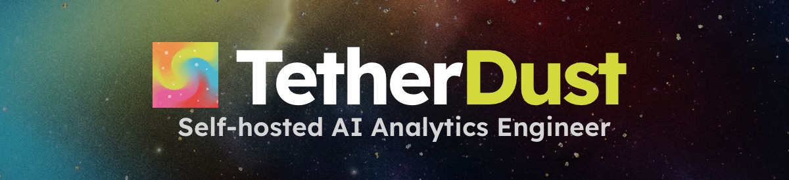
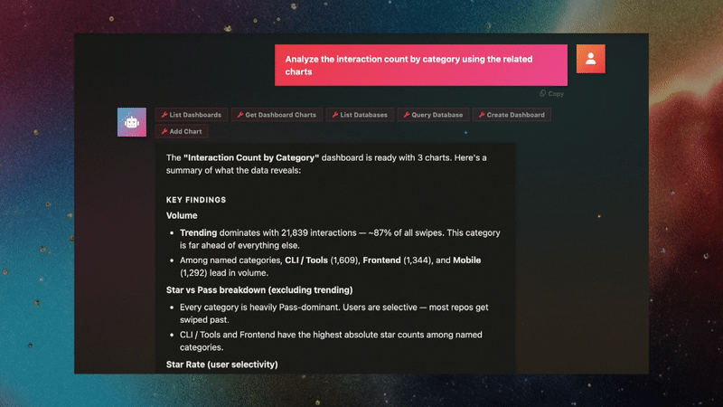
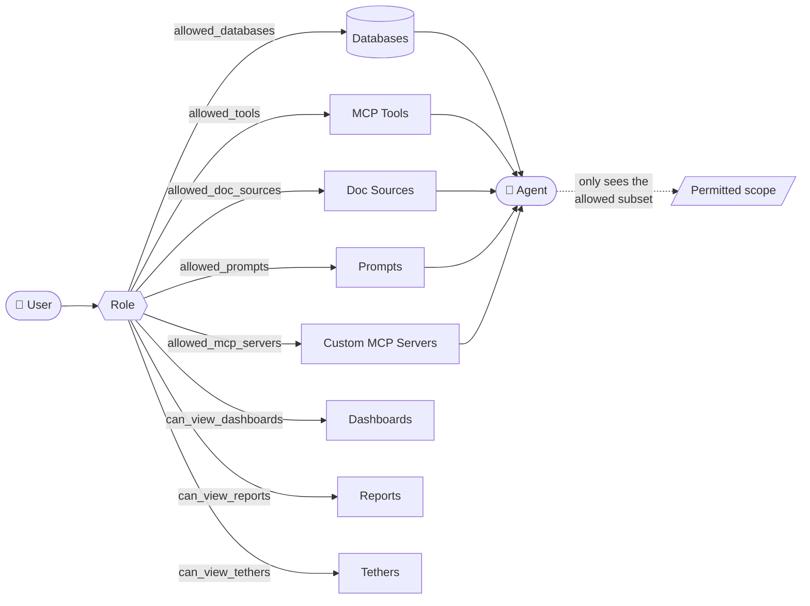

<div align="center">
  <p>
    <a href="LICENSE"></a>
    
    
    
  </p>
</div>

TetherDust bridges the gap between your codebase and databases using containerized Model Context Protocol (MCP) servers. By documenting database schemas alongside repository documentation, TetherDust enables any AI agent to generate verifiable SQL, build dynamic d3.js dashboards, and map schema-to-code dependencies. The platform runs entirely within your infrastructure, enforcing strict read-only query boundaries, role-based access control (RBAC), and immutable audit logging.

## Features
TetherDust is designed to be a flexible platform for AI-driven data interaction, with features that include:

### Docs

- Generate well-structured, wiki-like codebase and database documentation from natural language prompts, with rich Markdown support.

### Tethers

- Point TetherDust at a GitHub codebase (or codebase documentation) together with a database documentation. The agent explores both and produces an interactive visual graph showing which code files read or write which tables and columns, versioned as the schema drifts.

### Dashboards

- Describe the dashboard you want; the AI agent writes the SQL and the d3.js code for every chart. Charts auto-refresh on a schedule and are cached for performance.


- Edit the generated chart directly for custom behavior, or ask the agent to update it when requirements change.

### Reports

- Define queries and run them on a schedule, delivering results by email or download.

### Chat
Use **Chat** to access all of TetherDust's capabilities in one place.


- Ask natural language questions about your data and get streamed answers grounded in your documentation. You can mention documentation sources by name to pull in specific context, or let the agent decide what to use.


- TetherDust can write and execute SQL queries — either at your request or to confirm details before answering.


- Reach reports, dashboards, and tethers by name from the chat.


- Use predefined prompts.

## Technical Capabilities
### Multi-agent support
Use CLI tools, API calls, or Ollama to connect any agent that speaks MCP. Currently supported agent integrations:

| Provider | Method |
| --- | --- |
| **Codex CLI (OpenAI)** | ChatGPT subscription auth token |
| **Codex CLI (OpenAI)** | OpenAI API key |
| **Claude Code (Anthropic)** | Claude Pro/Max OAuth token |
| **Claude Code (Anthropic)** | Anthropic API key |
| **Direct API** | Any agent accessible via HTTP API, configured with custom MCP servers |
| **Ollama** | Local Ollama models with MCP support |

### Multi-database support
Connect any database with a Python SQLAlchemy dialect and a read-only user. Currently supported databases:
PostgreSQL, MySQL/MariaDB, SQL Server, SQLite, ClickHouse, Oracle, Snowflake, BigQuery.

> **Many more agents and databases to come**
> The architecture is designed to be agent-agnostic, with a simple interface for adding new ones.

### Built-in MCP server
Agent runtimes are containerized, so the only way for an agent to interact with TetherDust's features is through MCP servers, which expose tools and data sources as APIs. TetherDust includes a built-in MCP server that exposes the core features.

### Role-based access control
Every user's role decides which databases, MCP tools, documentation sources, dashboards, reports, and tethers they can see.



Agents only see the databases and tools their user role allows.

### Custom MCP servers
Extend the agent with remote HTTP or local subprocess MCP servers (Notion, GitHub, internal APIs, anything that speaks MCP), granted per role.

### Safe querying
Every agent query is parsed with SQLGlot and rejected unless it is read-only. Connections are read-only by default, and the real trust boundary is a read-only database user — always connect with one.

### Audit log
Actions and queries are logged in an immutable audit log. Every chat session, agent query, and generation run is recorded and reviewable by staff in the admin console.

### How it runs

The full stack ships as a Docker Compose project: a Django web app (portal + admin
console), an MCP server that exposes database and generation tools, pluggable AI agent
gateways (Codex CLI, Claude Code CLI, direct API/Ollama), PostgreSQL, Redis, and
Celery workers for background tasks. Switching the active agent is a single toggle in
the console — no restarts, no config changes.

## Quickstart

### Prerequisites

- [Docker](https://docs.docker.com/get-docker/) and Docker Compose v2
- An AI agent credential (one of):
  - **Codex** — a ChatGPT subscription auth token, or an OpenAI API key
  - **Claude Code** — a Claude Pro/Max OAuth token (`claude setup-token`), or an Anthropic API key

You configure the agent credential later, from the admin console — it is **not** needed to boot the stack.

### 1. Set your secrets before the first launch

All credentials live in a gitignored `.env` file that Docker Compose loads automatically.
Start from the template:

```bash
cp .env.example .env
```

`.env.example` ships with working local defaults for the database and admin login, but the
two cryptographic keys are intentionally blank — the stack will not start until you fill
them in. Edit `.env` and set the following.

**a. Generate a credential-encryption key** (Fernet). This key encrypts all stored
database passwords and agent API keys/tokens — generate your own and keep it secret:

```bash
python -c "from cryptography.fernet import Fernet; print(Fernet.generate_key().decode())"
```

Set `TETHERDUST_ENCRYPTION_KEY` to the generated value. It is shared from `.env` to every
service that needs it (`mcp`, `local-mcp`, `web`, `celery-worker`, `celery-beat`), so you
only set it once.

**b. Generate a Django secret key:**

```bash
python -c "import secrets; print(secrets.token_urlsafe(64))"
```

Set `DJANGO_SECRET_KEY` to the generated value.

**c. Set the admin login.** The superuser is created on first boot from these values —
change them so the default `admin`/`admin` is never used:

```bash
DJANGO_SUPERUSER_USERNAME=admin
DJANGO_SUPERUSER_PASSWORD=<a-strong-password>
DJANGO_SUPERUSER_EMAIL=you@example.com
```

**d. Change the database password.** Set `DB_NAME`, `DB_USER`, and `DB_PASSWORD` to your
chosen values. A single set of variables feeds the `db` service, both MCP connection
strings, and the web/celery services — there is nothing to keep in sync by hand.

**e. Generate the internal service secrets.** Two shared secrets authenticate
TetherDust's internal service-to-service calls — `MCP_FILTER_SECRET` (web/celery →
MCP filter registration) and `AGENT_GATEWAY_SECRET` (Django → the Codex/Claude
gateways). Generate a value for each:

```bash
python -c "import secrets; print(secrets.token_urlsafe(32))"
```

If left blank the stack still starts, but those internal calls are unauthenticated —
set both before exposing TetherDust to a network.

**f. (Local development only) Enable debug mode.** `.env.example` ships with
`DJANGO_DEBUG=false`, which enables production hardening (secure cookies, HTTPS
redirect, HSTS) and assumes TLS in front of the app — so logging in over plain
`http://localhost` won't work. For local development set `DJANGO_DEBUG=true` (dev
server with auto-reload, hardening relaxed). Leave it `false` for any real deployment.

> Note: `.env` is listed in `.gitignore`, so your real secrets stay out of version
> control. Never commit it. See [Production notes](#production-notes).

### 2. Launch

```bash
docker compose up --build
```

This starts PostgreSQL, the MCP server, the agent gateways, Redis, Celery, and the Django
web app. First boot runs database migrations, creates your superuser, and auto-discovers
documentation sources.

### 3. Open the app

Visit **http://localhost:8000** and log in with the superuser credentials you set in step 1c.

### 4. Connect an agent and a database

From the admin console:

1. **Agents** — add an agent configuration (Codex or Claude Code), paste your auth
   token/API key, and mark it active. Only one agent is active at a time.
2. **Databases** — add a connection to the database you want to query. Use a
   **read-only** database user (see below).
3. Open the chat and ask a question in natural language.

## Security notes

TetherDust runs every agent query through three layers of read-only protection:

1. **SQL validation** — each query is parsed (via SQLGlot, per database dialect) and
   rejected unless it is a single `SELECT`/CTE/set-operation. Multi-statement input,
   data-modifying CTEs, `SELECT … INTO`, stored-procedure calls, and DDL/DML are all
   blocked.
2. **Read-only session** — connections marked **Read-only** (default ON) run in a
   read-only database session where the engine supports it (PostgreSQL, MySQL/MariaDB,
   SQLite, Oracle, ClickHouse). SQL Server, BigQuery, and Snowflake have no session-level
   read-only — there, rely on a read-only user/role (below).
3. **Read-only database user** — the real trust boundary. **Always connect with an
   account that only has read access.** The two layers above are defense-in-depth; a
   read-only credential is what actually guarantees the agent can't write.

### Create a read-only database user

```sql
-- PostgreSQL
CREATE ROLE tetherdust_ro LOGIN PASSWORD '...';
GRANT CONNECT ON DATABASE mydb TO tetherdust_ro;
GRANT USAGE ON SCHEMA public TO tetherdust_ro;
GRANT SELECT ON ALL TABLES IN SCHEMA public TO tetherdust_ro;
ALTER DEFAULT PRIVILEGES IN SCHEMA public GRANT SELECT ON TABLES TO tetherdust_ro;

-- MySQL / MariaDB
CREATE USER 'tetherdust_ro'@'%' IDENTIFIED BY '...';
GRANT SELECT ON mydb.* TO 'tetherdust_ro'@'%';
```

For **BigQuery** grant `roles/bigquery.dataViewer` + `roles/bigquery.jobUser` (not
`dataEditor`); for **Snowflake** grant a role with `USAGE`/`SELECT` only; for **SQL
Server** add the login to the `db_datareader` role.

### Other notes

- **Stored credentials are encrypted** with the Fernet key from step 1a. If
  `TETHERDUST_ENCRYPTION_KEY` is left blank, credentials are stored in plaintext — always
  set it. In production (`DJANGO_DEBUG=false`) TetherDust refuses to save a credential
  without a key.
- **Set every secret in `.env`** before any non-local deployment, as described in step 1.

## Production notes

The default Compose configuration is tuned for local development. Before exposing
TetherDust to a network, work through this checklist:

- [ ] **Rotate every secret** — encryption key, Django secret key, `MCP_FILTER_SECRET`,
  `AGENT_GATEWAY_SECRET`, admin password, database password (see
  [step 1](#1-set-your-secrets-before-the-first-launch)).
- [ ] **Set `MCP_FILTER_SECRET` and `AGENT_GATEWAY_SECRET`** — without them the internal
  MCP filter registration and agent gateways accept unauthenticated calls.
- [ ] **`DJANGO_DEBUG=false`** — disables debug pages and switches to the Daphne
  ASGI server. This **also auto-enables the transport/cookie hardening below.**
- [ ] **`DJANGO_ALLOWED_HOSTS`** — set to your real host(s), comma-separated.
- [ ] **`DJANGO_CSRF_TRUSTED_ORIGINS`** — set to your HTTPS origin(s), e.g.
  `https://tetherdust.example.com` (required for form posts behind a proxy).
- [ ] **Terminate TLS** in front of the app (reverse proxy / load balancer) and
  forward `X-Forwarded-Proto`.
- [ ] **Publish only the `web` service (port 8000).** The internal services —
  `mcp` (8001), `local-mcp` (8003), the agent gateways (`codex`/`codex-api`/
  `claude`/`claude-api`, 8002), `db`, and `redis` — have no user-facing auth and
  must stay on the private Compose network. The default `docker-compose.yml`
  only maps `8000`; if you add port mappings or run host networking, do **not**
  expose the others. Treat `MCP_FILTER_SECRET` / `AGENT_GATEWAY_SECRET` as
  defense-in-depth, not a substitute for network isolation.
- [ ] **Keep secrets out of version control** — secrets already live in the gitignored
  `.env`; for production prefer a secrets manager and never commit `.env`.

When `DJANGO_DEBUG=false`, `settings.py` automatically turns on
`SECURE_SSL_REDIRECT`, `SESSION_COOKIE_SECURE`, `CSRF_COOKIE_SECURE`,
`SECURE_CONTENT_TYPE_NOSNIFF`, HSTS (1 year), and `SECURE_PROXY_SSL_HEADER`. These
assume TLS is terminated in front of the app. Optional overrides:

| Variable | Default (when DEBUG off) | Purpose |
| --- | --- | --- |
| `DJANGO_SECURE_SSL_REDIRECT` | `True` | Set `False` if your proxy already redirects HTTP→HTTPS. |
| `DJANGO_SECURE_HSTS_SECONDS` | `31536000` | Set `0` to disable HSTS while validating a TLS rollout. |
| `DJANGO_CSRF_TRUSTED_ORIGINS` | *(empty)* | Comma-separated HTTPS origins. |

Verify your configuration with `python manage.py check --deploy`.

## Versioning & updates

TetherDust tracks a single **product version** in the repo-root `VERSION` file
(independent of the `tdmcp` package version in `pyproject.toml`).
Staff see it under **Console → Version**, along with per-release notes read from
the `changelog/` directory (one `changelog/<version>.md` file per release) and an
**update-available** indicator.

The update check (a Celery task, every 6 hours) calls the GitHub API for the
**latest published Release** of the upstream repo (`GITHUB_REPOSITORY` in
`core/version.py`) and compares its tag against the running `VERSION` using
semantic versioning. A newer tag lights up the indicator. There is nothing to
configure — every install checks the same official repo.

> Only **published GitHub Releases** are detected. A bare `git tag` with no
> Release attached is invisible to the check.

### Cutting a release (maintainers)

1. Bump `VERSION` and add `changelog/<version>.md` with the upgrade notes for
   admins (migrations, new env vars, manual steps) plus the changes. Commit.
2. Tag and push: `git tag v<version> && git push --tags`.
3. **Publish a GitHub Release** for that tag — this is the step that flips the
   update indicator for every running install.

## License

TetherDust is licensed under the **GNU Affero General Public License v3.0
(AGPLv3)** — see [LICENSE](LICENSE). You are free to use, modify, and self-host
it; note that AGPL's network-copyleft requires you to make your modified source
available to users you provide the software to over a network.

A separate commercial license is available for the managed/cloud offering and
for use that doesn't fit AGPLv3 — contact the maintainers.

## Contributing

Contributions are welcome. By submitting a contribution you agree to the
[Contributor License Agreement](CLA.md), signaled by signing off your commits:

```bash
git commit -s
```

This certifies the Developer Certificate of Origin and lets the project include
your contribution in both the AGPLv3 codebase and the commercial offering.
