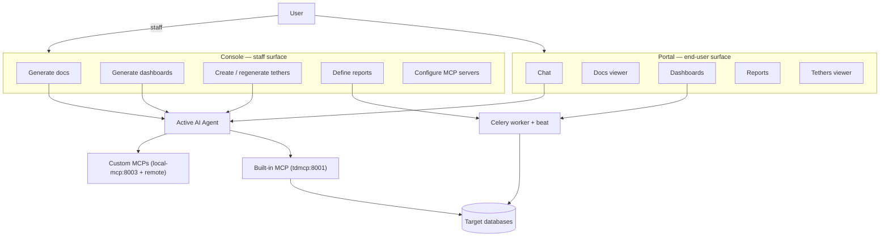

# Features — Overview

TetherDust is a multi-agent data-querying platform built around one idea: let
people ask questions of their data in plain language and get trustworthy
answers. Around that engine sit a handful of features that turn a single chat
answer into something a whole organisation can use — saved documentation, live
dashboards, scheduled reports, visual code↔database maps, and a pluggable tool
layer. This section documents each feature in depth; this page is the map.

---

## Table of Contents

1. [The features at a glance](#the-features-at-a-glance)
2. [How the pieces fit together](#how-the-pieces-fit-together)
3. [Two surfaces: workspace and management](#two-surfaces-workspace-and-management)
4. [The common thread: the AI agent + MCP tools](#the-common-thread-the-ai-agent--mcp-tools)
5. [The common thread: role-based access](#the-common-thread-role-based-access)
6. [Where each feature lives in the code](#where-each-feature-lives-in-the-code)

---

## The features at a glance

| # | Feature | What it is | Who creates it | Who consumes it |
|---|---|---|---|---|
| 2 | [[TetherDust Documentation/2. Features/2. Chat.md\|Chat]] | Natural-language conversation with the AI agent, streamed in real time. | Any user with `can_chat`. | The same user. |
| 3 | [[TetherDust Documentation/2. Features/3. Docs.md\|Docs]] | Built-in markdown documentation viewer with wiki-links and Mermaid. | Staff (manually or AI-generated). | Any user with access to the source. |
| 4 | [[TetherDust Documentation/2. Features/4. Tethers.md\|Tethers]] | AI-generated visual graph linking a codebase to the database it touches. | Staff (AI generation). | Users whose role is granted the tether. |
| 5 | [[TetherDust Documentation/2. Features/5. Built-in MCP.md\|Built-in MCP]] | The engine tool server that ships with TetherDust. | Ships with the product. | The agent, on every data answer. |
| 6 | [[TetherDust Documentation/2. Features/6. Custom MCPs.md\|Custom MCPs]] | User-defined MCP servers (remote or local subprocess) that extend the agent. | Staff. | The agent, gated per role. |
| 7 | [[TetherDust Documentation/2. Features/7. Reports.md\|Reports]] | Saved SQL that runs on a schedule and delivers results. | Staff. | Users whose role is granted the report. |
| 8 | [[TetherDust Documentation/2. Features/8. Dashboards.md\|Dashboards]] | Collections of AI-generated d3.js charts over live SQL. | Staff (AI generation or by hand). | Users whose role is granted the dashboard. |
| 9 | [[TetherDust Documentation/2. Features/9. Codebases.md\|Codebases]] | GitHub repositories the agent reads on demand and uses as a source. | Staff. | The agent, gated per role. |
| 10 | [[TetherDust Documentation/2. Features/10. Databases.md\|Databases]] | SQL database connections the agent queries read-only as a source. | Staff. | The agent, gated per role. |
| 11 | [[TetherDust Documentation/2. Features/11. Roles & Access Control.md\|Roles & Access Control]] | Role-based permission model controlling which users can access which features and data. | Staff. | Enforced automatically on every request. |
| 12 | [[TetherDust Documentation/2. Features/12. Audit Log.md\|Audit Log]] | Immutable logs of all database queries and AI generation runs. | Created automatically. | Staff only (management). |

The numbering matches the file order in this folder; each row links to its full
page.

---

## How the pieces fit together

Three engines drive everything:

- **The AI agent** powers anything generative — chat answers, documentation,
  dashboard charts, and tether graphs. It reaches data only through MCP tools.
- **Celery** (worker + beat) powers anything scheduled — report execution and
  dashboard chart refreshes.
- **Direct SQL** (via `engine/engines/db_runner.py`) powers anything that just
  needs to run a known query — report runs, chart data, chart previews.

---

## Two surfaces: workspace and management

Every feature has two halves split across two Django apps:

| App | Audience | Role | URL prefix |
|---|---|---|---|
| **`workspace/`** | End users | Consuming: chat, read docs, view dashboards/reports/tethers. | `/`, `/chat/`, `/docs/`, `/dashboards/`, `/reports/`, `/tethers/` |
| **`management/`** | Staff | Authoring & administration: define reports, generate dashboards/docs/tethers, configure MCP servers, manage roles. | `/management/` |

Shared models, agents, engines, and consumers live in **`engine/`**. A rule of
thumb: if a page is `@login_required` it is workspace; if it is
`@staff_member_required` it is management.

---

## The common thread: the AI agent + MCP tools

Chat, Docs generation, Dashboards, and Tethers are all the *same agent* doing
different jobs. Each one builds a prompt, grants a set of MCP tools, and streams
the agent's output:

- **Chat** streams to the browser over a WebSocket and saves the turn.
- **Docs / Dashboards / Tethers** run the agent in a background thread, stream
  status into a log/version row, and the page polls until done.

The agent never touches a database directly — it calls the
[[TetherDust Documentation/2. Features/5. Built-in MCP.md\|built-in MCP tools]]
(`query_database`, `search_docs`, `create_documentation`, `add_chart`,
`save_tether_graph`, …) and any granted
[[TetherDust Documentation/2. Features/6. Custom MCPs.md\|custom MCP servers]]. How
the agent itself is hosted (CLI, direct API, local LLM, gateway) is covered in
the **Agent Integrations** section
([[TetherDust Documentation/3. Agent Integrations/1. Overview.md\|overview]]).

---

## The common thread: role-based access

Every feature is gated by the same `Role` / `UserProfile` machinery
(`engine/models/auth.py`). A user's role decides, per feature:

| Feature | Gate |
|---|---|
| Chat | `Role.can_chat`; tools / databases / doc-sources / MCP-servers / row-limit allow-lists. |
| Docs | `Role.allowed_doc_sources`. |
| Tethers | `Role.can_view_tethers` + `Role.allowed_tethers`. |
| Reports | `Role.allowed_reports`. |
| Dashboards | `Role.allowed_dashboards`. |
| Codebases | `Role.allowed_codebases`. |
| Custom MCPs | `Role.allowed_mcp_servers` (explicit allow-list; built-in is always available). |

Staff users are the broad bypass: they can access the management and are
unrestricted by the workspace/agent allow-lists. In the supported management flow,
assigning a role flagged **`is_admin_role`** syncs the user to
`User.is_staff=True`, so admin-role users follow that same staff bypass. Access
changes take effect on the next request — no restart.

---

## Where each feature lives in the code

| Feature | Models | Portal | Console | Engine / tasks |
|---|---|---|---|---|
| Chat | `engine/models/chat.py` | `workspace/consumers/chat.py` | — | `engine/agents/` |
| Docs | `engine/models/connections.py` | `workspace/views/docs.py` | `management/views/docsource.py` | `mcp_server/tools/create_documentation.py` |
| Tethers | `engine/models/tethers.py` | `workspace/views/tethers.py` | `management/views/tether.py` | `engine/engines/tether_engine.py` |
| Built-in MCP | `engine/models/connections.py` | — | `management/views/mcp_server.py` | `mcp_server/` |
| Custom MCPs | `engine/models/connections.py` | — | `management/views/mcp_server.py` | `docker/local_mcp/local_mcp_api.py` |
| Reports | `engine/models/reports.py` | `workspace/views/reports.py` | `management/views/report.py` | `engine/engines/report_engine.py`, `engine/tasks.py` |
| Dashboards | `engine/models/dashboards.py` | `workspace/views/dashboards.py` | `management/views/dashboard.py` | `engine/tasks.py` (refresh) |
| Codebases | `engine/models/connections.py` | — | `management/views/codebase.py` | `engine/integrations/github_client.py`, `engine/tasks.py` (sync), `mcp_server/tools/*codebase*.py` |
| Databases | `engine/models/connections.py` | — | `management/views/database.py` | `mcp_server/utils/db_service.py`, `mcp_server/tools/{list_databases,list_tables,get_table_schema,query_database}.py` |
| Roles & Access Control | `engine/models/auth.py` | — | `management/views/role_user.py` | `engine/consumers/permissions.py`, `engine/agents/mcp_filter.py` |
| Audit Log | `engine/models/connections.py` (QueryAuditLog), `engine/models/agent.py` (DocGenerationLog), `engine/models/dashboards.py` (ChartGenerationLog) | — | `management/views/audit.py` | `engine/consumers/audit.py` |

Read on for the per-feature pages, in order.
