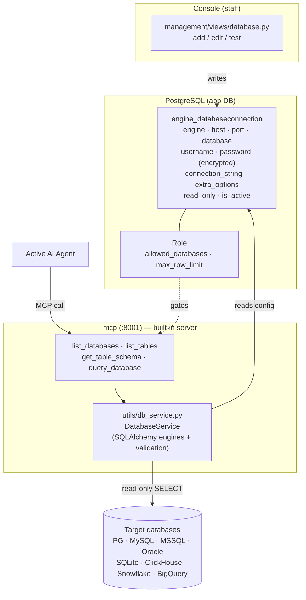

# Databases

A **Database connection** points TetherDust at a SQL database the AI agent can
query — a first-class **source**, the same way a
[[TetherDust Documentation/2. Features/9. Codebases.md\|Codebase]] or a documentation
source is. Staff register a connection in the management; from then on the agent can
list its tables, inspect schemas, and run read-only `SELECT` queries to answer
questions in [[TetherDust Documentation/2. Features/2. Chat.md\|chat]], build
[[TetherDust Documentation/2. Features/8. Dashboards.md\|dashboards]], and run
[[TetherDust Documentation/2. Features/7. Reports.md\|reports]]. Every query passes
through three layers of read-only protection, and credentials are encrypted at
rest.

---

## Table of Contents

1. [At a glance](#at-a-glance)
2. [The DatabaseConnection model](#the-databaseconnection-model)
3. [Adding a connection](#adding-a-connection)
4. [Supported engines](#supported-engines)
5. [Read-only protection](#read-only-protection)
6. [Row limits and query timeout](#row-limits-and-query-timeout)
7. [Credential encryption](#credential-encryption)
8. [The MCP tools](#the-mcp-tools)
9. [Documenting a database](#documenting-a-database)
10. [Access control](#access-control)
11. [Where connections are loaded from](#where-connections-are-loaded-from)
12. [What needs a restart](#what-needs-a-restart)

---

## At a glance

The management writes connection config to the app database; the built-in MCP
server's `DatabaseService` reads it, builds a SQLAlchemy engine per connection,
validates each query, and executes it read-only against the target.

---

## The DatabaseConnection model

`engine/models/connections.py` → `DatabaseConnection`.

| Field | Purpose |
|---|---|
| `name` | Unique identifier the agent uses to pick a connection (`query_database(database="…")`). |
| `description` | Free text — helps the agent understand what data the database holds. |
| `engine` | One of the [supported engines](#supported-engines). |
| `host` / `port` | Server address. Port defaults per engine if left blank. |
| `database` | Database name, or file path for SQLite. Optional for engines with a default (e.g. ClickHouse `default`) or when using `connection_string`. |
| `username` | Login user. **Use a read-only account** (see below). |
| `password` | Stored **Fernet-encrypted** at rest (`_password` column). |
| `connection_string` | Optional full SQLAlchemy URL that overrides all the above fields. |
| `extra_options` | JSON `connect_args` passed to SQLAlchemy (e.g. SSL settings, BigQuery/Snowflake driver options). |
| `read_only` | Default **ON**. Runs queries in a read-only session where the engine supports it (see [Read-only protection](#read-only-protection)). |
| `is_active` | Inactive connections are hidden from the agent. |

---

## Adding a connection

In **Console → Databases**:

1. **Add** opens an engine picker; choose the database engine.
2. Fill in the connection form (host/port/database/username/password, or paste a
   full `connection_string`). Leave **Read-only** checked unless you have a
   specific reason not to.
3. **Test** (`management/views/database.py` → `database_test_view`) runs a
   `SELECT 1` against the target via `DatabaseService.test_connection` and reports
   success or the connection error.

The password field is write-only in the UI — leave it blank when editing to keep
the existing encrypted value.

---

## Supported engines

| Engine | `engine` value | Default port | SQLAlchemy driver |
|---|---|---|---|
| PostgreSQL | `postgresql` | 5432 | `postgresql+psycopg2` |
| MySQL | `mysql` | 3306 | `mysql+pymysql` |
| MariaDB | `mariadb` | 3306 | `mariadb+pymysql` |
| Microsoft SQL Server | `mssql` | 1433 | `mssql+pymssql` |
| Oracle | `oracle` | 1521 | `oracle+cx_oracle` |
| SQLite | `sqlite` | — | `sqlite:///<path>` |
| ClickHouse | `clickhouse` | 8123 | `clickhouse+connect` (separate client) |
| Snowflake | `snowflake` | — | `snowflake-sqlalchemy` |
| Google BigQuery | `bigquery` | — | `sqlalchemy-bigquery` |

Database drivers are optional Python extras — install what you need
(`pip install -e ".[postgresql,mysql,…]"` or `[all-databases]`). Snowflake and
BigQuery typically authenticate through `connection_string` / `extra_options`
(account URL, key file, project), not host/port.

---

## Read-only protection

Every agent query is read-only-guarded by three independent layers. The first two
are defense-in-depth; the third is the real trust boundary.

**1. SQL validation** (`utils/db_service.py` → `validate_read_only_sql`). The
query is parsed with **SQLGlot** for the connection's dialect and rejected unless
it is a single `SELECT` / CTE / set-operation. This catches what string matching
misses — multi-statement input (`SELECT …; DROP …`), data-modifying CTEs
(`WITH x AS (DELETE …) …`), `SELECT … INTO` / `INTO OUTFILE`, stored-procedure
calls, and all DDL/DML. It **fails closed**: unparseable SQL is rejected.

**2. Read-only session** (when the connection's `read_only` flag is on). Where the
engine supports it, the database session itself refuses writes:

| Engine | Mechanism | When applied |
|---|---|---|
| PostgreSQL | `SET SESSION CHARACTERISTICS AS TRANSACTION READ ONLY` | per pooled connection (connect event) |
| MySQL / MariaDB | `SET SESSION TRANSACTION READ ONLY` | per pooled connection (connect event) |
| SQLite | `PRAGMA query_only = ON` | per pooled connection (connect event) |
| Oracle | `SET TRANSACTION READ ONLY` | first statement of the query transaction |
| ClickHouse | `readonly=1` query setting | per query |
| SQL Server · BigQuery · Snowflake | *no session-level read-only* | — rely on a read-only user / IAM role |

**3. Read-only database user.** The only guarantee. **Connect with an account
that has read access only** — `SELECT`-only grants (PostgreSQL/MySQL),
`db_datareader` (SQL Server), a viewer role (Snowflake), or
`bigquery.dataViewer` + `jobUser` (BigQuery). See the project README's *Security
notes* for copy-paste `GRANT` examples.

---

## Row limits and query timeout

- **Per-query limit** — `query_database` defaults to 100 rows, hard-capped at
  1000. `DatabaseService.execute_query` appends the appropriate clause when the
  query has none (`LIMIT` for most engines, `TOP` for SQL Server,
  `FETCH FIRST … ROWS ONLY` for Oracle).
- **Role limit** — a user's `Role.max_row_limit` (and the global
  `TETHERDUST_MAX_ROW_LIMIT`) further caps the effective limit per request.
- **Query timeout** — `TETHERDUST_QUERY_TIMEOUT` (default 30s).
- **Query length** — `TETHERDUST_MAX_QUERY_LENGTH` (default 10000 characters).

---

## Credential encryption

Passwords are encrypted with **Fernet** before being written to the app database
(`_password` column) and decrypted only when building a connection. The key comes
from `TETHERDUST_ENCRYPTION_KEY`; if it is unset, credentials are stored in
plaintext and — in production (`DJANGO_DEBUG=false`) — TetherDust refuses to save
them. When the MCP server loads connections directly from the app DB (see below),
it decrypts the same way using that key.

---

## The MCP tools

The built-in [[TetherDust Documentation/2. Features/5. Built-in MCP.md\|MCP server]]
exposes four database tools, all gated by role access control:

| Tool | What it does |
|---|---|
| `list_databases` | Lists the connections the requesting user is allowed to see. |
| `list_tables` | Lists tables in a given database. |
| `get_table_schema` | Returns columns and types for a table — the agent uses this before writing SQL. |
| `query_database` | Runs a validated read-only `SELECT` and returns results as a markdown table. |

---

## Documenting a database

A connection tells the agent *how* to query; a
[[TetherDust Documentation/2. Features/3. Docs.md\|documentation source]] of type
**Database** tells it *what the data means*. Document a database (by hand or
AI-generated) to give the agent table descriptions and vetted query examples,
surfaced through the `search_docs` and `get_query_examples` MCP tools. You can
also link a database's documentation to a codebase's with a
[[TetherDust Documentation/2. Features/4. Tethers.md\|Tether]].

---

## Access control

Database access follows the same `Role` / `UserProfile` machinery as every other
feature:

- **`Role.allowed_databases`** — an explicit allow-list of connections the role's
  users (and the agent acting for them) may reach. Connections outside the list
  are invisible to `list_databases` and blocked by `query_database`.
- **`Role.max_row_limit`** — caps rows returned per query.
- **Staff users**, including users made staff by an admin role, bypass these
  restrictions.

Enforcement happens at the MCP server: Django registers a per-request filter
token, and the database tools (`_db_shared.enforce_db_access`) check the allowed
set before touching any target.

---

## Where connections are loaded from

`DatabaseService` resolves configuration in priority order:

1. **Django model** — when running inside Django (`DJANGO_SETTINGS_MODULE` set), it
   reads `DatabaseConnection` rows directly.
2. **App DB over SQLAlchemy** — when running standalone with `ADMIN_DATABASE_URL`
   set, it queries the `engine_databaseconnection` table and Fernet-decrypts
   passwords. This is how the `mcp` container reads management-managed connections
   without importing Django.

---

## What needs a restart

- **Adding, editing, or deactivating a connection** takes effect on the next
  query — no restart. Cached SQLAlchemy engines are rebuilt when configuration is
  reloaded.
- **Installing a new database driver** (optional extra) requires rebuilding the
  `mcp` image.
- **Changing `TETHERDUST_ENCRYPTION_KEY`** invalidates all stored passwords —
  re-enter credentials after a key change.
