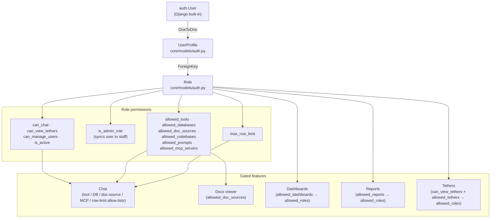

# Roles & Access Control

Every TetherDust user is subject to a permission model built on two database
records: a **`Role`** (which defines what is permitted) and a **`UserProfile`**
(which assigns a role to a user). This page documents the full model, how
permissions are evaluated at request time, and the admin access paths.

---

## Table of Contents

1. [At a glance](#at-a-glance)
2. [The Role model](#the-role-model)
3. [The UserProfile model](#the-userprofile-model)
4. [How permissions are resolved](#how-permissions-are-resolved)
5. [Admin access paths](#admin-access-paths)
6. [Feature gates reference](#feature-gates-reference)
7. [Managing roles and users](#managing-roles-and-users)
8. [Where access control is enforced](#where-access-control-is-enforced)

---

## At a glance



---

## The Role model

`engine/models/auth.py` → `Role`.

### Boolean flags

| Field | Default | Effect |
|---|---|---|
| `can_chat` | `True` | Allows the user to open the chat interface and send messages. |
| `can_view_tethers` | `True` | Allows the user to view the Tethers section at all. Individual tethers are further gated by `allowed_tethers` (see below). |
| `can_manage_users` | `False` | Allows a non-superuser **staff** member to create and edit users in the management. This flag does not make a user staff and does not grant management access by itself. |
| `is_active` | `True` | Marks the role active/inactive in the management. This flag is not currently a request-time deny-all gate by itself; remove permissions or reassign users to revoke access. |
| `is_admin_role` | `False` | Console-managed admin flag. Saving roles or users through the management syncs non-superuser users with this role to `User.is_staff=True`, grants management access, and bypasses role allow-lists. See [Admin access paths](#admin-access-paths). |

### Many-to-many allow-lists

Each allow-list is empty by default. An empty list means **no access** to that
category (not "access to all"). Access is explicitly granted by adding objects
to the list.

| Field | Allowed object type | Effect |
|---|---|---|
| `allowed_tools` | `ToolConfiguration` | MCP tools the agent may call on behalf of this role's users. Only tools that are `is_enabled=True` and belong to an active MCP server count. |
| `allowed_databases` | `DatabaseConnection` | Databases the agent may query on behalf of this role's users. Only `is_active=True` connections count. |
| `allowed_doc_sources` | `DocumentationSource` | Documentation sources visible in the Docs viewer and searchable by the agent. Only `is_active=True` sources count. |
| `allowed_codebases` | `Codebase` | GitHub codebases the agent may read on behalf of this role's users. Only `is_active=True` codebases count. |
| `allowed_prompts` | `PromptConfiguration` | Saved prompts available via `/` in chat for this role's users. |
| `allowed_mcp_servers` | `MCPServerConfiguration` | Custom MCP servers (non-built-in) the agent may call. The built-in server is always available regardless of this list. |

### Row limit

| Field | Default | Effect |
|---|---|---|
| `max_row_limit` | `100` | Maximum number of rows `query_database` may return to this role's users. The global `TETHERDUST_MAX_ROW_LIMIT` env var is an additional cap; the lower of the two values wins. |

### Reports, Dashboards, and Tethers

These three features use a reverse allow-list: the Role is not configured on the
Role object itself, but on the resource:

- `ReportDefinition.allowed_roles` — a role may view the report if it appears in this M2M.
- `Dashboard.allowed_roles` — same pattern.
- `Tether.allowed_roles` — a role may view the tether if it appears here **and** `Role.can_view_tethers` is `True`.

---

## The UserProfile model

`engine/models/auth.py` → `UserProfile`.

A `UserProfile` is auto-created for every user (by `docker-entrypoint.sh` on
startup and by a post-save signal for new users). It holds a single `ForeignKey`
to a `Role`.

| Field | Notes |
|---|---|
| `user` | OneToOne FK to `auth.User`. |
| `role` | FK to `Role`. May be `null` if not yet assigned — a user with no role has almost no access (equivalent to an empty role). |

> Deleting a `Role` is **protected** — Django prevents deletion while any
> `UserProfile` references it. Reassign all users to a different role first.

---

## How permissions are resolved

At request time, `UserProfile` helper methods compute each allow-list
dynamically from the database. No caching — access changes take effect on the
**next request** with no restart.

```
get_allowed_tools()         → set[str] | None
get_allowed_databases()     → set[str] | None
get_allowed_doc_sources()   → set[str] | None
get_allowed_codebases()     → set[str] | None
get_allowed_prompts()       → set[str] | None
get_allowed_mcp_servers()   → QuerySet[MCPServerConfiguration]
```

**Return value semantics:**
- `None` — unrestricted; all objects of that type are accessible. Staff users return `None`, and users assigned an admin role through the management become staff.
- `set()` / empty queryset — no access to any object in that category.
- Non-empty set — only the named objects are accessible.

These values are passed to the agent at chat time
(`engine/consumers/permissions.py`) and also registered as a per-request token
filter at the MCP server (`engine/agents/mcp_filter.py`).

---

## Admin access paths

### 1. Staff users (`is_staff = True`)

Django's standard `is_staff` flag on `auth.User`. **All** permission checks in
`UserProfile` return `None` (unrestricted) for staff users, regardless of the
assigned role. A staff user also has access to the management (`/management/`).

Staff status is set by assigning an admin role through the TetherDust management,
by creating a superuser, or directly via Django admin / management code. The
TetherDust user edit form does not expose an independent "Staff" checkbox.

### 2. Admin roles (`is_admin_role = True`)

`is_admin_role` is the management-level shortcut for staff/admin access. When a role
is saved, every non-superuser assigned to that role is updated to
`User.is_staff = role.is_admin_role`. When a user is created or edited through
the management, assigning an admin role applies the same staff sync.

Because management access is staff-gated, users assigned an admin role through the
supported management flows can access `/management/` and receive unrestricted workspace
and agent access. There is no supported workspace-only admin role in the current UI.

If `is_admin_role` is changed outside the management forms without syncing
`User.is_staff`, only the helper methods that explicitly check the role flag will
treat that user as unrestricted. `is_staff` remains the authoritative broad
management/resource bypass.

### 3. How `is_admin_role` and `can_manage_users` combine

| Role flags | Console access? | User management? | Portal / agent allow-list restrictions? |
|---|---|---|---|
| `is_admin_role=False`, `can_manage_users=False` | No, unless `is_staff` was set outside the role flow. | No. | Enforced from the role's allow-lists. |
| `is_admin_role=False`, `can_manage_users=True` | No, unless `is_staff` was set outside the role flow. | Only if the user is already staff; the flag alone is not enough. | Enforced from the role's allow-lists. |
| `is_admin_role=True`, `can_manage_users=False` | Yes. The management syncs assigned non-superusers to staff. | No, unless the user is a superuser. | Bypassed. |
| `is_admin_role=True`, `can_manage_users=True` | Yes. | Yes for non-superuser staff users with this role. | Bypassed. |

---

## Feature gates reference

| Feature | Gate condition |
|---|---|
| **Chat (general)** | `UserProfile.can_chat` must be `True`. For staff/admin-role users: always `True`. |
| **Chat (tools)** | `get_allowed_tools()` — intersection with enabled tools on active MCP servers. |
| **Chat (databases)** | `get_allowed_databases()` — intersection with active DB connections. |
| **Chat (doc sources)** | `get_allowed_doc_sources()` — intersection with active doc sources. |
| **Chat (codebases)** | `get_allowed_codebases()` — intersection with active codebases. |
| **Chat (row limit)** | `get_max_row_limit()` — `None` for staff (no limit), else `Role.max_row_limit`. |
| **Chat (prompts)** | `get_allowed_prompts()` — intersection with enabled prompts on active MCP servers. |
| **Docs viewer** | `UserProfile.can_view_docs` — `True` if the user has at least one accessible doc source. |
| **Dashboards** | `UserProfile.can_view_dashboards` — `True` if the user has at least one accessible dashboard. Access per-dashboard via `Dashboard.allowed_roles`. |
| **Reports** | `UserProfile.can_view_reports` — `True` if the user has at least one accessible report. Access per-report via `ReportDefinition.allowed_roles`. |
| **Tethers** | `UserProfile.can_view_tethers` — requires `Role.can_view_tethers = True` AND at least one tether in `Tether.allowed_roles`. |
| **Custom MCPs** | `get_allowed_mcp_servers()` — staff see all active custom servers; non-staff roles require explicit allow-listing. The built-in server is always included. |
| **Console** | `is_staff = True`. Assigning an admin role through the management sets this flag for non-superusers. |
| **User management** | `is_staff = True` AND (`is_superuser = True` OR `Role.can_manage_users = True`). |

---

## Managing roles and users

Both are managed from the management.

### Roles

**Console → Roles**

- Create a role with a name, description, and desired permissions.
- The role form groups the many-to-many allow-lists by MCP server for tools and prompts, making it easy to grant/revoke tool access per server.
- Checking **Admin role** hides the allow-list controls because the management syncs assigned non-superusers to staff, making those allow-lists irrelevant for them.
- Checking **Can manage users** without **Admin role** is useful only for users who are already staff by some other path; it does not grant management access.
- You cannot delete a role that is assigned to users — reassign those users first.

### Users

**Console → Users** (requires `is_staff = True` and `is_superuser` or `can_manage_users`)

- Create users with username, email, password, and optional role assignment. Assigning an admin role makes the user staff.
- Edit an existing user's role. Staff status follows the assigned role's `is_admin_role` flag for non-superusers.
- The user list shows each user's username, email, role, and staff status.

---

## Where access control is enforced

Access restrictions are applied in two places — both must be passed for an agent
to reach a resource.

**1. The WebSocket consumer** (`engine/consumers/permissions.py`) — reads the
user's `UserProfile` before the agent starts and builds the allow-lists that are
passed to the agent.

**2. The MCP server token filter** (`engine/agents/mcp_filter.py` +
`mcp_server/_context.py`) — Django registers a per-request filter token with
the MCP server before spawning the agent. The MCP server extracts the token on
every tool call and silently hides disallowed tools and databases. Even if the
CLI agent were somehow told about a tool or database it is not allowed to use,
the MCP server would reject the call.

This two-layer design means access control cannot be bypassed by manipulating
the agent's prompt or tool list — the MCP server enforces it independently.
