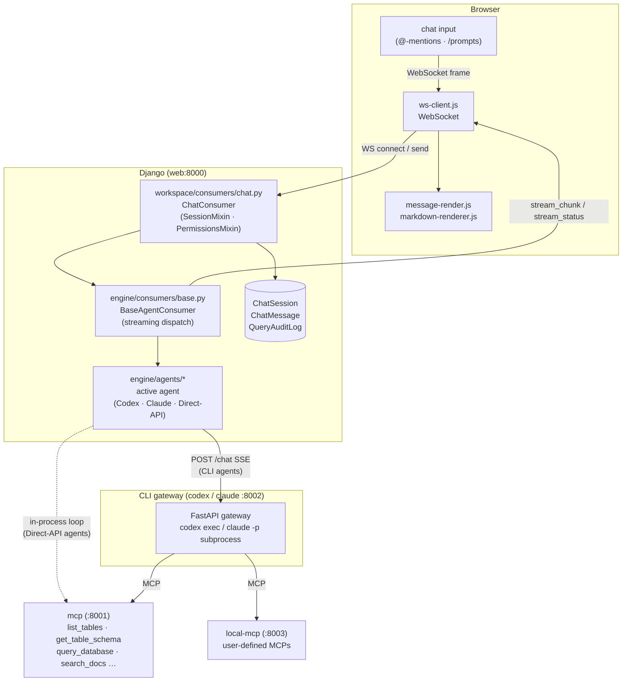

# Chat

The **Chat** feature is TetherDust's primary interface. Users type natural-language questions into a browser-based chat window; the active AI agent answers in real time, calling MCP tools to query databases and search documentation along the way. Every conversation is stored as a **ChatSession**, messages are preserved across page reloads, and all query activity is audit-logged.

---

## Table of Contents

1. [At a glance](#at-a-glance)
2. [Chat sessions and messages](#chat-sessions-and-messages)
3. [The chat interface](#the-chat-interface)
4. [@-mentions and /prompts](#-mentions-and-prompts)
5. [Access control](#access-control)
6. [Agent streaming](#agent-streaming)
7. [Cancellation](#cancellation)
8. [Audit logging](#audit-logging)

---

## At a glance



---

## Chat sessions and messages

### Models

`engine/models/chat.py` defines two models.

**`ChatSession`** — one record per conversation thread.

| Field | Purpose |
|---|---|
| `user` | FK to `auth.User`. Each session belongs to exactly one user. |
| `title` | Auto-set from the first 100 characters of the first user message. |
| `created_at` / `updated_at` | Timestamps; sessions are ordered newest-first. |

**`ChatMessage`** — one record per turn.

| Field | Purpose |
|---|---|
| `session` | FK to `ChatSession`. |
| `role` | `user`, `assistant`, or `system`. |
| `content` | Full message text (markdown). |
| `tools_used` | JSON list of MCP tool names called during this assistant turn. |
| `sources_used` | JSON list of `{uri, name}` dicts for `@`-mentioned doc resources. |
| `prompts_used` | JSON list of `{name, display_name}` dicts for `/`-selected prompts. |
| `created_at` | Message timestamp; messages are ordered oldest-first within a session. |

### Conversation history

Before each new request, `SessionMixin._get_conversation_messages()` fetches the last 20 messages (capped at 8 000 characters) and passes them to the agent as structured `{"role", "content"}` turns. This gives multi-turn context without unbounded prompt growth.

---

## The chat interface

The viewer is at `/chat/` and is login-required.

### Request flow

```
1. Browser opens WebSocket  →  workspace/consumers/chat.py:ChatConsumer.connect
   - Authenticates the user (closes 4001 if anonymous).
   - Creates or resumes a ChatSession.
   - Loads UserProfile → checks can_chat (closes 4003 if denied).
   - Resolves allowed_tools, allowed_databases, allowed_doc_sources,
     allowed_mcp_servers, max_row_limit from the user's role.
   - Sends { type: "session_info", session_id, title }.
   - Sends { type: "history", messages: [...] } for existing sessions.

2. User submits a message  →  ChatConsumer.receive
   - Parses the JSON frame: message, resource_uris, prompt_context, sources_info, prompts_info.
   - Saves the user ChatMessage (with sources_used / prompts_used).
   - Prepends any @-mentioned doc file contents and /prompt text to agent_message.
   - Strips chart-edit-only tools (e.g. update_chart) from effective_tools.
   - Calls _stream_agent_response(agent, ...) — streams chunks back in real time.
   - Saves the assistant ChatMessage (with tools_used) after the stream completes.
   - Sets the session title if this is the first message.

3. After each agent turn  →  { type: "stream_end", tools, content }
   - tools: list of MCP tool names actually invoked (fetched from the MCP server).
   - content: full response text.
```

### Frontend modules

| Module | Role |
|---|---|
| `chat-app.js` | Entry point; wires together all modules against the DOM. |
| `ws-client.js` | Manages the WebSocket connection with automatic reconnect. |
| `message-render.js` | Appends user / assistant message divs, typing indicators, tool badges. |
| `markdown-renderer.js` | Renders markdown to HTML; transforms `[[wiki-link]]` hrefs into doc viewer calls. |
| `mention-chips.js` | Tracks selected `@`-resources and `/`-prompts, renders chips above the input. |
| `slash-commands.js` | Autocomplete dropdown for `@` doc-resource search and `/` prompt selection. |
| `session-ui.js` | Session history panel — list, search, switch, new-chat. |

### WebSocket frame types

| Frame (server → client) | Meaning |
|---|---|
| `session_info` | Session ID and title on connect. |
| `history` | Full message list for the resumed session. |
| `stream_start` | Agent has started generating. |
| `stream_chunk` | A partial response token or the completed response text. |
| `stream_status` | Transient status line (tool call name or model thinking trace). |
| `stream_end` | Generation complete; carries `tools` and final `content`. |
| `error` | Agent or WebSocket error message. |

| Frame (client → server) | Meaning |
|---|---|
| `{ message, resource_uris, prompt_context, sources_info, prompts_info }` | User turn. |
| `{ type: "cancel" }` | Stop the current generation. |

---

## @-mentions and /prompts

Users can attach context to a message without pasting content manually.

### @-mention (doc resources)

Typing `@` in the input opens an autocomplete dropdown backed by `GET /docs/sources/?q=<term>`. Results are files from the user's accessible documentation sources. Selecting a file adds a **chip** above the input and records the resource URI.

When the message is sent, `ChatConsumer.receive` calls `read_mcp_resources()` which fetches the file content via the MCP server and prepends it to the agent message:

```
[Resource: TetherDust Documentation/2. Features/3. Docs.md]
<file content>

<user message>
```

Multiple resources can be attached to a single message.

### /prompt (prompt templates)

Typing `/` opens a dropdown of reusable prompt templates available to the user's role. Selecting one adds a **prompt chip**. The prompt's rendered text is prepended to the agent message as:

```
[Prompt Instructions]
<prompt text>

<user message>
```

Multiple prompts can be combined in one message.

---

## Access control

Chat access is checked at WebSocket connection time and enforced on every turn.

| Gate | Check |
|---|---|
| **Can the user open `/chat/` at all?** | `UserProfile.can_chat` — derived from `Role.can_chat`. Staff always pass. |
| **Which MCP tools can they call?** | `UserProfile.get_allowed_tools()` — the role's `allowed_tools` set minus any chat-only exclusions. |
| **Which databases can they query?** | `UserProfile.get_allowed_databases()` — the role's `allowed_databases` set. |
| **Which doc sources can they @-mention?** | `UserProfile.get_allowed_doc_sources()` — the role's `allowed_doc_sources` set. Staff bypass this (see all active sources). |
| **How many rows per query?** | `UserProfile.get_max_row_limit()` — role override or system default. |
| **Which custom MCP servers?** | `UserProfile.get_allowed_mcp_servers()` — the role's `allowed_mcp_servers`. |

The `update_chart` tool is always blocked from the general chat regardless of role — it is only reachable through the chart-edit WebSocket panel.

**Staff users**, including users made staff by an admin role, always have
unrestricted access and bypass role allow-lists.

---

## Agent streaming

### Stream protocol

`engine/agents/stream.py` defines the internal protocol between agents and consumers. Agents yield flat strings; structured events use NUL-prefixed markers:

| Chunk prefix | Event kind | Consumer behavior |
|---|---|---|
| `\x00TOOL:<name>` | `tool` | Sends `stream_status` with a human-readable label (e.g. `Calling Query Database…`). |
| `\x00RESPONSE:<text>` | `response` | Sends `stream_chunk` with the full completed response; stored as `_stream_completed`. |
| `\x00THINKING:<text>` | `thinking` | Sends `stream_status` with the model's reasoning trace (displayed in the status bar, not saved). |
| *(plain text)* | `text` | Sends `stream_chunk` with a partial token; accumulated in `_stream_deltas`. |

`parse_chunk(chunk)` returns an `AgentEvent(kind, text)` dataclass. All consumers use `parse_chunk` — the prefix logic is not duplicated.

### Agent abstraction

`engine/agents/base.py` defines `BaseAgent` (abstract). Several implementations back it, selected per request from the active `AgentConfiguration` by `get_agent()` (the **Agent Integrations** section documents each one):

- **`CodexAgent`** (`engine/agents/codex.py`) and its subclasses `ClaudeCodeAgent`, `CodexApiAgent`, `ClaudeCodeApiAgent` — POST the message and permission args to a CLI gateway (`CODEX_SERVICE_URL` / `CLAUDE_SERVICE_URL` + `/chat`), read back an SSE stream, and re-yield structured chunks. The gateway spawns a `codex exec` or `claude -p` subprocess per session.
- **`OpenAICompatibleAgent`** (`engine/agents/direct_api.py`) and its subclasses `OpenAIPlatformAgent`, `ClaudeConsoleAgent`, `OllamaAgent`, `OpenRouterAgent` — run the agentic tool-call loop in-process against a provider API directly, with no gateway and no subprocess.

Whichever agent is active, it receives the message plus the role-based permission args from the consumer and streams structured chunks (NUL-prefixed) back to the WebSocket consumer. CLI-gateway agents connect their subprocess to the MCP server with a per-request tool-filter token; direct-API agents pass the same tokenized MCP URL into their in-process tool loop. Either way, the token restricts which tools can be called.

---

## Cancellation

The user can stop a generation mid-stream. While a response is streaming the send button becomes a **Stop** control (the text input is locked). The cancellation chain:

1. Each turn runs as a background `asyncio.Task` (`_run_turn`) rather than inline in `receive()`. Channels dispatches WebSocket frames serially per consumer, so an inline await would block the consumer from ever reading the cancel frame. Running the turn off the receive loop keeps it free.
2. Clicking Stop sends `{ type: "cancel" }` over the WebSocket.
3. `ChatConsumer.receive()` calls `_cancel_agent()`:
   - Cancels the background `asyncio.Task`, which raises `CancelledError` into `_stream_agent_response` and unwinds the agent's async generator.
   - Calls the agent's `cancel()`, which closes the HTTP SSE stream.
   - POSTs to the active gateway's `/abort/<session_id>` to terminate the CLI subprocess (skipped for direct-API agents).
4. The cancelled task's handler runs `_on_agent_cancelled()`, saving any partial response accumulated so far, appending `*(interrupted)*`.
5. The consumer replies with a `stream_cancelled` frame carrying the partial text; the browser finalizes the in-flight message with the `*(interrupted)*` marker and re-enables input.
6. On disconnect the same `_cancel_agent()` chain runs, with a 10-second timeout for graceful shutdown.

---

## Audit logging

After each successful agent turn, `log_queries_from_response()` (`engine/consumers/audit.py`) inspects the response text for query indicators ("Query Results" or "Query execution error") and writes a `QueryAuditLog` entry recording the user, success/failure, and timestamp.

The full tool-call list (`tools_used`) is also stored on the `ChatMessage` record, giving staff a per-message view of which MCP tools the agent invoked. Staff can browse sessions and inspect tool usage in **Console → Chat Sessions**.
