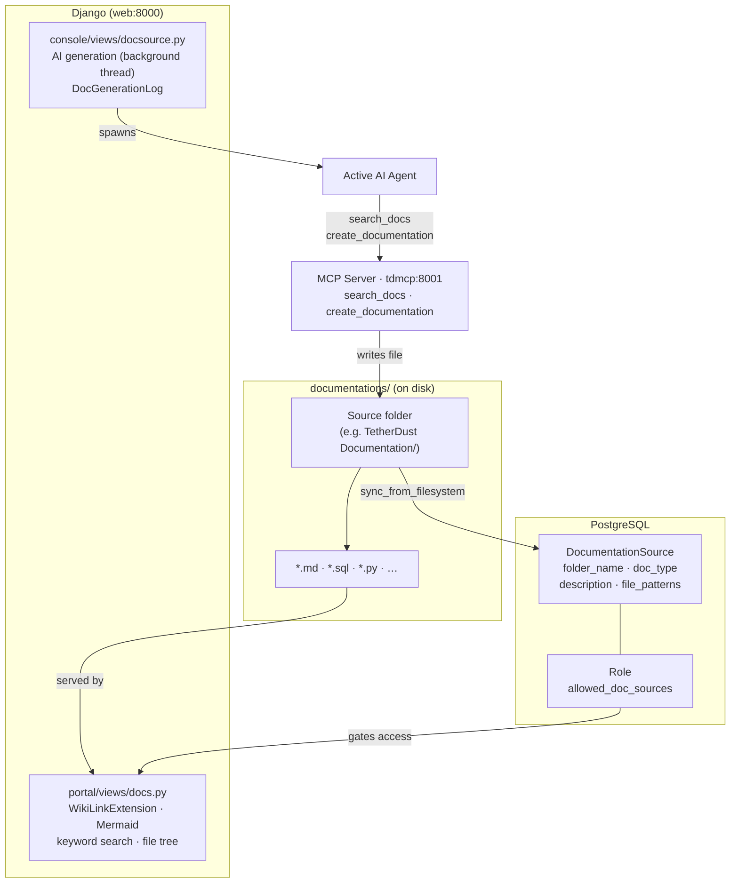
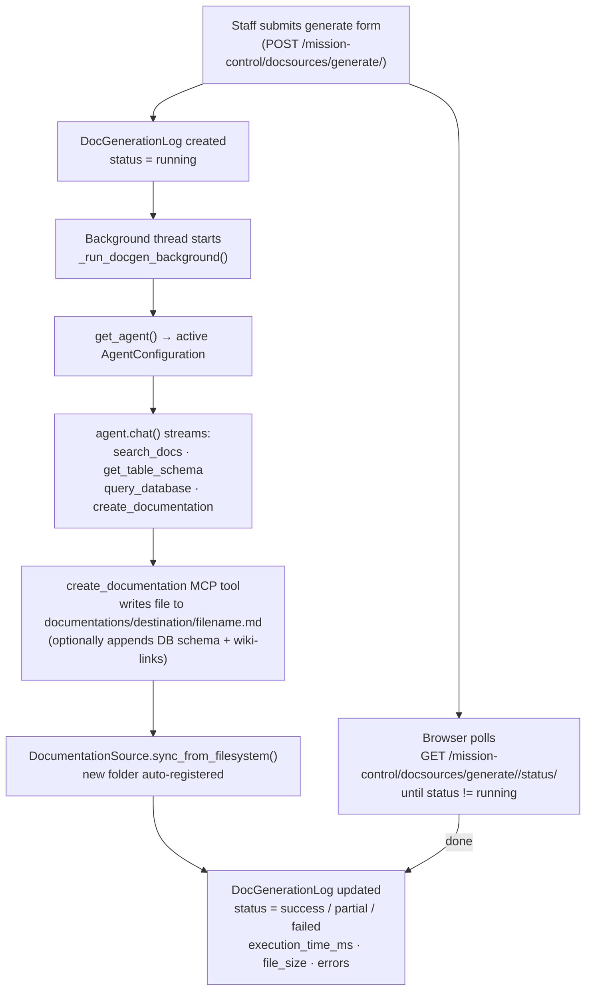

# Docs

The **Docs** feature gives every TetherDust user a built-in documentation
viewer. Markdown files stored on disk are organized into **Documentation
Sources**, each mapping to a folder under `documentations/`. Users browse a
sidebar tree, read rendered markdown, follow wiki-links between pages, and view
Mermaid diagrams — all without leaving TetherDust. Staff can generate new
documentation using the active AI agent directly from the console.

---

## Table of Contents

1. [At a glance](#at-a-glance)
2. [Documentation Sources](#documentation-sources)
3. [The viewer](#the-viewer)
4. [Wiki-link syntax](#wiki-link-syntax)
5. [Access control](#access-control)
6. [AI generation](#ai-generation)
7. [MCP integration](#mcp-integration)

---

## At a glance



---

## Documentation Sources

A **DocumentationSource** (`core/models/connections.py`) is the database record
that represents one top-level folder under `documentations/`. It tells TetherDust
what the folder contains and which files to index.

| Field | Purpose |
|---|---|
| `folder_name` | Unique name matching the disk folder (e.g. `TetherDust Documentation`). |
| `doc_type` | Category label — used in AI prompts and the console UI. |
| `description` | Free-text description. Passed to the AI agent to help it understand what to search. |
| `file_patterns` | JSON list of glob patterns (e.g. `["*.md"]`). Defaults to `["*.md"]` when empty. |
| `is_active` | Whether the source is visible to users and the MCP server. |

### Doc types

| Type | Intended contents |
|---|---|
| `database` | Table schemas, column docs, query examples |
| `codebase` | Source code overviews, API references, module docs |
| `manual` | User/admin guides, SOPs |
| `policy` | Compliance rules, business policies, governance docs |
| `api` | External REST/GraphQL specs, OpenAPI docs |
| `report` | Report templates or historical report definitions |
| `ontology` | Domain glossaries, taxonomies |
| `runbook` | Operational procedures, incident response playbooks |

### Auto-discovery

`DocumentationSource.sync_from_filesystem()` scans the top level of
`documentations/` and keeps the database in sync with the disk:

- **New folder found** → a new `DocumentationSource` record is created (active, `doc_type=database`, no patterns).
- **Existing folder reappears** → the record is re-activated.
- **Folder deleted** → the record is marked inactive (the record is not deleted so the configuration survives a folder rename).

The list view at `console/docsources/` calls this automatically on every page
load. It can also be triggered programmatically: `DocumentationSource.sync_from_filesystem()`.

### Admin management

Staff manage sources at **Console → Documentation Sources**:

- **List** (`/mission-control/docsources/`) — shows all sources with status badges.
- **Add / Edit** — set `doc_type`, `description`, and `file_patterns`.
- **Validate** — HTMX live check: confirms the folder exists and counts matching files with the last-modified timestamp.
- **Delete** — removes the DB record (the folder on disk is not touched).

---

## The viewer

The viewer is at `/docs/` and is login-required.

### Request flow

```
1. GET /docs/  →  portal/views/docs.py:docs_view
   - Loads all DocumentationSource records the user may see.
   - For each source, builds a nested file tree with _build_file_tree()
     (scans the folder using the source's file_patterns).
   - Renders portal/docs.html with the sidebar tree.

2. User clicks a file in the sidebar  →  loadWikiLink() (JavaScript)
   GET /docs/<source_id>/<file_path>  →  docs_content_view

3. docs_content_view:
   - Re-checks access (source_id must be in the user's allowed set).
   - Path-traversal guard: resolved path must stay inside documentations/.
   - Markdown files (.md): rendered with Python-Markdown.
   - Code files (.py, .sql, .ts, …): wrapped in a <pre><code> block with
     a highlight.js language class.
   - Returns the rendered HTML fragment (HTMX replaces the content pane).
```

### Markdown rendering

Markdown files are rendered with **Python-Markdown** and four extensions:

| Extension | Effect |
|---|---|
| `fenced_code` | ` ```lang ``` ` blocks with language labels |
| `tables` | GFM-style pipe tables |
| `toc` | Auto-generates a `[TOC]` anchor tree |
| `codehilite` | Syntax-highlighted code blocks via Pygments |
| `WikiLinkExtension` | Converts `[[Source/path.md\|Display]]` to clickable links (see [Wiki-link syntax](#wiki-link-syntax)) |

**Mermaid diagrams** — code blocks with language `mermaid` are picked up by
mermaid.js v11 (loaded from CDN) and rendered as SVG. Theme follows the
TetherDust dark/light toggle.

**Code files** — non-markdown files matched by `file_patterns` (e.g. `.sql`,
`.py`) are served as highlighted code blocks; they are not markdown-rendered.
Extension-to-language mappings are defined in `_EXT_TO_LANG` in
`portal/views/docs.py`.

---

## Wiki-link syntax

Any markdown file in any documentation source can link to any other file using
the wiki-link syntax:

```
[[Source/path/to/file.md|Display Text]]
[[Source/path/to/file.md]]
```

- **`Source`** is the `folder_name` of the target `DocumentationSource`.
- **`path/to/file.md`** is the path relative to that source's root folder.
- **`Display Text`** is optional; if omitted, the viewer uses the filename
  without the `.md` extension.

At render time, `WikiLinkExtension` (in `portal/views/docs.py`) resolves the
source name to a `DocumentationSource` ID, checks whether the current user has
access to that source, and produces either:

- An `<a class="wikilink">` element that navigates to
  `/docs/<source_id>/<file_path>` via `loadWikiLink()` (in-pane, no page
  reload), or
- A `<span class="wikilink-noaccess">` element with a tooltip if the source
  does not exist or the user lacks access.

> **In table cells**, the `|` separator must be escaped as `\|` to avoid
> conflicting with pipe-table syntax. The Markdown table parser removes the
> backslash before inline patterns run, so `\|` renders correctly as the
> wiki-link separator. Alternatively, use `[[path]]` without a display
> argument in table cells to avoid the escape entirely.

The `create_documentation` MCP tool automatically appends wiki-links to
referenced source files at the end of generated documents.

---

## Access control

The viewer respects TetherDust's role-based access control at two levels:

| Level | Gate |
|---|---|
| **Can the user open `/docs/` at all?** | `UserProfile.can_view_docs` — True if any active source is in the user's allowed set (or the user is staff). |
| **Which sources appear in the sidebar?** | `UserProfile.get_allowed_doc_sources()` — returns the `folder_name` set from `Role.allowed_doc_sources`. Staff users see all active sources. |

Each `docs_content_view` call re-checks access by source ID, so direct URL
access to a file in a source the user's role does not include returns a `403`.

**Staff users** always have unrestricted access — they see all active sources
regardless of role configuration.

**Role assignment** — in the console, open a Role's edit form and add the
desired `DocumentationSource` records to **Allowed doc sources**. The change
takes effect on the next page load; no restart required.

---

## AI generation

Staff can generate documentation files using the active AI agent directly from
the console at **Console → Documentation Sources → Generate with AI**
(`/mission-control/docsources/add/create-with-ai/`).

### What the admin configures

| Field | Purpose |
|---|---|
| Document name | Filename for the output `.md` file. |
| Doc type | Selects the built-in task template (database tables, architecture, query examples). |
| Target folder | Where inside `documentations/` to write the file. |
| Source databases | Databases the agent may introspect via `get_table_schema` / `query_database`. |
| Reference docs | Existing sources the agent may read via `search_docs`. Wiki-links to their files are appended to the output. |
| Source codebases | Repositories the agent may ground the docs in via `list_codebases`, `get_codebase_tree`, `read_codebase_file`, `search_codebase`. |

The prompt itself is not editable from the UI — it is assembled server-side from
the inputs above, so the durable guidance stays in one place.

### Prompt composition

Built-in prompts are assembled in `core/prompts/docs.py` from layered pieces, so
the durable guidance lives in one place and is shared across both generation
modes.

| Layer | Constant | Applies to | Contents |
|---|---|---|---|
| Principles | `CORE_PRINCIPLES` | both modes | The five disciplines: ground claims in source, name real entities, layer concrete→detailed, show structure visually, cross-link don't repeat. |
| Environment | `TETHERDUST_CONTEXT` | both modes | The agent's read tools, how output renders (GFM tables, ` ```mermaid ` diagrams, `[[wiki-link]]` syntax), and how to save via `create_documentation`. Notes that there is no git/commit access, so citations are file/symbol or `database → table → column`. |
| Task (single file) | `DOC_TEMPLATES[doc_type]` | single-file only | The lean per-type instruction for `database_table`, `architecture`, or `query_examples`. |
| Task (library) | `LIBRARY_GUIDE` | library only | The multi-page playbook: overview + deep-dive page hierarchy, page shapes, the seven-step process, and a completion checklist. |

`build_doc_generation_prompt(doc_type, context_parts)` emits *principles +
context + per-type template* (plus any source material). The unknown-`doc_type`
fallback is `database_table`. `build_library_prompt(library_name)` emits
*principles + context + library guide + the named task* — the library
scaffolding never leaks into single-file prompts. Both functions are exported
from `core.prompts` and covered by `tests/test_doc_prompts.py`.

> **Library generation** is the multi-file counterpart, reached from the
> documentation **Add** picker → **Create Documentation Library**
> (`docsources/add/create-library/`). The agent plans a folder tree and calls
> `create_documentation` once per file (with a root `index.md` linking the
> pages), tracked at the folder level rather than a single expected filename.

### Generation flow



The generation request returns immediately with a `log_id`; the browser polls
the status endpoint until `status` is no longer `running`.

### create_documentation MCP tool

`create_documentation` (`mcp_server/tools/create_documentation.py`) is the only
MCP tool that writes files. It is always force-enabled during generation
regardless of the role's tool allow-list. Parameters:

| Parameter | Purpose |
|---|---|
| `destination` | Target folder path within `documentations/` (subdirectories are created automatically). |
| `filename` | Output filename; `.md` is appended if absent. |
| `content` | The markdown content to write. |
| `databases` | Optional list of database names — a **Database Schema Reference** section with full table/column details is appended. |
| `reference_docs` | Optional list of source names — existing files in those sources are appended as wiki-links. |

Path traversal is blocked: `..` segments are stripped and the resolved path
must remain inside `documentations/`.

### DocGenerationLog

Every generation run is recorded in `DocGenerationLog`
(`core/models/agent.py`):

| Field | Contents |
|---|---|
| `status` | `running` → `success` / `partial` / `failed` |
| `execution_time_ms` | Wall-clock duration of the generation thread. |
| `source_databases` / `source_docs` | The databases and doc sources selected for the run. |
| `prompt_used` | Full prompt sent to the agent (including the tool instruction). |
| `agent_output` | Last streamed output or final response from the agent. |
| `errors` | Structured list of per-database errors extracted from the tool return. |
| `file_size` | Bytes written to disk on success. |

`partial` status means the file was written but at least one database was
unavailable during schema introspection.

---

## MCP integration

Documentation sources are exposed to the AI agent in the chat via the
`search_docs` MCP tool (`mcp_server/tools/search_docs.py`).

### search_docs

`search_docs(query)` runs a keyword search across all markdown files in every
active, accessible documentation source:

1. Splits the query into terms.
2. Iterates every file matched by the source's `file_patterns`.
3. Splits each file into sections at headings (H1–H3).
4. Scores each section: the number of query terms found in
   `heading + body + filename`.
5. Returns the top-scored sections as `SearchResult` records, each carrying a
   snippet, source name, file path, and relevance score.

Access is enforced by the MCP filter token: `get_allowed_doc_sources()` returns
the set of sources the requesting user's role permits, and results from other
sources are filtered out before the response is returned.

The `description` field on `DocumentationSource` is loaded by the MCP server at
startup and included in the tool's source listing so the agent can choose which
source to search against a given question.

### get_query_examples

`get_query_examples` (`mcp_server/utils/markdown_parser.py`) reads query
example blocks from `database`-type sources. It parses structured Markdown
sections with titles, descriptions, table lists, and SQL code blocks — allowing
the agent to surface ready-made queries rather than writing them from scratch.
