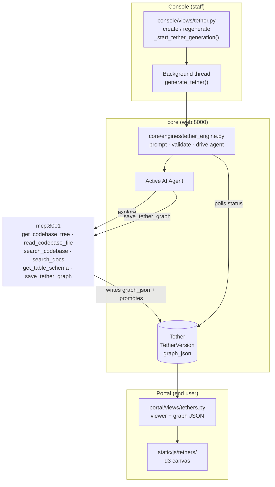
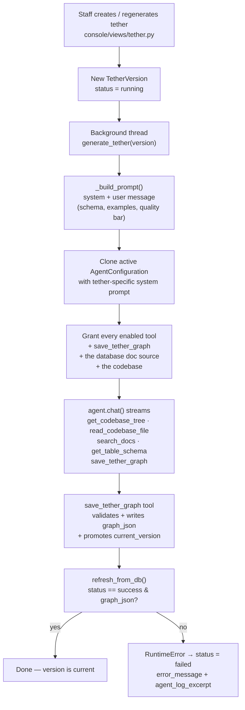

# Tethers

A **Tether** is a visual link between a **codebase** and the **database** it
talks to. Point TetherDust at one
[[TetherDust Documentation/2. Features/9. Codebases.md\|Codebase]] and one
`database` documentation source, and the AI agent explores both, works out which
code files and functions read or write which tables and columns, and persists
the result as a graph. Users then browse that graph on an interactive canvas —
ER-style cards for tables and code files, with expressive edges showing reads,
writes, references, and column mappings. Each generation run is stored as an
immutable **version**, so a tether keeps its history as the code and schema
drift.

---

## Table of Contents

1. [At a glance](#at-a-glance)
2. [Tethers and versions](#tethers-and-versions)
3. [The graph schema](#the-graph-schema)
4. [Generation](#generation)
5. [The save_tether_graph tool](#the-save_tether_graph-tool)
6. [The viewer](#the-viewer)
7. [Access control](#access-control)
8. [Managing tethers in the console](#managing-tethers-in-the-console)

---

## At a glance

---

## Tethers and versions

Two models in `core/models/tethers.py` back the feature.

**`Tether`** — the link definition. One row per codebase↔database pair.

| Field | Purpose |
|---|---|
| `name` / `description` | Display metadata. |
| `codebase` | FK to a [[TetherDust Documentation/2. Features/9. Codebases.md\|`Codebase`]] (a GitHub repository). `on_delete=PROTECT`. |
| `database_doc_source` | FK to a `DocumentationSource` with `doc_type=database`. `on_delete=PROTECT`. |
| `current_version` | FK to the latest **successful** `TetherVersion` — this is what the viewer renders. `SET_NULL` if removed. |
| `allowed_roles` | M2M to `Role`. Which roles may view this tether. |
| `is_active` | Hides the tether without deleting it. |
| `created_by` / `created_at` / `updated_at` | Audit metadata. |

The console form offers active **Codebases** for the code side and
`database`-typed documentation sources for the data side. See
[[TetherDust Documentation/2. Features/9. Codebases.md\|Codebases]] for the code
side and [[TetherDust Documentation/2. Features/3. Docs.md\|Docs]] for how
doc-source types are assigned.

**`TetherVersion`** — one generation run. Versions are immutable history.

| Field | Purpose |
|---|---|
| `tether` | FK to the parent. |
| `version_number` | Monotonic per tether (`unique_together` with `tether`). |
| `status` | `running` → `success` / `failed`. |
| `graph_json` | The validated graph (nodes, edges, summaries). Populated by the tool. |
| `started_at` / `completed_at` / `execution_time_ms` | Timing. |
| `error_message` | Failure reason, if any. |
| `agent_log_excerpt` | Last ~4 kB of the agent stream — powers the live status poll while running and post-mortem debugging on failure. |
| `prompt_used` | The exact user message sent to the agent. |
| `triggered_by` | The staff user who started the run. |

Only a **successful** run with a non-empty `graph_json` is promoted to the
tether's `current_version`. A failed run stays in the history but never becomes
what users see.

---

## The graph schema

The graph is a versioned JSON document. The current schema is **v2**, defined
and validated in `core/engines/tether_engine.py` (and re-validated in the MCP
tool). Top-level keys: `schema_version`, `generated_at`, `codebase_summary`,
`database_summary`, `nodes`, `edges`.

### Nodes

Every node has the required keys `id`, `label`, `kind`, `parent_id`, plus
optional kind-specific metadata.

| `kind` | Represents | Parent | Notable optional fields |
|---|---|---|---|
| `code-file` | A source file. | none (top level) | `description`, `language`, `path` |
| `code-symbol` | A function/method inside a file. | a `code-file` | `description`, `signature`, `snippet`, `line_range` |
| `db-table` | A database table. | none (top level) | `description`, `schema`, `row_count_hint` |
| `db-column` | A column inside a table. | a `db-table` | `description`, `data_type`, `nullable`, `primary_key`, `foreign_key` |

### Edges

Edges connect any two node ids that appear in `nodes`.

| Field | Purpose |
|---|---|
| `source_id` / `target_id` | Endpoint node ids (must exist in `nodes`). |
| `relationship` | One of `reads`, `writes`, `references`, `maps-to`. |
| `confidence` | Float in `[0.0, 1.0]` — how sure the agent is. |
| `description` | One sentence on *why* the edge exists. |
| `evidence_snippet` / `evidence_lang` | The actual SQL/code excerpt that justifies the edge, and its language for highlighting. |

### Validation rules

`validate()` rejects a graph (raising `TetherSchemaError`) if any of these fail:

- `nodes` and `edges` must both be arrays.
- Every node needs a unique string `id`, a string `label`, and a `kind` in the
  allowed set.
- A `code-symbol` must have a `code-file` parent; a `db-column` must have a
  `db-table` parent; parent ids must resolve to a node of the right kind.
- Every edge endpoint must reference a node id that exists.
- Every edge `relationship` must be in the allowed set and `confidence` must be
  in `[0.0, 1.0]`.

Because validation runs both in the engine and inside the tool, an invalid graph
is rejected before it can be persisted — a malformed `save_tether_graph` call
returns an error instead of corrupting the version.

---

## Generation

Generation is triggered from the console — either automatically when a new
tether is created, or via the **Regenerate** action. It runs **inside the web
container** (not a Celery worker) so the agent service URL is available, on a
background thread.

Key behaviours from `core/engines/tether_engine.py`:

- **The prompt does the heavy lifting.** `_build_prompt()` hands the agent a
  schema description, worked examples (a code-symbol node with a snippet, a
  db-column node with type/FK, an edge with an evidence snippet), and a quality
  bar (every code-file should have child symbols, every db-column should carry
  `data_type`, every edge should carry evidence). It points the agent at the
  codebase tools (`get_codebase_tree`, `read_codebase_file`, `search_codebase`)
  for the code side and `search_docs` for the database side, and explicitly tells
  it: *don't paste the graph in chat — only the tool call counts.*
- **It clones the active agent** with a tether-specific system prompt, carrying
  both the auth token and API key so the clone authenticates regardless of agent
  type. See [[TetherDust Documentation/3. Agent Integrations/1. Overview.md\|Agent Integrations]].
- **It grants tools generously** — every enabled tool on an active MCP server,
  plus `save_tether_graph`, plus read access to the database doc source and the
  linked codebase (`allowed_codebases`).
- **Live status** — each streamed chunk is scrubbed and written to
  `agent_log_excerpt`, so the console detail page can poll
  `tether_status_view` and show what the agent is thinking in real time.
- **The tool is the source of truth.** The engine does not write `graph_json`
  itself. After the stream ends it re-reads the row; success requires that the
  agent actually called `save_tether_graph` and that the row now has a graph.
  If not, the run is marked failed with a message pointing at the agent log.
- **Timeout** — `TETHER_GEN_TIMEOUT` (default 1800s / 30 minutes), because a
  rich graph takes far longer than a normal chat turn.

---

## The save_tether_graph tool

`save_tether_graph` (`mcp_server/tools/save_tether_graph.py`) is the only way a
graph gets persisted. It is a built-in MCP tool (see
[[TetherDust Documentation/2. Features/5. Built-in MCP.md\|Built-in MCP]]) and
takes `version_id`, `nodes`, `edges`, and the two summaries.

On call it:

1. **Validates** the nodes and edges against the v2 schema; returns a
   `{"success": false, "error": …}` JSON string if anything is wrong.
2. **Looks up** the `TetherVersion` row by `version_id` (failing cleanly if it
   does not exist).
3. **Writes** the assembled `graph_json` (schema version, timestamp, summaries,
   nodes, edges), sets `status = 'success'`, fills `completed_at` and
   `execution_time_ms`, and clears `error_message`.
4. **Promotes** the version to its tether's `current_version` so the viewer
   immediately renders the new graph.

It talks to the app database directly over SQLAlchemy (via the admin engine),
since the MCP service runs without Django.

---

## The viewer

The end-user viewer lives in `portal/views/tethers.py` and is login-required:

| Route | View | Returns |
|---|---|---|
| `/tethers/` | `tethers_list_view` | The list of tethers the user's role allows. |
| `/tethers/<pk>/` | `tether_view` | The viewer page for one tether (404 if not allowed). |
| `/tethers/<pk>/graph/` | `tether_graph_json_view` | The current version's `graph_json` as JSON; `{nodes:[], edges:[], status:"pending"}` if no version exists yet. |

### The canvas

The front end is a d3-powered canvas under `static/js/tethers/` (entry:
`canvas.js`). It fetches the graph JSON and renders a mixed SVG + HTML scene:

- **Cards** (HTML) — one ER-style card per `code-file` and `db-table`
  container; child `code-symbol` / `db-column` nodes are rows inside the card.
- **Edges** (SVG) — tapered, animated wave paths with direction pulses; only the
  container nodes participate in the d3-force simulation, while child rows
  resolve to precise anchor points for row-level edges.
- **Detail panel** — the `codebase_summary` / `database_summary` and per-node /
  per-edge metadata (snippets, signatures, evidence) are shown on selection.

If the graph is empty (generation still running or never succeeded) the canvas
shows a "No graph yet" banner instead.

---

## Access control

Tethers are gated at two levels, both enforced in every portal view:

| Gate | Check |
|---|---|
| **Can the user open Tethers at all?** | `UserProfile.can_view_tethers` — requires `Role.can_view_tethers` **and** at least one accessible tether. Staff bypass. |
| **Which tethers can they see?** | `UserProfile.get_allowed_tethers()` — `Tether` rows whose `allowed_roles` include the user's role and that are `is_active`. Staff see all active tethers. |

Direct URL access to a tether the role does not include returns a `404`. The
generation and management actions are all `@staff_member_required`.

---

## Managing tethers in the console

Staff manage tethers at **Console → Tethers** (`console/views/tether.py`):

- **List** — every tether with its latest version's status.
- **Create** — pick a name, the codebase, the database source, and the
  allowed roles. Saving a *new* tether immediately kicks off the first
  generation run.
- **Detail** — shows all versions, the current version, and (while a run is in
  progress) polls `tether_status_view` for live agent output.
- **Regenerate** — starts a fresh `TetherVersion`; the previous one stays in
  history and remains current until the new run succeeds.
- **Version detail** — inspect any past run's graph, prompt, timing, and log
  excerpt.
- **Delete** — removes the tether and all its versions.

Because generation depends on the active agent and the built-in MCP tools, a
tether can only be generated when an `AgentConfiguration` is active and the MCP
server is reachable.
