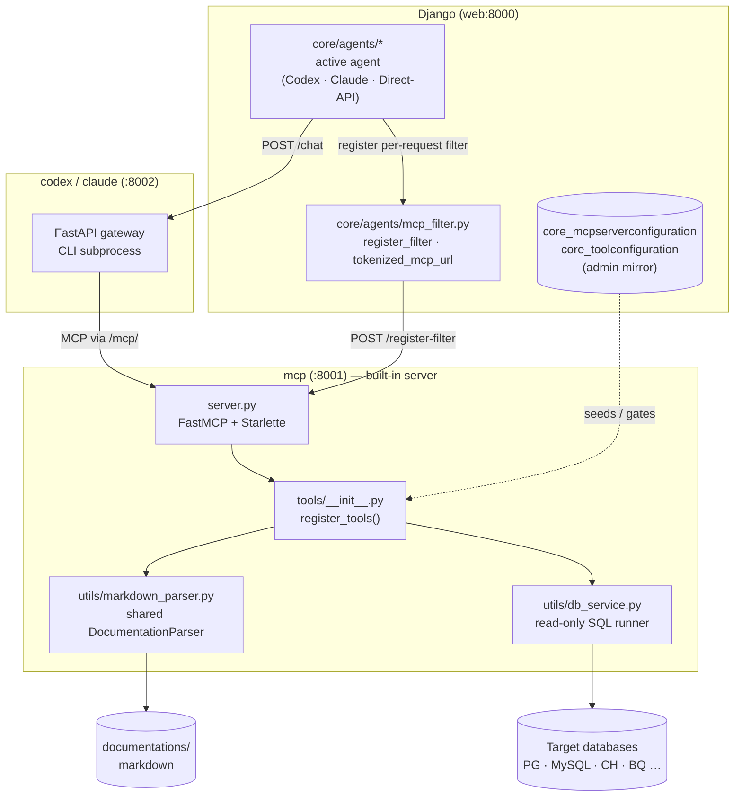

# Built-in MCP

The **built-in MCP server** is the set of core tools that ship with TetherDust. It is a standalone Python service (the `mcp` container, port 8001) that exposes database-querying, documentation, dashboard, and tether tools to the active AI agent over the Model Context Protocol. Every chat answer that touches data flows through these tools. The server is always active, cannot be deleted, and its individual tools can be enabled, disabled, and granted to roles from the console.

---

## Table of Contents

1. [At a glance](#at-a-glance)
2. [What "built-in" means](#what-built-in-means)
3. [The tools](#the-tools)
4. [How tools are registered and served](#how-tools-are-registered-and-served)
5. [The database mirror](#the-database-mirror)
6. [Seeding](#seeding)
7. [Access control and tool filtering](#access-control-and-tool-filtering)
8. [Read-only enforcement](#read-only-enforcement)
9. [Managing the built-in server in the console](#managing-the-built-in-server-in-the-console)
10. [Editing tools: what needs a restart](#editing-tools-what-needs-a-restart)

---

## At a glance



---

## What "built-in" means

There are two distinct things called "the built-in MCP server", and keeping them separate is the key to understanding this feature:

1. **The running service** — the `mcp` container. It is a long-running Python process (`python -m mcp_server.server`) that actually executes the tools. The agent connects to it over HTTP at the URL given by `MCP_BASE_URL` (default `http://tdmcp:8001`), and this is the *only* place tool calls are executed and enforced.

2. **The database mirror** — a single `MCPServerConfiguration` row with `is_builtin=True`, plus one `ToolConfiguration` row per tool. These rows do **not** run anything. They exist so the console can display and manage the server, and so roles can grant or revoke individual tools.

The agent reaches the built-in tools through the *service*, not through the mirror — so the tools work even if the mirror rows are missing. The mirror only governs **console visibility** and **role-based tool grants**.

---

## The tools

The built-in server registers fifteen tools (`tdmcp/tools/__init__.py`, `register_tools()`):

| Tool | Purpose |
|---|---|
| `list_tables` | List all documented database tables, grouped by domain. The agent's first stop when discovering what data exists. |
| `get_table_schema` | Full schema for one table: columns, data types, descriptions, enum/status mappings, example values. |
| `search_docs` | Semantic search over documentation for data flows, business logic, table relationships, and architecture. |
| `get_query_examples` | Verified, working SQL examples for common use cases. The agent is instructed to call this *before* writing a new query. |
| `list_databases` | List configured database connections and their descriptions. |
| `query_database` | Execute a read-only `SELECT` and return results. Write statements are rejected; results are row-limited. |
| `create_documentation` | Create or overwrite a documentation file; it becomes immediately searchable via `search_docs`. |
| `create_dashboard` | Create a new dashboard container and return its `dashboard_id`. |
| `add_chart` | Add a d3.js chart to a dashboard; the chart's SQL runs against a chosen database. |
| `update_chart` | Update an existing chart's title, description, SQL, or d3 code. Reachable only from the chart-edit panel, not general chat. |
| `save_tether_graph` | Persist a tether graph (nodes, edges, summaries) to a version and promote it to the tether's current version. |
| `list_codebases` | List the source-code repositories (codebases) available to the role. |
| `get_codebase_tree` | List files in a codebase from its cached tree, optionally scoped to a sub-path. |
| `read_codebase_file` | Read one file's contents, fetched live from GitHub on the codebase's branch. |
| `search_codebase` | Search code within a codebase via GitHub code search; falls back to tree/file navigation. |

Each tool lives in its own module under `tdmcp/tools/` as a plain async function. The data tools share a single `DocumentationParser` instance (`get_shared_parser()`); the dashboard, chart, and tether tools write directly to the app database (`core_dashboard`, `core_chart`, `core_tether`, `core_tetherversion`) over SQLAlchemy; the codebase tools read repositories live from the GitHub API (see [[TetherDust Documentation/2. Features/9. Codebases.md\|Codebases]]).

---

## How tools are registered and served

`register_tools(mcp)` registers each function on a `FastMCP` instance with `mcp.tool()(handler)`. FastMCP derives the tool's MCP metadata from the function itself:

- **name** ← the function name (e.g. `query_database`)
- **description** ← the function docstring (this is the text the agent actually sees)
- **input schema** ← the function signature and type hints

So the function source is the single source of truth for what the agent sees. The `ToolConfiguration.description` in the database is an admin-facing mirror, not what is sent to the agent.

`server.py` builds a Starlette app around the FastMCP server and supports three transports selected by `MCP_TRANSPORT`:

| Transport | Use |
|---|---|
| `stdio` | Standalone / local CLI use. |
| `sse` | Server-Sent Events HTTP transport. |
| `streamable-http` | The Docker default. Serves MCP at `/mcp/<token>`, where `<token>` is a per-request filter token (see [Access control](#access-control-and-tool-filtering)). |

The container resolves its documentation sources by querying the app database directly via `ADMIN_DATABASE_URL` (`_load_sources_from_admin_db()` reads `core_documentationsource`), since the MCP service runs without Django. If that is unavailable it falls back to filesystem resolution.

---

## The database mirror

Two models in `web/core/models/connections.py` back the mirror.

**`MCPServerConfiguration`** — one row per MCP server. The built-in server is the row with `is_builtin=True`. It has a blank `url`/`transport` (it is served in-process, not over a configured URL) and is always `is_active=True`. Built-in rows are protected: the console refuses to edit, delete, or connectivity-test them.

**`ToolConfiguration`** — one row per tool, linked to its server by FK. Relevant fields:

| Field | Purpose |
|---|---|
| `tool_name` | Internal name; must match the registered function name. Globally unique. |
| `display_name` | Human-readable label shown in the console. |
| `description` | Admin-facing description (not sent to the agent for built-in tools). |
| `is_enabled` | Toggle that hides the tool from agents without deleting the row. |
| `input_schema` / `source_code` / `settings` | Used by custom tools; left blank for built-ins. |

---

## Seeding

Because the built-in rows are reference data, they are seeded idempotently rather than hand-created. The canonical definition lives in `web/core/builtin_mcp.py` (`BUILTIN_SERVER_NAME`, `BUILTIN_TOOLS`, and `ensure_builtin_mcp()`), and it is wired to Django's `post_migrate` signal in `core/apps.py`:

```python
# core/apps.py
post_migrate.connect(_seed_builtin_mcp, sender=self)
```

Behaviour:

- **Runs on every `migrate`.** A fresh install always ends up with the built-in server and its fifteen tool rows.
- **Self-healing.** If the server row is deleted, the next migrate recreates it.
- **Create-only.** Existing rows are never overwritten, so admin edits and enable/disable toggles survive deploys. The trade-off: changing a tool's `display_name`/`description` in `builtin_mcp.py` only affects *new* rows, not installs that already have them.

This mirrors how Django itself seeds permissions and content types via `post_migrate`.

---

## Access control and tool filtering

Role-based access is enforced at the **MCP layer**, not in the agent. The CLI runs autonomously and decides which tools to call with no interception hook once running, so the MCP server is the only reliable enforcement point.

The flow, per request:

1. The chat consumer resolves the user's permissions from their role — `UserProfile.get_allowed_tools()` (`core/models/auth.py`) and the matching `get_allowed_databases()`, `get_allowed_doc_sources()`, `get_allowed_codebases()`, `get_max_row_limit()`.
2. `core/agents/mcp_filter.py` registers a per-request token with the MCP server (`register_filter()` → `POST /register-filter`) and hands the agent a tokenized URL (`tokenized_mcp_url()` → `/mcp/<token>`). This happens even for unrestricted users; an all-`None` filter is an all-access token.
3. The MCP server applies the token's filter on every call.

`None` means **unrestricted**; an empty list means **deny-all**. A token is still
registered in both cases because the streamable HTTP `/mcp` endpoint fails closed
without a known token:

| User | `get_allowed_tools()` | Result |
|---|---|---|
| Staff, including users made staff by an admin role | `None` | All-access token registered — full built-in toolset. |
| Role with specific tools granted | set of `tool_name`s | Only those tools (that are `is_enabled` and on an active server) are callable. |
| Role with no tools granted | empty set | Deny-all filter — every built-in tool call is blocked. |

The enforcement is **hide-vs-block**: the server's `list_tools` is guidance (it hides disallowed tools), while `call_tool` is the authoritative wall and **fails closed** for unknown or disallowed tools. Unknown or expired filter tokens are rejected. If filter registration fails (MCP unreachable, timeout, HTTP error), the agent yields a user-facing error and returns — it does **not** fall back to an unfiltered request.

> Because the role mirror grants tools by `ToolConfiguration` row, the seeded built-in tool rows are what make it possible to grant built-in tools to a non-admin role at all.

---

## Read-only enforcement

`query_database` and other SQL paths run through `tdmcp/utils/db_service.py`, which validates every statement and rejects anything that is not a read (`INSERT`, `UPDATE`, `DELETE`, `DROP`, etc. are blocked). Results are capped by the effective row limit (`max_row_limit` from the role, or the system default). The agent is also instructed, via the tool descriptions, to consult `get_query_examples` and `get_table_schema` before composing SQL.

---

## Managing the built-in server in the console

In **Console → MCP Servers**, the built-in server appears at the top of the list (servers are ordered `-is_builtin, name`). Clicking it opens the detail page where staff can:

- View every built-in tool and its description.
- **Enable / disable** individual tools (HTMX toggle). A disabled tool is unavailable to all agents regardless of role.
- Edit a tool's display name and description.

The server itself is read-only: the edit, delete, and connectivity-test actions are blocked for built-in rows (`console/views/mcp_server.py`). Custom MCP servers — added and edited freely — are covered in **6. Custom MCPs**.

---

## Editing tools: what needs a restart

The answer depends on *what* you change:

| Change | Picked up by |
|---|---|
| **Tool source code** (`mcp_server/tools/*.py`) | The source is mounted into the `mcp` container, but the process does not auto-reload. Run `docker compose restart mcp`. No image rebuild is needed. |
| **Tool config in the console** (description, enable/disable, role grants) | Live — read from the database on every request. No restart. |
| **A custom (local) MCP server's config** | Live — the console pings the local-mcp `/reload` endpoint on save. |
| **A custom MCP server's code** (`docker/local_mcp/`) | Not mounted; rebuild with `docker compose up -d --build local-mcp`. |

In short: editing a built-in tool's Python requires a quick `restart mcp` (no rebuild); editing tool settings in the UI takes effect immediately.
