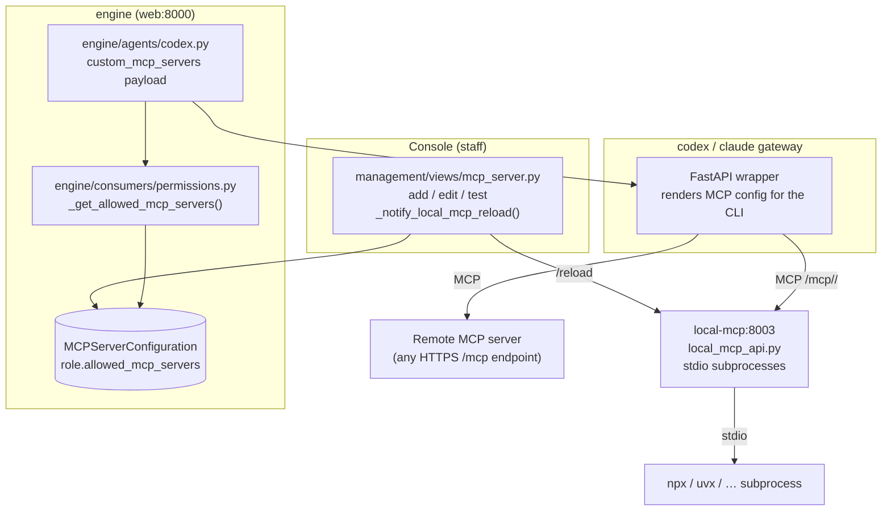

# Custom MCPs

The [[TetherDust Documentation/2. Features/5. Built-in MCP.md\|built-in MCP server]]
ships with the database, documentation, dashboard, and tether tools. **Custom
MCPs** are everything beyond that: extra Model Context Protocol servers that
staff register to give the agent new capabilities — a Notion integration, a
GitHub server, an internal company API, anything that speaks MCP. TetherDust
supports two kinds: **remote** servers (an HTTP MCP endpoint you point at) and
**local** servers (a stdio subprocess TetherDust launches and proxies). Either
way, access is gated per role, so a custom MCP can be granted to some teams and
withheld from others.

---

## Table of Contents

1. [At a glance](#at-a-glance)
2. [Remote vs. local servers](#remote-vs-local-servers)
3. [The configuration model](#the-configuration-model)
4. [The local MCP proxy](#the-local-mcp-proxy)
5. [How custom servers reach the agent](#how-custom-servers-reach-the-agent)
6. [Access control](#access-control)
7. [Managing custom servers in the management](#managing-custom-servers-in-the-management)
8. [Connectivity testing](#connectivity-testing)
9. [What needs a reload or restart](#what-needs-a-reload-or-restart)

---

## At a glance

---

## Remote vs. local servers

| | **Remote** | **Local (subprocess)** |
|---|---|---|
| What it is | An MCP server already running somewhere, reachable over HTTP. | A command TetherDust runs as a child process (stdio transport). |
| You provide | A `url` (e.g. `https://example.com/mcp`), optional `auth_token` and `headers`. | A `command` (e.g. `npx`, `uvx`) and `args`, plus optional env vars. |
| Transport | `sse` or `streamable-http`. | stdio, proxied to streamable-http by the `local-mcp` container. |
| Runs where | The third party's infrastructure. | The `local-mcp` container (port 8003). |
| Identified by | `is_local == False` and a non-empty `url`. | `is_local == True` — has a `command`, not built-in. |

Both are the same model row (`MCPServerConfiguration`); the presence of a
`command` is what makes a server "local".

---

## The configuration model

`MCPServerConfiguration` (`engine/models/connections.py`) backs both kinds, plus
the built-in mirror.

| Field | Used by | Purpose |
|---|---|---|
| `name` | all | Unique display name. |
| `description` | all | What the server provides. |
| `url` | remote | Full MCP endpoint URL. |
| `transport` | remote | `sse` or `streamable-http` (blank = built-in). |
| `_auth_token` / `auth_token` | remote | Encrypted bearer token, sent as `Authorization: Bearer …`. |
| `headers` | remote | Extra HTTP headers (e.g. `{"X-API-Key": "…"}`). |
| `command` | local | Executable to run (`npx`, `uvx`, …). |
| `args` | local | Argument list, e.g. `["-y", "@notionhq/notion-mcp-server"]`. |
| `_command_env` / `command_env` | local | Encrypted JSON dict of subprocess env vars (API keys, etc.). |
| `is_active` | all | Hides the server without deleting it. |
| `is_builtin` | built-in | Protected flag — built-in rows cannot be edited, deleted, or tested. |

The `auth_token` and `command_env` properties transparently encrypt/decrypt via
the Fernet helper (`_encryption.py`), so secrets are never stored in plaintext.
The convenience property `is_local` returns `True` when a server has a `command`
and is not built-in.

Tools and prompts a server provides are mirrored as `ToolConfiguration` and
`PromptConfiguration` rows linked by FK — the same models the built-in server
uses (see [[TetherDust Documentation/2. Features/5. Built-in MCP.md\|Built-in MCP]]).

---

## The local MCP proxy

Local subprocess servers are managed by a **separate container**, `local-mcp`
(`docker/local_mcp/local_mcp_api.py`, port 8003). The Django web container does
not spawn subprocesses itself — it delegates to this proxy. Why a separate
service? stdio MCP servers are long-running child processes that must persist
across requests; isolating them keeps the web app stateless.

How it works:

1. **On startup and on `/reload`**, the proxy reads PostgreSQL directly
   (`_load_servers()`), selecting active, non-built-in rows that have a
   `command`. It decrypts `command_env` with `TETHERDUST_ENCRYPTION_KEY`.
2. For each row it starts a **`_ServerProxy`** — a persistent `ClientSession`
   connected to the subprocess over stdio. The proxy tracks each server's state
   (`pending` → `starting` → `ready` / `failed` / `stopped`) and captures
   subprocess stderr so a crash surfaces the real reason (missing npm package,
   bad API key, traceback) rather than a bare "Connection closed".
3. **Incoming requests** hit `POST /mcp/{server_id}/`. The proxy forwards the
   JSON-RPC method to the right subprocess session and returns the result —
   `initialize`, `tools/list`, `tools/call`, `prompts/list`, `prompts/get`,
   `resources/list`, and `ping` are dispatched; notifications get a fire-and-
   forget `202`.

Operational endpoints: `GET /healthz`, `GET /status` (per-proxy state and last
error), and `POST /reload` (re-read the DB and sync running proxies).

---

## How custom servers reach the agent

Custom servers are wired into a chat turn, not registered globally. The flow:

1. **On WebSocket connect**, the chat consumer resolves the user's allowed
   custom servers via `_get_allowed_mcp_servers()`
   (`engine/consumers/permissions.py`). For each:
   - **Local** servers become a dict pointing at the proxy:
     `{"name", "url": "<local_mcp_base>/mcp/<id>/", "transport": "streamable-http", …}`.
   - **Remote** servers become a dict with the configured `url`, `transport`,
     decrypted `auth_token`, and `headers`.
   - The built-in server is **excluded** here — it is always available and the
     gateway renders its config regardless.
2. **On each turn**, the consumer passes the list as `custom_mcp_servers=` to
   `agent.chat()` (`workspace/consumers/chat.py`).
3. **The agent** forwards it to the gateway in the `/chat` payload
   (`engine/agents/codex.py`), which renders MCP server config the CLI understands
   so the model can call those tools.

The `local_mcp_base_url` is resolved from `SystemConfiguration` or the
`LOCAL_MCP_BASE_URL` env var (default `http://local-mcp:8003`).

---

## Access control

Custom MCP servers are an **explicit allow-list**, unlike most other
permissions. `Role.allowed_mcp_servers` is an M2M; an empty list means the role
can use *only* the built-in server.

| User | `get_allowed_mcp_servers()` |
|---|---|
| Staff, including users made staff by an admin role | All active, non-built-in servers. |
| Role with servers granted | Just those (active, non-built-in). |
| Role with none granted | None — built-in only. |
| No role | None. |

The built-in server is **always** available to everyone and is never part of
this list (`engine/models/auth.py`). Tool-level access within a server still
applies on top — a granted server's individual tools are gated by the role's
`allowed_tools` and the tool's `is_enabled` flag.

---

## Managing custom servers in the management

Staff manage servers at **Console → MCP Servers** (`management/views/mcp_server.py`):

- **List** — all servers, built-in pinned first (`-is_builtin, name`).
- **Add / Edit** — set remote fields (`url`, `transport`, `auth_token`,
  `headers`) or local fields (`command`, `args`, `command_env`). Built-in rows
  cannot be edited — the form redirects to the read-only detail page.
- **Detail** — view the server's tools and prompts; toggle, edit, or delete
  individual tools/prompts.
- **Delete** — removes the server (and cascades its tool/prompt rows). Blocked
  for built-in.

Saving or deleting a **local** server automatically fires
`_notify_local_mcp_reload()`, which POSTs `/reload` to the `local-mcp` container
on a background thread so the running subprocess set re-syncs immediately.

Grant a server to a role from the Role edit form (**Allowed MCP servers**);
changes take effect on the next chat connection.

---

## Connectivity testing

The detail page's **Test** action (`mcp_server_test_view`) probes a server with
a real `initialize` + `tools/list` handshake and reports back:

- HTTP status and latency for each step.
- The server's protocol version, name, and version.
- The discovered tool count and a preview of up to 50 tool names/descriptions.
- For remote servers, whether an auth token and custom headers were sent.

It understands both plain JSON and `text/event-stream` responses, follows the
MCP session-id handshake, and returns a structured error (connection refused,
timeout, non-JSON body, JSON-RPC error) instead of throwing. Local servers are
tested through the proxy URL (`/mcp/<id>/`) with a longer timeout, since a cold
subprocess may take time to boot. Built-in servers are not testable here — they
run in-process in the `mcp` container.

---

## What needs a reload or restart

| Change | Picked up by |
|---|---|
| **Remote server config** (url, token, headers) | Live — read per chat connection. No restart. |
| **Local server config** (command, args, env, active toggle) | Live — the management pings the local-mcp `/reload` on save; the proxy re-syncs subprocesses. |
| **Role grants** (`allowed_mcp_servers`) | Live — applied on the next chat connection. |
| **The `local-mcp` container's own code** (`docker/local_mcp/`) | Rebuild: `docker compose up -d --build local-mcp`. |

In short: configuring custom servers and granting them to roles is all live;
only changing the proxy service's source requires a rebuild.
