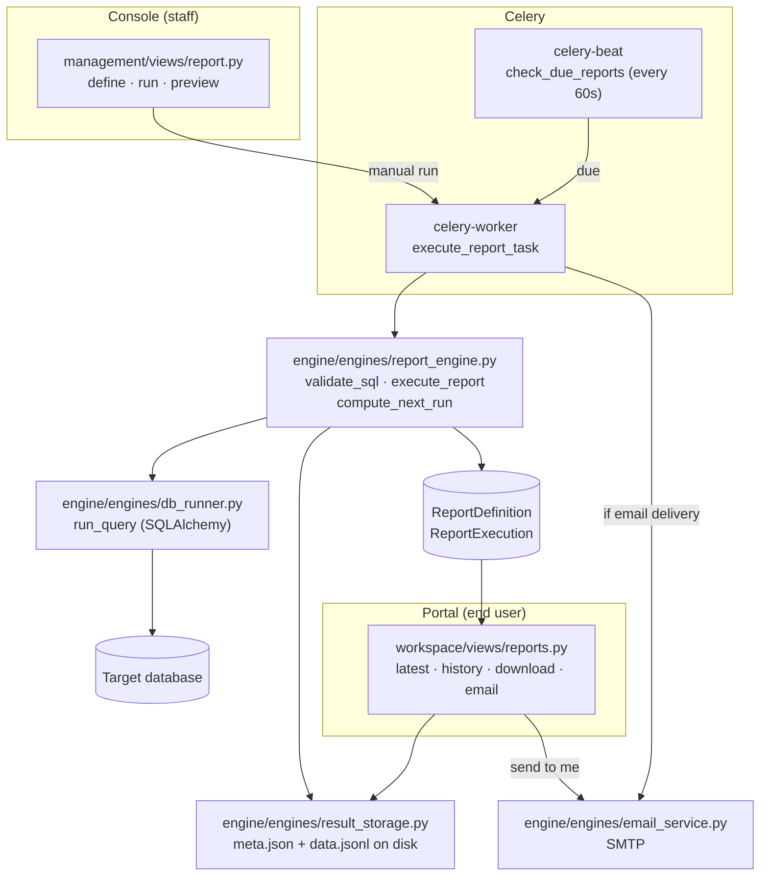

# Reports

A **Report** is a saved read-only SQL query that runs on a schedule (or on
demand) against a configured database, with its results stored for later viewing,
download, and email delivery. Where [[TetherDust Documentation/2. Features/2. Chat.md\|Chat]]
is interactive and exploratory, Reports are repeatable and unattended: a staff
member writes the query once, picks a cadence, and grants it to roles —
thereafter Celery runs it automatically and users read the latest results in the
workspace. No AI agent is involved; reports are plain SQL executed directly.

---

## Table of Contents

1. [At a glance](#at-a-glance)
2. [Report definitions and executions](#report-definitions-and-executions)
3. [Scheduling](#scheduling)
4. [Execution](#execution)
5. [Result storage](#result-storage)
6. [Read-only enforcement](#read-only-enforcement)
7. [The viewer](#the-viewer)
8. [Delivery: email](#delivery-email)
9. [Access control](#access-control)
10. [Managing reports in the management](#managing-reports-in-the-management)

---

## At a glance



---

## Report definitions and executions

Two models in `engine/models/reports.py`.

**`ReportDefinition`** — the saved template. One row per report.

| Field | Purpose |
|---|---|
| `name` / `description` | Display metadata (`name` is unique). |
| `database` | FK to the `DatabaseConnection` to run against. `on_delete=PROTECT`. |
| `sql_query` | The read-only `SELECT` / `WITH` query. |
| `schedule_type` | `manual`, `interval`, `daily`, `weekly`, or `monthly`. |
| `schedule_interval_minutes` | For `interval` schedules. |
| `schedule_time` | Time of day for `daily` / `weekly` / `monthly`. |
| `schedule_day_of_week` | `0`=Monday … `6`=Sunday (weekly). |
| `schedule_day_of_month` | `1`–`28` (monthly). |
| `next_run_at` | Computed next execution time; how `check_due_reports` finds work. |
| `delivery_method` | `in_app`, `email`, `slack`, or `teams`. |
| `delivery_config` | JSON — e.g. `{"email_recipients": [...]}`. |
| `allowed_roles` | M2M to `Role` — who can view this report. |
| `is_active` | Whether the report runs and is visible. |
| `created_by` / timestamps | Audit metadata. |

`get_latest_execution()` returns the most recent **successful** run — what the
viewer shows by default.

**`ReportExecution`** — one run.

| Field | Purpose |
|---|---|
| `definition` | FK to the parent. |
| `status` | `running` → `success` / `failed`. |
| `started_at` / `completed_at` / `execution_time_ms` | Timing. |
| `row_count` | Number of result rows. |
| `result_file_path` | Identifier for the on-disk result (the execution's PK). |
| `error_message` | Failure reason, if any. |
| `triggered_by` | The user who ran it manually; `None` for scheduled runs. |

The `column_names` and `result_data` properties lazily load from disk via
`result_storage` — result rows are **not** stored in the database.

---

## Scheduling

Schedules are time-based, computed in `compute_next_run()`
(`engine/engines/report_engine.py`):

| `schedule_type` | Next run |
|---|---|
| `manual` | Never auto-runs; `next_run_at` stays null. |
| `interval` | `now + schedule_interval_minutes` (default 60). |
| `daily` | Today at `schedule_time`, rolled to tomorrow if already past. |
| `weekly` | The next `schedule_day_of_week` at `schedule_time`. |
| `monthly` | `schedule_day_of_month` (capped at 28) at `schedule_time`, rolled to next month if past. |

`next_run_at` is recomputed after every scheduled execution and saved, so each
run schedules the next.

---

## Execution

Two Celery tasks drive scheduled runs (`engine/tasks.py`):

- **`check_due_reports`** — runs every 60 seconds (celery-beat). It backfills
  `next_run_at` for any active scheduled report missing one, then finds reports
  whose `next_run_at <= now` and dispatches an `execute_report_task` for each.
- **`execute_report_task`** — executes a single report (soft limit 300s, hard
  360s). Manual runs from the management call the same task.

The actual work is `execute_report()`:

```
1. Create a ReportExecution (status=running).
2. Validate the SQL (see Read-only enforcement). On failure → status=failed.
3. Run the query via db_runner.run_query against the report's database.
4. Stringify non-JSON-serializable values; save results to disk.
5. status=success, store row_count + execution_time_ms + result_file_path.
   (On any DB error → status=failed with the error message.)
6. For scheduled reports, recompute and save next_run_at.
```

If the report's `delivery_method` is `email` and the run succeeded,
`execute_report_task` dispatches `send_report_email_task` to the configured
recipients.

---

## Result storage

Results live on the filesystem, not the database
(`engine/engines/result_storage.py`). Each execution gets a directory under
`TETHERDUST_REPORT_RESULTS_DIR` (default `BASE_DIR/report_results`), named by the
execution PK, containing:

- **`meta.json`** — `{"column_names": [...], "row_count": N}`.
- **`data.jsonl`** — one JSON array per line, preserving types.

This keeps large result sets out of PostgreSQL and lets the viewer stream or
limit rows (`load_rows(execution_id, limit=…)`). `delete_results()` removes a
directory when an execution is purged.

---

## Read-only enforcement

Reports execute arbitrary SQL, so the query is validated before it runs.
`validate_sql()` (`engine/engines/report_engine.py`):

- Requires the query to start with `SELECT` or `WITH`.
- Rejects any statement containing `INSERT`, `UPDATE`, `DELETE`, `DROP`,
  `ALTER`, `CREATE`, `TRUNCATE`, `GRANT`, `REVOKE`, `EXEC`, or `EXECUTE`.

The same validator backs the management's `ChartForm` and the chart preview, so the
rule is identical across reports and [[TetherDust Documentation/2. Features/8. Dashboards.md\|dashboards]].
For the admin preview, the query is wrapped in `SELECT * FROM (<query>) LIMIT N`
to cap rows without altering the saved SQL.

---

## The viewer

The workspace viewer (`workspace/views/reports.py`, login-required) is at `/reports/`:

| Route | View | Returns |
|---|---|---|
| `/reports/` | `reports_view` | Sidebar of accessible reports, grouped by when they last ran (Today / Yesterday / weekday / month / Never Run). |
| latest | `report_latest_view` | The most recent successful execution as an HTML table (HTMX). |
| history | `report_history_view` | The last 20 executions with status, duration, and row count (HTMX). |
| execution | `report_execution_content_view` | A specific past execution's results. |
| download | `report_download_view` | The execution as **CSV** or **Excel** (`.xlsx` via openpyxl). |
| email | `report_send_email_view` | Emails the results to the logged-in user. |

Every endpoint re-checks access by report ID, returning `403`/`404` for reports
the role does not include.

---

## Delivery: email

Email delivery uses `engine/engines/email_service.py` over SMTP. Two paths reach
it:

- **Scheduled / on-run delivery** — when a report's `delivery_method` is `email`,
  a successful run dispatches `send_report_email_task` to the addresses in
  `delivery_config["email_recipients"]`.
- **On-demand "send to me"** — any viewer can email a result to *their own*
  account address via `report_send_email_view`.

Both require SMTP to be configured; `is_smtp_configured()` gates the UI affordance
and the on-demand endpoint, returning a clear error if email is unavailable. The
email carries an HTML summary plus a CSV attachment of the results.

> `slack` and `teams` are defined as delivery methods on the model but email is
> the implemented automated channel; in-app viewing is always available.

---

## Access control

| Gate | Check |
|---|---|
| **Can the user open Reports?** | `UserProfile.can_view_reports` — true if they have at least one accessible report. Staff: any active report exists. |
| **Which reports can they see?** | `UserProfile.get_allowed_reports()` — active reports whose `allowed_roles` include the user's role. Staff see all active reports. |

Grant a report to a role from the report's management form (**Allowed roles**).
Staff bypass role filtering everywhere. All authoring actions are
`@staff_member_required`.

---

## Managing reports in the management

Staff manage reports at **Console → Reports** (`management/views/report.py`):

- **List / Add / Edit** — define the query, database, schedule, delivery method,
  and allowed roles. The SQL is validated on save.
- **Preview** (`report_preview_view`) — run the query with a small `LIMIT` to
  sanity-check it without saving an execution.
- **Run now** (`report_run_view`) — dispatch an immediate `execute_report_task`.
- **Toggle** — activate/deactivate without deleting.
- **Executions** — browse run history and inspect any single execution's
  results, timing, and errors across all reports.

Scheduled execution depends on the `celery-worker` and `celery-beat` services
(backed by Redis) running — see the project README for the Docker Compose setup.
