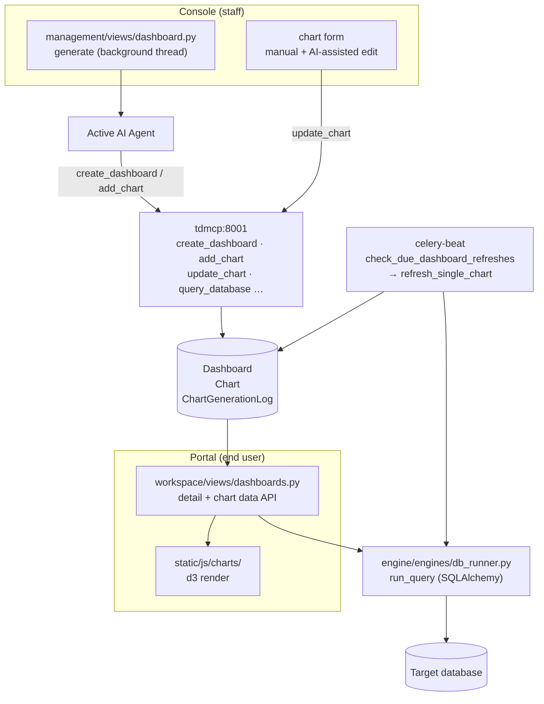
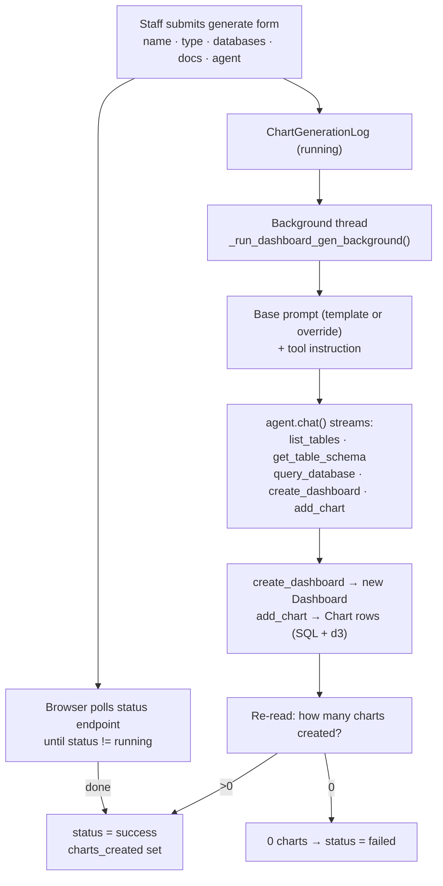

# Dashboards

A **Dashboard** is a grid of **charts**, each one a piece of raw d3.js code
rendering the results of a read-only SQL query. The headline feature is AI
generation: a staff member describes the dashboard they want, picks the source
databases and docs, and the AI agent explores the data and builds the charts —
writing the SQL and the d3 code for each one via MCP tools. Charts can also be
created and edited by hand. Once built, a dashboard caches its data, optionally
refreshes on a schedule, and is shown to whichever roles it is granted to.

---

## Table of Contents

1. [At a glance](#at-a-glance)
2. [Dashboards, charts, and logs](#dashboards-charts-and-logs)
3. [AI generation](#ai-generation)
4. [The chart contract](#the-chart-contract)
5. [Manual creation and AI-assisted editing](#manual-creation-and-ai-assisted-editing)
6. [Chart data and caching](#chart-data-and-caching)
7. [Auto-refresh](#auto-refresh)
8. [The viewer](#the-viewer)
9. [Access control](#access-control)
10. [Managing dashboards in the management](#managing-dashboards-in-the-management)

---

## At a glance



---

## Dashboards, charts, and logs

Three models in `engine/models/dashboards.py`.

**`Dashboard`** — a chart container.

| Field | Purpose |
|---|---|
| `name` / `description` | Display metadata (`name` is unique). |
| `is_active` | Hides the dashboard without deleting it. |
| `auto_refresh` | Whether charts refresh on a schedule. |
| `refresh_interval` | Minutes between refreshes (`5` … `1440`). |
| `allowed_roles` | M2M to `Role` — who can view it. |
| `created_by` / timestamps | Audit metadata. |

**`Chart`** — one d3 chart in a dashboard.

| Field | Purpose |
|---|---|
| `dashboard` | FK to the parent (`CASCADE`). |
| `title` / `description` | Display metadata. |
| `sql_query` | Read-only `SELECT` producing the chart data. |
| `chart_type` | `bar`, `line`, `scatter`, `pie`, `area`, `grouped_bar`, `stacked_bar`, `heatmap`, or `custom`. |
| `chart_spec` | JSON spec (axes, colors, labels, options). |
| `custom_d3_code` | Raw d3.js that renders the chart (see [the chart contract](#the-chart-contract)). |
| `database` | FK to the `DatabaseConnection` the SQL runs against (`PROTECT`). |
| `position` / `width` / `height` | Layout: order, grid span (3/4/6/8/12 of 12), pixel height. |
| `is_active` | Hides the chart. |
| `cached_data` | Last query result: `{columns, rows, refreshed_at}`. |
| `last_refreshed_at` / `last_error` | Refresh bookkeeping. |

**`ChartGenerationLog`** — audits each AI generation run: `status`
(`running`/`success`/`partial`/`failed`), timing, the source databases and docs,
`charts_created`, the full `prompt_used`, `agent_output`, and any errors.

---

## AI generation

Generation runs **inside the web container** on a background thread (so the agent
service URL is available), and the page polls a status endpoint until it
finishes — the same pattern as [[TetherDust Documentation/2. Features/3. Docs.md\|Docs]]
and [[TetherDust Documentation/2. Features/4. Tethers.md\|Tethers]] generation.



From `management/views/dashboard.py`:

- **Prompt templates** — three built-ins (`overview`, `time_series`,
  `comparison`) seed the request, or staff supply a custom prompt override.
- **Tool instruction** — the prompt appends explicit instructions to call
  `create_dashboard` first, then `add_chart` per chart, with the selected
  database/doc names and a reminder to *use the tools, not a chat response*.
- **Tools granted** — every enabled tool on an active MCP server, plus
  `create_dashboard` and `add_chart` force-added.
- **Outcome** — after the stream ends, the dashboard is looked up by name; the
  run succeeds only if at least one chart was created (otherwise `failed`).
- **Timeout** — governed by the chartgen timeout helper, well above a normal
  chat turn.

The MCP tools `create_dashboard` and `add_chart` (and `update_chart`) write
directly to the `engine_dashboard` / `engine_chart` tables — see
[[TetherDust Documentation/2. Features/5. Built-in MCP.md\|Built-in MCP]].

---

## The chart contract

Every chart — AI-generated or hand-written — is **raw d3.js**. The code receives
three arguments and renders into a container:

| Argument | What it is |
|---|---|
| `data` | Array of row objects from the chart's SQL query. |
| `container` | The DOM element to render into. |
| `d3` | The d3 library. |

Convention (enforced by the generation prompt): use `d3.select(container)` as the
root, and size from `container.clientWidth` / `container.clientHeight`. This
single contract is why arbitrary chart types are possible — `chart_type` is
metadata; the d3 code is the source of truth. Front-end rendering lives in
`static/js/charts/` (`render.js`, `chart-form.js`, `dashboard.js`).

---

## Manual creation and AI-assisted editing

Charts don't have to be AI-generated. The management chart form
(`management/views/dashboard.py`) lets staff write the title, SQL, database, layout,
and d3 code by hand (saved with `chart_type = "custom"`).

The edit page also supports **AI-assisted editing**: the agent can rewrite a
chart's title, description, SQL, or d3 code through the `update_chart` MCP tool.
After the agent writes to the DB, the page re-reads the chart via
`chart_state_view` to pull the updated fields back into the form. Because
`update_chart` can mutate a saved chart, it is **blocked from general chat** —
it is only reachable through this chart-edit flow (see
[[TetherDust Documentation/2. Features/2. Chat.md\|Chat]]).

A **preview** endpoint (`chart_preview_view`) runs ad-hoc, unsaved form values
(`database_id` + `sql_query`) through `validate_sql`, executes them, and returns
`{columns, data}` — without writing `cached_data` to any chart row.

---

## Chart data and caching

Charts cache their last result in `Chart.cached_data`. The data endpoints
(management `chart_data_view`, workspace `chart_data_api_view`) follow the same logic:

```
1. Unless ?refresh=1 is set and cached_data has rows → return the cache.
2. Otherwise run the SQL via db_runner.run_query, serialize values,
   store {columns, rows, refreshed_at} in cached_data, and return it.
3. On error, save last_error and return HTTP 500.
```

SQL values that aren't JSON-native (dates, decimals, timedeltas) are serialized
before caching. The workspace endpoint additionally checks that the requesting
user's role includes the chart's dashboard, returning `403` otherwise.

---

## Auto-refresh

When a dashboard has `auto_refresh` on and a `refresh_interval`, Celery keeps its
charts warm (`engine/tasks.py`):

- **`check_due_dashboard_refreshes`** runs every 60 seconds (celery-beat). For
  each active auto-refresh dashboard, it dispatches `refresh_single_chart` for
  any chart whose `last_refreshed_at` is older than the interval (or never run).
- **`refresh_single_chart`** runs the chart's SQL and writes fresh `cached_data`,
  `last_refreshed_at`, and clears `last_error` (recording the error on failure).

This means dashboards can serve instantly from cache while staying current in the
background — the viewer never blocks on a slow query unless the user forces a
refresh.

---

## The viewer

The workspace viewer (`workspace/views/dashboards.py`, login-required) is at
`/dashboards/`:

| Route | View | Returns |
|---|---|---|
| `/dashboards/` | `dashboards_view` | The list of accessible dashboards with chart counts. |
| `/dashboards/<pk>/` | `dashboard_detail_view_user` | The dashboard grid; redirects away if the role lacks access. |
| chart data | `chart_data_api_view` | A chart's `{columns, data}` (cached unless `?refresh=1`), role-checked. |

Charts render client-side from the data API using their stored `custom_d3_code`.

---

## Access control

| Gate | Check |
|---|---|
| **Can the user open Dashboards?** | `UserProfile.can_view_dashboards` — true if they have at least one accessible dashboard. Staff: any active dashboard exists. |
| **Which dashboards can they see?** | `UserProfile.get_allowed_dashboards()` — active dashboards whose `allowed_roles` include the user's role. Staff see all active dashboards. |

The chart data API re-checks dashboard access per request. Grant a dashboard to a
role from the dashboard's management form (**Allowed roles**). Staff bypass role
filtering; all authoring actions are `@staff_member_required`.

---

## Managing dashboards in the management

Staff manage dashboards at **Console → Dashboards** (`management/views/dashboard.py`):

- **List / Add / Edit / Delete** — manage dashboards, their auto-refresh
  settings, and allowed roles.
- **Generate with AI** — the generation page: pick a name, type (or custom
  prompt), source databases, source docs, and the agent.
- **Detail** — view charts; add, edit (with preview + AI assist), or delete each.
- **Generation logs** — **Console → Chart Generation Logs** audits every AI run:
  prompt, agent output, charts created, timing, and errors.

AI generation depends on an active `AgentConfiguration` and the built-in MCP
server; scheduled refresh depends on the `celery-worker` / `celery-beat`
services.
