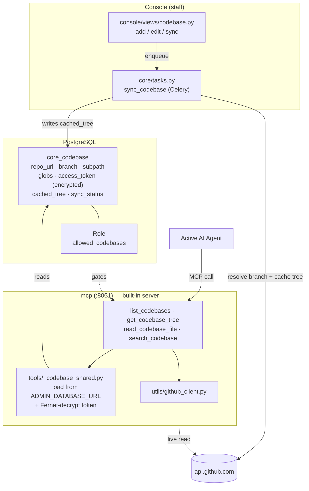

# Codebases

A **Codebase** connects a source-code repository to TetherDust as a first-class
**source** — the same way a database connection or a documentation source is.
Point TetherDust at a GitHub repository and the AI agent can browse its file
tree, read individual files, and search its code on demand: to answer questions
in chat, to ground generated documentation and dashboards, and to build
[[TetherDust Documentation/2. Features/4. Tethers.md\|Tethers]] against the real
code. Reads happen live through the GitHub REST API — nothing is cloned to disk;
a manual **Sync** caches the repository's file tree so browsing stays fast.

---

## Table of Contents

1. [At a glance](#at-a-glance)
2. [The Codebase model](#the-codebase-model)
3. [Adding a codebase](#adding-a-codebase)
4. [Sync and the cached tree](#sync-and-the-cached-tree)
5. [GitHub access and authentication](#github-access-and-authentication)
6. [The MCP tools](#the-mcp-tools)
7. [Using codebases as a source](#using-codebases-as-a-source)
8. [Access control](#access-control)
9. [What needs a restart](#what-needs-a-restart)

---

## At a glance

The Django side (console + Celery) **writes** configuration and caches the tree;
the MCP side **reads** the repository live for the agent. The two never share a
clone — they share the GitHub API and the `core_codebase` table.

---

## The Codebase model

A **`Codebase`** (`tetherdust/web/core/models/connections.py`) is the database
record describing one repository.

| Field | Purpose |
|---|---|
| `name` | Unique identifier. This is the name the agent and role allow-lists use. |
| `description` | Free-text; helps the agent understand what the repository contains. |
| `provider` | Source provider. Only `github` for now; the field leaves room for others. |
| `repo_url` | e.g. `https://github.com/owner/repo`. Parsed to `(owner, repo)` by `parse_owner_repo()`. |
| `branch` | Branch to read. Blank = the repository's resolved default branch. |
| `subpath` | Optional sub-directory to scope to, for monorepos (e.g. `services/api`). |
| `include_globs` | JSON glob list; when non-empty, only matching files are kept. |
| `exclude_globs` | JSON glob list of files to drop. Empty = a sensible default set (`node_modules`, build output, binaries). |
| `access_token` | GitHub token, **encrypted at rest** (Fernet, like database passwords). Blank for public repos. |
| `default_branch` | Resolved on sync. |
| `cached_tree` | The filtered repository file tree (`[{path, size, type}]`), refreshed on sync. |
| `sync_status` | `pending` → `syncing` → `ok` / `error`. |
| `sync_error` / `last_synced_at` | Last sync result and timestamp. |
| `is_active` | Hides the codebase from the agent and the role allow-lists without deleting it. |

`parse_owner_repo()` (in the Django-free `core/integrations/github_client.py`)
normalises the common URL forms — `https://github.com/owner/repo`,
`…/owner/repo.git`, and `git@github.com:owner/repo.git` — and rejects anything
that does not resolve to an owner/repo pair, so the form can surface a clear
validation error.

---

## Adding a codebase

Staff manage codebases at **Console → Codebases** (`console/views/codebase.py`),
which mirrors the Databases tab:

- **List** (`/console/codebases/`) — every codebase with its repository, branch,
  active state, and a live sync-status cell.
- **Add** — a provider picker (GitHub only for now) leads to the form.
- **Form** — set the name, description, repository URL, branch, subpath,
  include/exclude globs, and an optional access token. Saving a *new* codebase
  immediately enqueues a first **sync** so the tree is cached right away.
- **Sync** — re-validate access and refresh the cached tree (see below).
- **Edit / Delete** — standard CRUD. A codebase referenced by a Tether is
  protected from deletion (`on_delete=PROTECT`).

The token field follows the same blank-keeps-existing convention as database
passwords: leave it empty when editing to keep the stored token.

---

## Sync and the cached tree

Because codebases are read **on demand** (no clone), "sync" does not pull code to
disk. Instead `sync_codebase` (`core/tasks.py`, a Celery task) refreshes the
metadata the agent needs to navigate quickly:

1. Set `sync_status = syncing`.
2. Resolve the repository's **default branch** from the GitHub API.
3. Fetch the **recursive git tree** for the effective branch.
4. Apply the codebase's `subpath`, `include_globs`, and `exclude_globs`
   (`filter_tree()` in `core/integrations/github_client.py`) — directories are
   dropped, paths are relativised to the subpath.
5. Store the result in `cached_tree`, stamp `last_synced_at`, set
   `sync_status = ok`. On any failure, store `sync_error` and set
   `sync_status = error`.

The list view's status cell polls itself (HTMX) while a sync is in flight and
settles to **Synced** (with a file count) or **Error** (with the message). File
**contents** are never cached — only the tree — so `read_codebase_file` always
returns the current file on the chosen branch.

---

## GitHub access and authentication

| Concern | Behaviour |
|---|---|
| **Public repos** | Work with no token. GitHub's unauthenticated rate limit (60 requests/hour) applies, so a token is still recommended. |
| **Private repos** | Require an access token with read access to the repository. |
| **Token scope** | A fine-grained read-only PAT (`contents: read`) is sufficient. Tokens are encrypted at rest and decrypted only inside the `mcp` container at read time. |
| **Rate limits** | A token raises the limit to 5,000 requests/hour. The tools surface a clear rate-limit message, and the cached tree keeps tree browsing off the API entirely. |
| **File size / binaries** | `read_codebase_file` refuses directories and binaries and caps text at ~256 KB (GitHub's contents API tops out near 1 MB), truncating with a notice. |
| **Provider** | `api.github.com` only in this version. The `mcp` container needs outbound access to it. |

> **Security note.** The agent can read **anything committed** to the repository,
> including secrets committed by mistake. Only connect repositories whose full
> contents are safe for the agent — and the users who can chat with it — to see.

---

## The MCP tools

Codebases are exposed to the agent through four built-in MCP tools (registered in
`mcp_server/tools/__init__.py`; see
[[TetherDust Documentation/2. Features/5. Built-in MCP.md\|Built-in MCP]]):

| Tool | Purpose |
|---|---|
| `list_codebases` | List the codebases available to the role, with repository and branch. The agent's first stop. |
| `get_codebase_tree` | List files in a codebase (optionally under a sub-path) from the **cached tree** — fast, no GitHub call. |
| `read_codebase_file` | Read one file's full contents, fetched **live** from GitHub on the codebase's branch. Honors the configured subpath. |
| `search_codebase` | Search code by keyword via GitHub's code-search API. Degrades gracefully to tree/file navigation when search is unavailable. |

The `mcp` container has no Django, so `tools/_codebase_shared.py` loads codebases
straight from the app database via `ADMIN_DATABASE_URL` (`core_codebase`) and
Fernet-decrypts the access token using `TETHERDUST_ENCRYPTION_KEY`. Every tool
resolves the requested codebase through `get_codebase()`, which enforces the
per-request allow-list before touching GitHub.

> **`search_codebase` caveat.** GitHub code search only indexes the default
> branch, requires an authenticated token, and is not available for every
> repository. When it cannot run, the tool returns a clear message telling the
> agent to navigate with `get_codebase_tree` and `read_codebase_file` instead.

---

## Using codebases as a source

Once a codebase exists and is granted, it behaves like any other source:

- **Chat** — a user whose role includes the codebase can ask the agent about the
  code; the agent calls the codebase tools to answer.
- **Documentation generation** — the AI doc and doc-library generators
  (`console/views/docsource.py`) offer codebase checkboxes; selected codebases
  are passed to the agent so generated docs are grounded in real source.
- **Dashboard generation** — the dashboard generator
  (`console/views/dashboard.py`) likewise offers codebases as context.
- **Tethers** — a `Tether` now links a **Codebase** to a database documentation
  source, and the agent explores the code side with the codebase tools. See
  [[TetherDust Documentation/2. Features/4. Tethers.md\|Tethers]].

In every case the selected codebase names are threaded into the per-request MCP
filter as `allowed_codebases`, exactly like `allowed_databases` and
`allowed_doc_sources`.

---

## Access control

Codebases use the same `Role` / `UserProfile` machinery as every other source
(`core/models/auth.py`):

| Level | Gate |
|---|---|
| **Which codebases can a user's agent read?** | `Role.allowed_codebases` (M2M). `UserProfile.get_allowed_codebases()` returns the `name` set. |
| **Staff / console-managed admin roles** | Bypass the restriction entirely (`None` = unrestricted). |
| **Role with none granted** | Empty set = deny-all; the codebase tools return "not available for your role". |

The allow-list rides through the MCP filter token (`core/agents/mcp_filter.py` →
the `mcp` server's per-request `request_allowed_codebases` context var), so the
enforcement point is the MCP server — the same place tools, databases, and doc
sources are gated. Assign codebases on a Role's edit form under **Allowed
codebases**; changes take effect on the next request.

---

## What needs a restart

| Change | Picked up by |
|---|---|
| **Codebase config** (URL, branch, globs, token, active state) | Live — read from the database on every request. No restart. |
| **A re-sync** | Click **Sync** (or it runs automatically when a codebase is added). |
| **The four codebase tools' Python** (`mcp_server/tools/*codebase*.py`) | The source is mounted into the `mcp` container but the process does not auto-reload — run `docker compose restart mcp`. |

In short: configuration and grants are live; only changes to the tool source code
require a quick `restart mcp` (no image rebuild).
