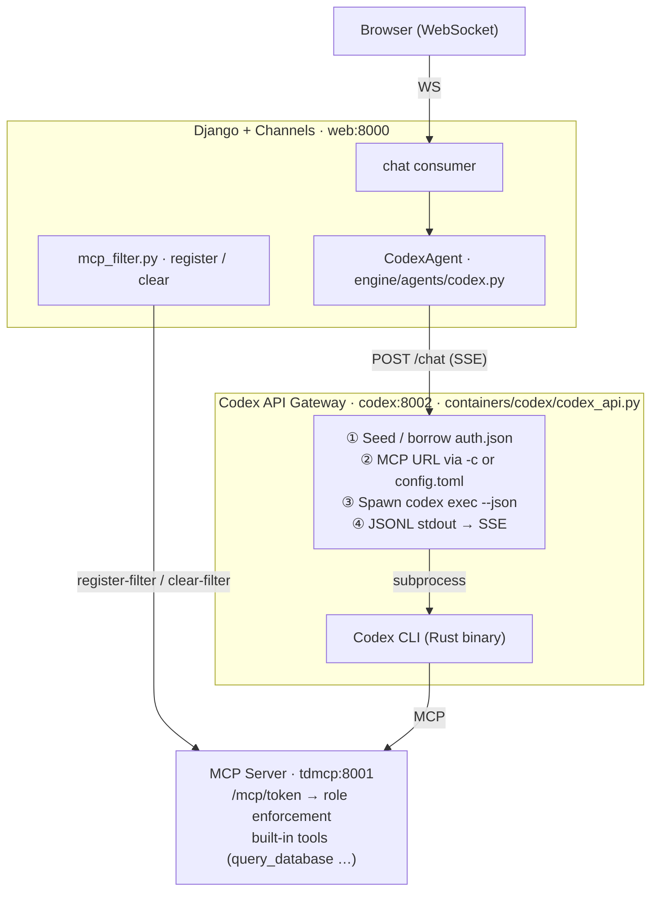
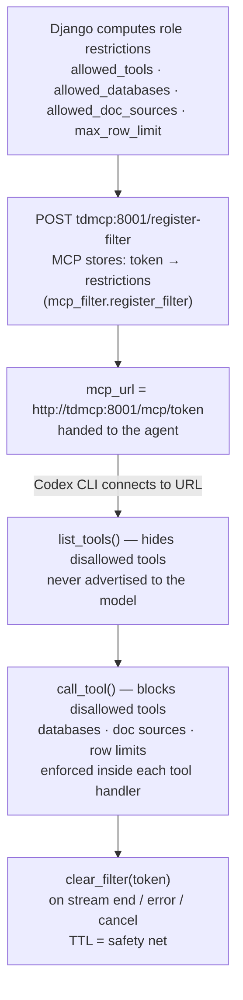

# CLI Tool with Auth Token

This integration runs a provider's coding CLI inside its own Docker container,
authenticated with a **subscription** session credential rather than a per-token
API key. Cost is flat — there are no per-token charges. Two providers are wired:

| Provider | CLI | Subscription | Gateway | Credential |
|---|---|---|---|---|
| **OpenAI** *(default)* | Codex CLI | ChatGPT Plus/Pro | `containers/codex` (`codex:8002`) | `auth.json` via device-code login, refreshed automatically |
| **Anthropic** | Claude Code CLI | Claude Pro/Max | `containers/claude` (`claude:8002`) | OAuth token via `claude setup-token`, stored once |

Most of this page documents the **Codex** path in depth (components, request
flow, credential lifecycle, MCP access control, configuration). Claude Code
reuses the *same* pipeline and contract — only its gateway and credential differ
— and is covered in [Claude Code (alternative provider)](#claude-code-alternative-provider)
at the end. See [[TetherDust Documentation/3. Agent Integrations/1. Overview.md|Overview]] for how this option fits
alongside the other integration approaches.

---

## Table of Contents

1. [At a glance](#at-a-glance)
2. [Components](#components)
3. [Request flow](#request-flow)
4. [Authentication lifecycle](#authentication-lifecycle)
5. [MCP token filtering](#mcp-token-filtering)
6. [How the MCP config reaches the CLI](#how-the-mcp-config-reaches-the-cli)
7. [Stream protocol](#stream-protocol)
8. [Configuration](#configuration)
9. [Claude Code (alternative provider)](#claude-code-alternative-provider)

---

## At a glance



- **Auth model:** a single ChatGPT subscription credential (`auth.json`),
  obtained once via in-app device-code sign-in and refreshed automatically.
- **One active agent:** exactly one `AgentConfiguration` row is `is_active`.
  `get_agent()` reads it fresh per request, so switching agents is a DB change,
  not a redeploy.
- **Access control** (allowed tools / databases / doc sources / row limit) is
  enforced at the **MCP server**, keyed by a per-request token Django registers.

---

## Components

| Layer | File | Role |
|---|---|---|
| Agent abstraction | `engine/agents/base.py` — `BaseAgent` | Transport-agnostic `chat()` async-generator contract. |
| Agent | `engine/agents/codex.py` — `CodexAgent` | POSTs to the codex gateway, parses its SSE, re-yields framed chunks. Registered under the `codex` agent type. |
| Factory | `engine/agents/__init__.py` — `get_agent()` | Reads the active `AgentConfiguration` and returns the matching agent (`{"codex": CodexAgent}`). Falls back to an unconfigured `CodexAgent` if none is active. |
| Filter helper | `engine/agents/mcp_filter.py` | Agent-agnostic `register_filter` / `tokenized_mcp_url` / `clear_filter`. Any future agent reuses these instead of re-implementing the handshake. |
| Stream protocol | `engine/agents/stream.py` | NUL-prefixed marker format + `parse_chunk`. |
| Config model | `engine/models/agent.py` — `AgentConfiguration` | Persisted agent settings (see [Configuration](#configuration)). |
| Gateway | `containers/codex/codex_api.py` | FastAPI wrapper owning a single Codex CLI invocation: credential seeding, MCP config, subprocess lifecycle, JSONL→SSE, device-code login endpoints. |
| Sync task | `engine/tasks.py` — `sync_codex_auth_token` | Hourly Celery job that pulls the refreshed credential back into the DB and warns near expiry. |

The codex gateway is a *thin* wrapper. It does not talk to the MCP server
itself — Django registers the filter and hands the gateway a ready-tokenized
`mcp_url`; the gateway just points the CLI at it.

---

## Request flow

```
1.  User sends a message over the WebSocket.
2.  The chat consumer calls get_agent() → CodexAgent, then CodexAgent.chat(...)
    with the role's allowed_tools / allowed_databases / allowed_doc_sources /
    max_row_limit / custom_mcp_servers.

    Inside CodexAgent.chat() (engine/agents/codex.py):
3.  Always register a per-request MCP token:
        register_filter(...)  →  POST tdmcp:8001/register-filter  →  token
        payload["mcp_url"] = tokenized_mcp_url(token)  = http://tdmcp:8001/mcp/<token>
    Unrestricted users register an all-access token (all allow-lists are `None`).
    Registration failures fail closed: the user gets an error chunk and the
    request aborts (no unfiltered fallback).
4.  Build the JSON payload (message, session_id, user_id, instructions=system
    prompt, the restriction lists, the decrypted auth_token, mcp_url, and any
    model / reasoning_effort overrides from the agent's settings) and POST it to
    {service_url}/chat as a streaming request.

    Inside the codex gateway (_stream_codex):
5.  Seed the volume credential from auth_token on cold start (only if the
    volume has no auth.json yet — never clobber a refreshed copy).
6.  Choose how to supply MCP config to the CLI (see "How the MCP config reaches
    the CLI"): inline `-c` override or per-request config.toml.
7.  Spawn:  codex exec --skip-git-repo-check
                       [ --sandbox read-only | --dangerously-bypass-approvals-and-sandbox ]
                       --ephemeral --json
                       [ -c model="..." ] [ -c model_reasoning_effort="..." ]
                       [ -c mcp_servers.tetherdust.url=... ]
                       -- "<instructions>\n\n<message>"
8.  Read JSONL from stdout and translate to SSE:
        item.created (tool_call/function_call) → {"type":"tool_call","name":…}
        item.delta (reasoning)                 → {"type":"thinking","text":…}
        item.delta (answer)                    → {"type":"text","text":…}
        item.completed (message)               → {"type":"response","text":…}
9.  Subprocess exits → data: [DONE].
10. finally: terminate the subprocess if still alive; if a per-request home was
    used, harvest a refreshed token back to the volume, then rmtree it.

    Back in CodexAgent.chat():
11. Each SSE event → a framed chunk yielded to the consumer:
        tool_call → "\x00TOOL:<name>"
        response  → "\x00RESPONSE:<text>"
        thinking  → "\x00THINKING:<text>"
        text      → "<raw text>"
12. finally: clear_filter(token). This runs on completion, error, AND cancel —
    when the consumer closes the HTTP stream, the `async for` unwinds through
    here. The MCP server's token TTL is the safety net if the clear is missed.
13. The WebSocket consumer streams chunks to the browser in real time.
```

`CodexAgent.cancel()` closes the in-flight HTTP stream (`self._http_response`),
which is what triggers the cancel path in step 12. The gateway separately
exposes `POST /abort/{session_id}` to terminate the CLI subprocess directly.

---

## Authentication lifecycle

The subscription credential is a `auth.json` blob containing a refreshable
ChatGPT session token. There is **no manual file copying and no separate
device** — sign-in happens in-app, and the refreshed token is preserved across
requests. The credential lives in three tiers:

| Tier | Location | Role |
|---|---|---|
| Source of truth / backup | `AgentConfiguration._auth_token` (Fernet-encrypted in PostgreSQL) | Durable; seeds a cold volume. |
| Live working copy | persistent volume `/var/codex-home/.codex/auth.json` (`CODEX_HOME_DIR`) | What Codex reads and **refreshes in place**. |
| Per-request copy | `codex_req_<uuid>/.codex/auth.json` | Borrowed per request (only when a per-request home is used); deleted after. |

Three flows maintain it across the credential lifecycle — they are one pipeline,
not alternatives:

### Flow A — onboarding (once)
An admin opens the agent form and clicks **"Sign in to ChatGPT"**:

- `management/views/agent.py:agent_device_login_start` proxies `POST /auth/device/start`
  to the gateway, which runs `codex login --device-auth` against the volume HOME
  and captures the **verification URL + user code** from the CLI output.
- The browser shows "go to `<URL>`, enter `<CODE>`". The user approves in *any*
  browser (personal ChatGPT accounts enable device-code auth in their own
  security settings — no workspace admin needed).
- `agent_device_login_status` polls `GET /auth/device/status/{login_id}`; on
  completion the resulting `auth.json` is read back and encrypted into
  `_auth_token` via `config.set_auth_token(...)`.

### Flow B — per request
The per-request credential is seeded from the **volume** copy, not the DB secret
(`_setup_per_request_home` copies `CODEX_HOME_DIR/auth.json` in). After the
request, if Codex refreshed the token, `_harvest_volume_auth` copies it back to
the volume under an asyncio lock before the per-request home is deleted. On the
fast path (no per-request home), Codex runs directly from the volume, so a
refresh lands in place with no harvest needed.

### Flow C — proactive (Celery)
`sync_codex_auth_token` runs hourly: it calls the gateway's `GET /auth/token`,
which returns the live (possibly refreshed) volume credential plus a best-effort
`expires_at` decoded from the access-token JWT. The task writes any changed
token back into the encrypted DB backup and logs a warning when the credential
is within ~2 days of expiry. This keeps refresh off the request hot path and a
cold volume always re-seeds from a fresh token.

> **Security note:** nothing is ever written to `/root/.codex`. Credentials live
> only on the encrypted DB column, the volume, and (transiently) a per-request
> home. The subprocess is pointed at its config dir via `CODEX_HOME`, not by
> hijacking `HOME`, so the blast radius is limited to `.codex`.

---

## MCP token filtering

Role-based access control is enforced at the **MCP layer**, not in the agent.
The Codex CLI runs in its own process and autonomously decides which tools to
call — there is no hook to intercept calls once it is running — so the MCP
server is the only reliable enforcement point.



Two important properties:

- **Registration is agent-agnostic.** It lives in Django
  (`engine/agents/mcp_filter.py`), where the role data already is — not in the
  codex gateway. The gateway never calls `/register-filter`; it only receives
  the tokenized URL. Other integration options reuse the same helper, so the
  same filters serve every backend.
- **Hide vs. block.** `list_tools()` filtering is *guidance* (shapes what the
  model attempts); `call_tool()` filtering is the *authoritative wall*. Tool-name
  blocking is a whitelist and fails **closed**. Database / doc-source / row-limit
  checks are centralized in the MCP layer (`mcp_server/tools/_db_shared.py` —
  `check_database_access` + the `@enforce_db_access` decorator) so a new
  data-touching tool can't silently fail open; a test asserts every
  `database`-taking tool carries the enforcement marker.

If filter registration fails (MCP unreachable, timeout, HTTP error),
`CodexAgent.chat` yields a user-facing error and returns — it does **not** fall
back to an unfiltered request.

---

## How the MCP config reaches the CLI

The Codex CLI is configured by an on-disk `config.toml` read from `$CODEX_HOME`.
The gateway picks one of two paths per request, trading temp-dir churn against
config complexity:

| Request shape | Mechanism | `CODEX_HOME` |
|---|---|---|
| No custom MCP servers | Inline `-c mcp_servers.tetherdust.url="<tokenized-url>"` override (`_mcp_url_override_args`) | the persistent volume |
| **Any** custom MCP servers | Mint a per-request temp home with a full `config.toml` — built-in `tetherdust` block + a `[mcp_servers.<key>]` block per custom server (`_setup_per_request_home`) | the temp home |

The fast path (no custom servers) avoids `mkdtemp` + write +
`rmtree` and the auth seed/harvest round-trip entirely — it just adds a `-c`
flag and runs from the volume. The per-request home is reserved for custom MCP
servers, whose nested `[mcp_servers.<key>.http_headers]` tables don't map cleanly
to `-c` overrides. Custom-server auth tokens become `Authorization: Bearer …`
headers, and secrets are redacted before logging.

> Per-request homes live under `/opt/codex-homes`, **not** `/tmp`: the Codex CLI
> refuses to create helper binaries under temporary directories, which breaks MCP
> tool discovery.

---

## Stream protocol

`engine/agents/stream.py` defines the flat-string contract between agents and the
WebSocket consumer. Structured events are framed with a NUL byte (`\x00`) — a
sentinel that never appears in model text, so events can't be confused with
literal output:

| Prefix | Meaning | Consumer behavior |
|---|---|---|
| `\x00TOOL:<name>` | Agent is calling an MCP tool | Show tool status in the UI |
| `\x00RESPONSE:<text>` | Completed final answer | **Persist** as the message of record, render |
| `\x00THINKING:<text>` | Model reasoning trace | Show in the status bar only |
| *(plain text)* | Partial streaming token | Append to the in-progress message |

Consumers call `parse_chunk(chunk)` → `AgentEvent(kind, text)` rather than
re-implementing the prefix split.

> **Plain text vs. `\x00RESPONSE:`.** Both carry the same answer content but serve
> different roles. Plain-text chunks are the incremental `item.delta` tokens
> streamed for the live typing effect — display-only. `\x00RESPONSE:` is the
> single `item.completed` payload, the canonical answer that is saved. The
> consumer streams the former for UX and commits the latter; it does not
> reassemble the saved message from the deltas. Plain text is also the safe
> fallback for unknown event types or malformed JSON.

---

## Configuration

`AgentConfiguration` (`engine/models/agent.py`) — admin-editable, persisted in
PostgreSQL:

| Field | Purpose |
|---|---|
| `name` | Display name (unique). |
| `agent_type` | Selects the agent class. This integration uses `"codex"`. |
| `is_active` | Only one row may be active; saving an active row deactivates the others. |
| `system_prompt` | Sent as `instructions` per request **and** synced to the gateway's `AGENTS.md` on save (`_sync_agents_md` → `POST /update-agents-md`). |
| `_auth_token` | Fernet-encrypted `auth.json` (the subscription credential). Accessed via `get_auth_token()` / `set_auth_token()`. |
| `service_url` | Validated `URLField` overriding which gateway this agent POSTs to. Nullable/blank → fall back to system config / env. |
| `settings` | JSON blob holding optional `model` and `reasoning_effort` overrides (see [Model & reasoning effort](#model--reasoning-effort)). |

### Model & reasoning effort

The agent form exposes an optional **Model & Reasoning** section. Both values are
stored in `AgentConfiguration.settings` (`model`, `reasoning_effort`) and edited
in the management at `management/forms/agent.py` / `management/views/agent.py`:

| Field | Maps to | Values |
|---|---|---|
| `model` | `codex exec -c model="..."` | Any model the authenticated subscription tier exposes (e.g. `gpt-5.5`, `gpt-5.3-codex`). Blank → Codex's built-in default. |
| `reasoning_effort` | `codex exec -c model_reasoning_effort="..."` | `minimal` · `low` · `medium` · `high` · `xhigh`. Blank → Codex's default. |

`CodexAgent.chat` reads these from the agent's `settings` and adds them to the
`/chat` payload only when non-empty; the gateway appends them as `-c` overrides
on **every** supported request path (inline override or per-request home), so they
apply regardless of how MCP config is supplied. An unset value is omitted
entirely, leaving Codex's defaults untouched. A model the subscription tier
doesn't allow surfaces as a Codex `error` event (captured as `error_detail`),
not a silent fallback.

> Because availability mirrors the **ChatGPT subscription tier**, this auth-token
> integration can reach subscription-only models (e.g. newer GPT-5.x releases)
> that the per-token API-key integration cannot.

For this integration, **device-code sign-in is the only auth path** — there is
no API-key field and no manual `auth.json` paste. (Authenticating a CLI with a
per-token API key instead is a separate integration option; see
[[TetherDust Documentation/3. Agent Integrations/1. Overview.md|Overview]].) The `service_url` is a first-class validated
`URLField`.

**Service-URL resolution** (used by `CodexAgent`, the management device-login
proxy, and the Celery sync task), in precedence order:

```
AgentConfiguration.service_url  →  SystemConfiguration["codex_service_url"]  →  CODEX_SERVICE_URL env
```

**Switching the active agent** is a database change, not a deploy: `get_agent()`
reads `AgentConfiguration.get_active()` fresh on every request, so flipping
`is_active` takes effect on the next message. The target container must already
be running and healthy — activation only changes *which* `service_url` gets the
POST; it doesn't start anything. Both the `codex` and `claude` gateways run by
default (no Compose profile), so switching between Codex and Claude needs no
manual start step.

---

## Claude Code (alternative provider)

Claude Code is the second provider in this category: the **`claude` CLI** in its
own container (`containers/claude`, `claude:8002`), authenticated with a **Claude
Pro/Max subscription**. It is the same architecture as Codex — Django POSTs to a
gateway that spawns the CLI and streams SSE back, with the per-request MCP token
filter registered identically — so only the gateway internals and the credential
differ.

### What is identical to Codex

Inherited unchanged, because `ClaudeCodeAgent` **subclasses `CodexAgent`**
(`engine/agents/claude.py`):

- The `chat()` pipeline, the `/chat` JSON payload shape, and the SSE parsing.
- The stream protocol (`\x00TOOL:` / `\x00RESPONSE:` / `\x00THINKING:` framing).
- MCP token filtering — Django registers the filter and hands the gateway a
  ready-tokenized `mcp_url`; the gateway never calls `/register-filter`.
- History flattening, cancellation (`cancel()` closes the HTTP stream), and the
  `instructions`/system-prompt handling.

`ClaudeCodeAgent` overrides only two things: the **service-URL resolution**
(`claude_service_url` / `CLAUDE_SERVICE_URL`, so it never routes to the Codex
container) and `get_name()`. Credential handling is inherited — the parent sends
`payload["auth_token"]`, which here carries the Claude OAuth token.

### What differs

| Aspect | Codex | Claude Code |
|---|---|---|
| Gateway | `containers/codex/codex_api.py` | `containers/claude/claude_api.py` |
| Agent class | `CodexAgent` (`codex`) | `ClaudeCodeAgent` (`claude_code`), subclass of `CodexAgent` |
| Credential | `auth.json` (device-code login), refreshed in place, 3-tier (DB + volume + per-request) | A single long-lived **OAuth token** from `claude setup-token`, stored encrypted in `_auth_token`; injected per request as `CLAUDE_CODE_OAUTH_TOKEN`. No volume, no refresh harvesting. |
| CLI invocation | `codex exec --json … -- "<prompt>"` | `claude -p --output-format stream-json --verbose --include-partial-messages --mcp-config <json> --allowedTools mcp__… --permission-mode default`; prompt on **stdin** |
| MCP config | `config.toml` / inline `-c` override | `--mcp-config` JSON blob + `--allowedTools mcp__<server>` (scoped to MCP servers only — no built-in Bash/file tools) |
| Stream source | JSONL `item.*` events | `stream-json` events: `stream_event` deltas (text/thinking/tool-name) + the terminal `result` as the canonical answer |
| System prompt sync | `AGENTS.md` via `/update-agents-md` | `CLAUDE.md` via `/update-agents-md`; per-request `instructions` applied with `--append-system-prompt` |
| Model override | `model` + `reasoning_effort` | `model` only (e.g. `sonnet`, `opus`); no reasoning-effort knob |

The gateway translates the CLI's `stream-json` into the **same** SSE event shape
the `CodexAgent` parser already consumes (`tool_call` / `text` / `thinking` /
`response` / `error_detail` + `[DONE]`), which is why the agent class can be a
thin subclass.

### Authentication — guided sign-in

Claude has no poll-based device-code grant, so the credential is obtained with
`claude setup-token` rather than Codex's `--device-auth`. Two paths, both ending
in an encrypted `_auth_token`:

- **Guided sign-in (recommended).** The agent form's **"Sign in to Claude"**
  button calls `agent_claude_login_start`, which proxies `POST
  /auth/setup-token/start` on the gateway. The gateway runs `claude setup-token`
  **under a PTY**, captures the authorization URL, and returns it. The admin
  approves in a browser and pastes the short code back; `agent_claude_login_submit`
  → `POST /auth/setup-token/submit/{login_id}` feeds it to the subprocess and
  harvests the printed OAuth token, which Django stores via `set_auth_token(...)`.
  Net UX: *click → approve → paste one short code → done*.
- **Manual paste (fallback / CI).** Run `claude setup-token` on any machine
  signed in to Claude and paste the resulting `sk-ant-oat…` token into the
  agent form. Required for a not-yet-saved agent (guided sign-in needs the saved
  `pk` to address the gateway).

Nothing is persisted on the container — the token lives only in the encrypted DB
column and (per request) the subprocess environment. There is **no** Celery sync
task: the OAuth token is long-lived and not refreshed in place, so the
`sync_codex_auth_token` job (codex-only) does not apply.

### Container

The `claude` service runs **always-on** (no Compose profile) and is **not** a
`web` dependency:

```yaml
# docker-compose.yml
claude:
  build:
    context: .
    dockerfile: containers/claude/Dockerfile
  environment:
    - MCP_URL=http://tdmcp:8001/mcp
    - MCP_BASE_URL=http://tdmcp:8001
    - CLAUDE_API_PORT=8002
  depends_on:
    mcp:
      condition: service_healthy
```

The CLI is pinned (`@anthropic-ai/claude-code@2.1.153`) because newer versions
can change the `stream-json` event shape and the `setup-token` login I/O the
gateway parses. `web` ships a fallback URL: `CLAUDE_SERVICE_URL=http://claude:8002`.

### Configuration

Same `AgentConfiguration` model. For Claude Code: `agent_type = "claude_code"`,
the credential in `_auth_token` (the OAuth token), an optional `model` in
`settings`, and service-URL resolution:

```
AgentConfiguration.service_url  →  SystemConfiguration["claude_service_url"]  →  CLAUDE_SERVICE_URL env
```
