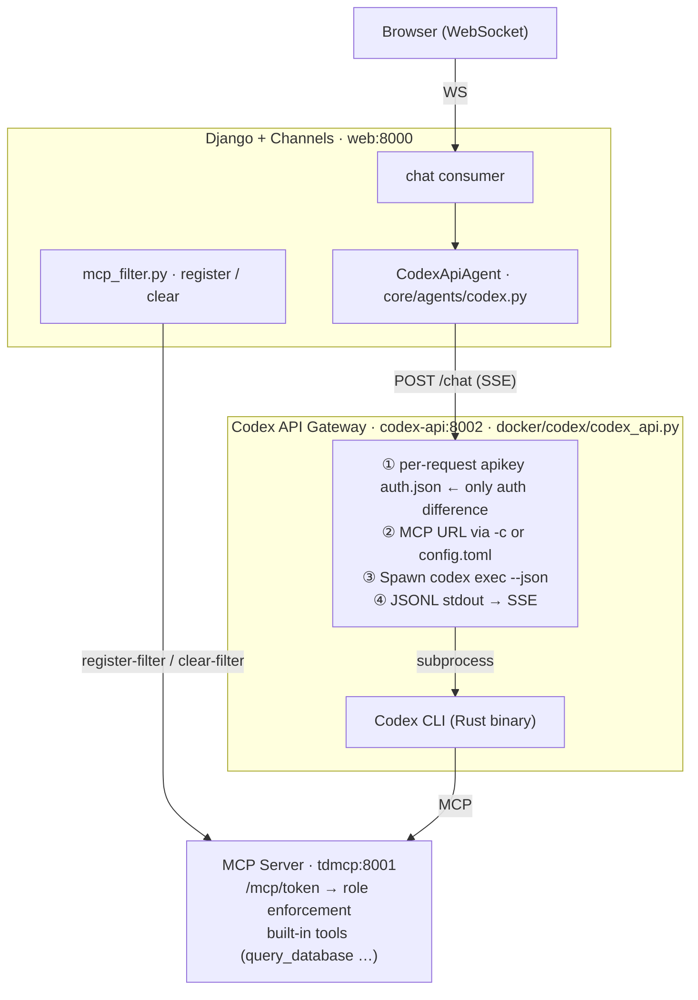

# CLI Tool with API Key

This integration runs a coding **CLI** inside its own Docker container —
**identical architecture** to [[TetherDust Documentation/3. Agent Integrations/2. CLI Tool with Auth Token.md|CLI Tool with Auth Token]] —
but authenticated with a **per-token provider API key** instead of a
subscription credential. Billing is per token.

**Two CLIs are wired today:**

| Agent type | CLI | Gateway / container | How the key reaches the CLI |
|---|---|---|---|
| `codex_api` | Codex CLI | `docker/codex` · `codex-api:8002` | Per-request `auth.json` file (Codex's `exec` reads credentials only from a file, never an env var). |
| `claude_code_api` | Claude Code | `docker/claude` · `claude-api:8002` | `ANTHROPIC_API_KEY` env var on the per-request subprocess (the documented headless path; `claude -p` sends it as the `X-Api-Key` header). |

The credential mechanism is the **only** real difference between the two — and
the choice is dictated by each CLI, not by preference: Codex ignores the env var
so it *must* use a file; Claude Code's reliable headless path *is* the env var
(and matches how the Claude gateway already injects its OAuth token). Everything
else is the shared `CodexAgent` pipeline.

Because all of these integrations share almost everything, this page focuses on
**what differs**: the credential, how it reaches the CLI, the service-URL
resolution, and the separate (always-on) containers. For the full request
lifecycle, MCP config mechanics, and stream protocol, see
[[TetherDust Documentation/3. Agent Integrations/2. CLI Tool with Auth Token.md|CLI Tool with Auth Token]]. See
[[TetherDust Documentation/3. Agent Integrations/1. Overview.md|Overview]] for how this fits alongside the other approaches.

---

## Table of Contents

1. [At a glance](#at-a-glance)
2. [Components](#components)
3. [What is shared with the auth-token integration](#what-is-shared-with-the-auth-token-integration)
4. [What is different](#what-is-different)
5. [Authentication](#authentication)
6. [The containers](#the-containers)
7. [Configuration](#configuration)
8. [Extending to other CLIs](#extending-to-other-clis)

---

## At a glance



(The diagram shows Codex; the Claude Code API-key path is identical with
`ClaudeCodeApiAgent`, `claude-api:8002`, and `docker/claude/claude_api.py`
spawning `claude -p` in place of the Codex boxes.)

- **Auth model:** a single provider **API key**, stored Fernet-encrypted on the
  agent config. No device-code login, no token refresh, no persistent credential
  volume — the decrypted key is sent in the request payload and handed to the
  per-request subprocess transiently (Codex via a short-lived `auth.json`; Claude
  Code via the `ANTHROPIC_API_KEY` env var), then discarded.
- **Same image, separate service:** each API-key gateway reuses its auth-token
  sibling's image (`codex-api` reuses the `codex` image, `claude-api` reuses the
  `claude` image) but runs as its own **always-on** Compose service (not a `web`
  dependency), so it never blocks startup and is ready the moment its agent is
  activated.
- **Everything else is the `CodexAgent` pipeline** — same SSE parsing, same MCP
  filtering, same stream protocol. (`ClaudeCodeApiAgent` subclasses
  `ClaudeCodeAgent`, which subclasses `CodexAgent`.)

---

## Components

| Layer | File | Role |
|---|---|---|
| Agent (Codex) | `core/agents/codex.py` — `CodexApiAgent` | **Subclass of `CodexAgent`.** Reuses the entire streaming + MCP-filter pipeline; overrides only credential injection and service-URL resolution. Registered under the `codex_api` agent type. |
| Agent (Claude) | `core/agents/claude.py` — `ClaudeCodeApiAgent` | **Subclass of `ClaudeCodeAgent`** (itself a `CodexAgent`). Same overrides — credential + service-URL chain. Registered under the `claude_code_api` agent type. |
| Factory | `core/agents/__init__.py` — `get_agent()` | Maps `codex_api` → `CodexApiAgent`, `claude_code_api` → `ClaudeCodeApiAgent`. |
| Filter helper | `core/agents/mcp_filter.py` | Same agent-agnostic `register_filter` / `tokenized_mcp_url` / `clear_filter` used by every integration. |
| Stream protocol | `core/agents/stream.py` | Same NUL-prefixed marker format + `parse_chunk`. |
| Config model | `core/models/agent.py` — `AgentConfiguration` | Persisted settings; the credential lives in `_api_key` (see [Configuration](#configuration)). |
| Gateway (Codex) | `docker/codex/codex_api.py` | The **same** FastAPI wrapper as the auth-token option; for an API-key request it writes a per-request apikey `auth.json` into an isolated Codex home instead of seeding the volume subscription credential. |
| Gateway (Claude) | `docker/claude/claude_api.py` | The **same** wrapper as the OAuth-token Claude option; for an API-key request it sets `ANTHROPIC_API_KEY` on the subprocess env (clearing `CLAUDE_CODE_OAUTH_TOKEN`) instead of injecting the OAuth token. |
| Containers | `docker-compose.yml` — `codex-api` and `claude-api` services | Both always-on (no profile; not a `web` dependency), no persistent volume. |

Each API-key agent is deliberately thin. Its whole definition is a different
credential and a different service-URL fallback chain:

```python
class CodexApiAgent(CodexAgent):
    def _apply_credentials(self, payload: dict) -> None:
        if self._api_key:
            payload["api_key"] = self._api_key   # auth-token path sends auth_token instead

class ClaudeCodeApiAgent(ClaudeCodeAgent):
    def _apply_credentials(self, payload: dict) -> None:
        if self._api_key:
            payload["api_key"] = self._api_key   # resolves the claude_api_service_url chain
```

Both send `payload["api_key"]`; the gateways diverge only on how they hand that
key to the subprocess (file vs env var).

---

## What is shared with the auth-token integration

All of the following are **inherited from `CodexAgent` unchanged** — see
[[TetherDust Documentation/3. Agent Integrations/2. CLI Tool with Auth Token.md|CLI Tool with Auth Token]] for the details:

- **Request flow** — POST the JSON payload to `{service_url}/chat`, read the SSE
  stream, re-yield framed chunks.
- **MCP token filtering** — `register_filter` →
  `tokenized_mcp_url` embedded as `payload["mcp_url"]`, `clear_filter` in the
  `finally` block. Every supported chat request gets a token, including
  unrestricted requests. Registration failures fail closed.
- **How the MCP config reaches the CLI** — inline `-c` override, per-request
  `config.toml` for custom MCP servers, or an API-key per-request home.
- **Stream protocol** — `\x00TOOL:` / `\x00RESPONSE:` / `\x00THINKING:` / plain
  text, parsed by `parse_chunk`.
- **`cancel()`** — closes the in-flight HTTP stream; the gateway's
  `POST /abort/{session_id}` terminates the subprocess.
- **System prompt delivery** — sent as `instructions` per request **and** synced
  to the container's system-prompt file on save (Codex `AGENTS.md`, Claude Code
  `CLAUDE.md`). `_sync_agents_md` is type-aware, so a blank-URL `claude_code_api`
  agent resolves the `claude_api_service_url` / `CLAUDE_API_SERVICE_URL` chain and
  a `codex_api` agent resolves `codex_api_service_url` / `CODEX_API_SERVICE_URL`,
  rather than defaulting onto the auth-token container.

---

## What is different

Two things change versus the auth-token integration — *which credential* and
*which container* — plus a per-CLI choice of *how the key reaches the subprocess*:

| Aspect | Auth token (Option 1) | API key (this page) |
|---|---|---|
| Credential field | `_auth_token` (encrypted) | `_api_key` (encrypted provider key) |
| Payload key | `payload["auth_token"]` | `payload["api_key"]` |
| Gateway handling (Codex) | Seed the subscription `auth.json` onto the persistent volume on cold start | Write a per-request apikey `auth.json` into an isolated Codex home; **never touches the shared volume credential** |
| Gateway handling (Claude) | Inject the OAuth token as `CLAUDE_CODE_OAUTH_TOKEN` | Inject the key as `ANTHROPIC_API_KEY` on the subprocess; clear `CLAUDE_CODE_OAUTH_TOKEN` so it can't shadow it |
| Onboarding | In-app sign-in (device code / `setup-token`) | Paste the key once into the agent form |
| Refresh | Token refreshed / re-issued | None — API keys don't refresh |
| Persistent volume | Codex requires one (holds `auth.json`); Claude none | **Not required** for either |
| Service-URL chain (Codex) | `service_url` → `codex_service_url` → `CODEX_SERVICE_URL` | `service_url` → `codex_api_service_url` → `CODEX_API_SERVICE_URL` |
| Service-URL chain (Claude) | `service_url` → `claude_service_url` → `CLAUDE_SERVICE_URL` | `service_url` → `claude_api_service_url` → `CLAUDE_API_SERVICE_URL` |

The distinct service-URL chain matters: it ensures an API-key agent **never
routes to its auth-token sibling container by accident**.

**Codex** — the key must go in a file: `exec` **ignores `OPENAI_API_KEY` in the
environment** and reads the credential only from `auth.json`. The API key takes
precedence; if `request.api_key` is set, a per-request Codex home is minted with
an apikey `auth.json` and the shared volume credential is left untouched
(`docker/codex/codex_api.py`):

```python
# _setup_per_request_home(...): API-key auth writes its own credential file
if api_key:
    (codex_dir / "auth.json").write_text(
        json.dumps({"auth_mode": "apikey", "OPENAI_API_KEY": api_key})
    )
```

The per-request home is deleted after the request and **never harvested back to
the volume**, so the key never lands on shared storage.

**Claude Code** — the documented headless path *is* the env var, so there is no
file to write. The gateway injects it for the one subprocess and clears the OAuth
token so a stray value can't shadow it (`docker/claude/claude_api.py`):

```python
# _stream_claude(...): API key takes precedence over the OAuth token
if request.api_key:
    env.pop("CLAUDE_CODE_OAUTH_TOKEN", None)
    env["ANTHROPIC_API_KEY"] = request.api_key      # claude -p → X-Api-Key header
else:
    env.pop("ANTHROPIC_API_KEY", None)
    if request.auth_token:
        env["CLAUDE_CODE_OAUTH_TOKEN"] = request.auth_token
```

The env var lives only in that child process's memory and is gone when the
subprocess exits — so, unlike Codex, the plaintext key never touches disk at all.

---

## Authentication

The API-key lifecycle is far simpler than the subscription credential — there is
nothing to refresh and no device flow:

1. An admin pastes the provider API key into the agent form's **API Key** field.
   The field is a write-only `PasswordInput`: it never re-renders the stored key,
   and **leaving it blank on edit keeps the existing key**.
2. `console/views/agent.py` encrypts it via `config.set_api_key(...)` (Fernet) and
   stores it in `AgentConfiguration._api_key`.
3. On each request, `CodexAgent.chat()` reads the decrypted key
   (`config.get_api_key()`) and the agent's `_apply_credentials` puts it in the
   request payload as `api_key`.
4. The gateway hands it to the subprocess:
   - **Codex** writes it into a per-request `auth.json`
     (`{"auth_mode": "apikey", "OPENAI_API_KEY": …}`) inside an isolated Codex
     home and points `CODEX_HOME` at it. Codex's `exec` authenticates **only**
     from that file.
   - **Claude Code** sets `ANTHROPIC_API_KEY` in the subprocess environment.
     `claude -p` reads it and sends it as the `X-Api-Key` header.

The key lives durably in exactly one place: the encrypted `_api_key` DB column.
Per request it exists only transiently — for Codex, in a temp `auth.json` deleted
when the request finishes (never on the persistent volume); for Claude Code, only
in the child process's environment, which vanishes when the subprocess exits.

---

## The containers

Each API-key gateway reuses its auth-token sibling's image and runs **always-on**
(no profile), so its agent can be activated without a manual start step:

```yaml
# docker-compose.yml
codex-api:
  build:
    context: .
    dockerfile: docker/codex/Dockerfile     # same image as `codex`
  environment:
    - CODEX_API_PORT=8002
  depends_on:
    mcp:
      condition: service_healthy
  # No persistent volume — API-key auth needs no auth.json.

claude-api:
  build:
    context: .
    dockerfile: docker/claude/Dockerfile    # same image as `claude`
  environment:
    - CLAUDE_API_PORT=8002
  depends_on:
    mcp:
      condition: service_healthy
  # No persistent volume — API-key auth needs no credential on disk.
```

They start with the rest of the stack:

```bash
docker compose up
```

Because neither is in `web`'s `depends_on`, an unhealthy gateway never blocks
Django from booting — activating an agent whose container is down simply surfaces
a runtime "service unavailable" rather than a startup failure. The `web` service
ships a fallback URL for each container:

```yaml
# web environment
- CODEX_API_SERVICE_URL=http://codex-api:8002
- CLAUDE_API_SERVICE_URL=http://claude-api:8002
```

Idle, each container runs only the FastAPI wrapper (~50–80 MB); the CLI subprocess
is spawned per request.

---

## Configuration

`AgentConfiguration` (`core/models/agent.py`) — admin-editable, persisted in
PostgreSQL:

| Field | Purpose |
|---|---|
| `name` | Display name (unique). |
| `agent_type` | Selects the agent class. This integration uses `"codex_api"` or `"claude_code_api"`. |
| `is_active` | Only one row may be active; saving an active row deactivates the others. |
| `system_prompt` | Sent as `instructions` per request **and** synced to the container's system-prompt file on save (Codex `AGENTS.md`, Claude Code `CLAUDE.md`). |
| `_api_key` | Fernet-encrypted provider API key. Accessed via `get_api_key()` / `set_api_key()`; handed to the CLI per request (Codex apikey `auth.json`, Claude Code `ANTHROPIC_API_KEY`). |
| `settings.model` | Optional model override (e.g. `gpt-5.3-codex`, or `sonnet`/`opus` for Claude Code). Blank → CLI default. |
| `service_url` | Validated `URLField` overriding which gateway this agent POSTs to. Blank → fall back to the type's `…_api_service_url` system config / env var. |

> **The service-URL fallback is type-aware.** `_sync_agents_md` resolves a
> blank-URL `codex_api` agent via `codex_api_service_url` / `CODEX_API_SERVICE_URL`
> and a `claude_code_api` agent via `claude_api_service_url` /
> `CLAUDE_API_SERVICE_URL`, so the system-prompt sync lands on the matching API-key
> container rather than the auth-token sibling. Setting `service_url` explicitly
> (e.g. `http://claude-api:8002`) pins both chat and the prompt sync to one
> container. (Even if the sync misfires, the prompt still reaches the agent each
> request via `instructions`, so chat keeps working.)

**Switching the active agent** is a database change, not a deploy: `get_agent()`
reads `AgentConfiguration.get_active()` fresh per request, so flipping `is_active`
takes effect on the next message. The `codex-api` and `claude-api` containers run
by default, so the target is already up and healthy when an API-key agent is
activated — no manual start step.

---

## Extending to other CLIs

**Credential injection is CLI-specific** — there is no single shared mechanism.
Each CLI reads its key its own way, so wrapping a new one means teaching that
CLI's gateway how to supply the key:

| CLI | Gateway | Credential mechanism |
|---|---|---|
| Codex CLI *(implemented — `codex_api`)* | `docker/codex` | per-request apikey `auth.json` (`exec` ignores the env var) |
| Claude Code *(implemented — `claude_code_api`)* | `docker/claude` | `ANTHROPIC_API_KEY` env var on the `claude -p` subprocess |
| Gemini CLI *(pattern only)* | — | `GEMINI_API_KEY` env var |

Adding another CLI follows the standard recipe in
[[TetherDust Documentation/3. Agent Integrations/1. Overview.md|Overview → Adding a new integration]]: a new
Compose service (its own `service_url`), a new `agent_type` and
`AgentConfiguration` choice, registration in the `get_agent()` factory, and the
gateway's credential injection. The agent class can subclass `CodexApiAgent` (or
`ClaudeCodeApiAgent`) if the new CLI also speaks the gateway's `/chat` SSE
contract — the only methods to override are `_apply_credentials` and the
service-URL chain in `__init__`.
