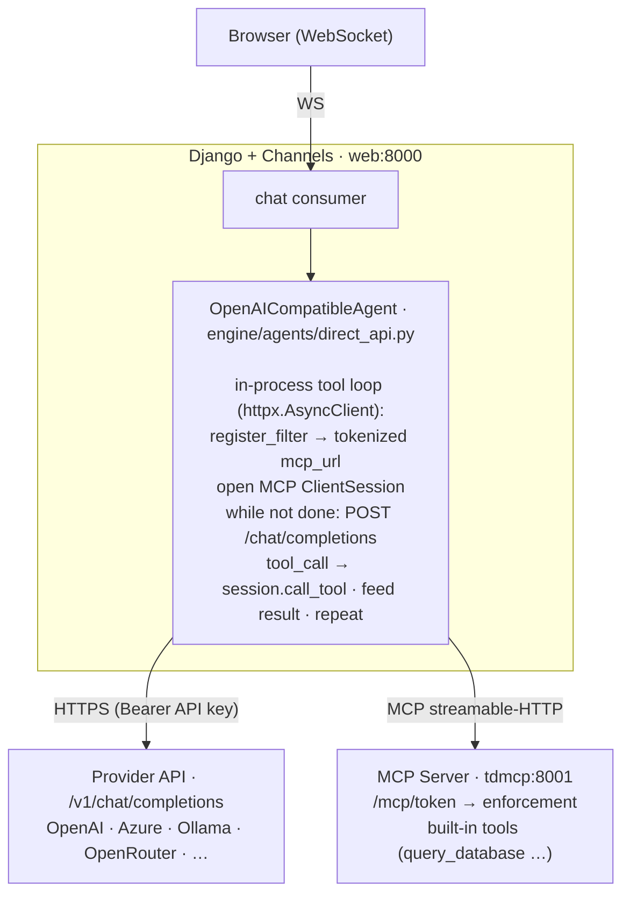
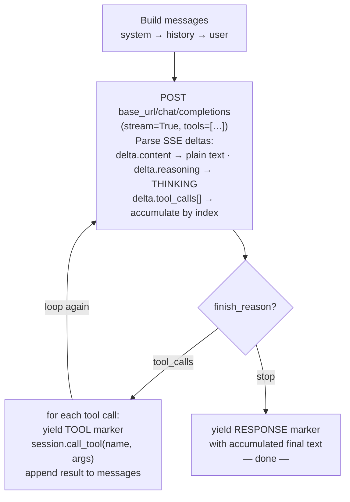
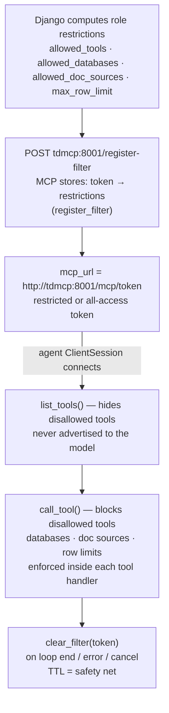

# Direct API Agent

This integration runs the agentic **tool-call loop in-process inside Django** —
no extra Docker container, no CLI subprocess. The agent calls an
**OpenAI-compatible chat-completions API** directly over HTTP (`httpx`) and
drives the MCP tools itself. Because there is no wrapped CLI, **every** capability
the model can reach is an MCP tool, fully subject to role-based filtering.

This document describes how it works, end to end: the components, the request
flow, the in-process tool loop, MCP-based access control, the streaming
translation, and how the agent is configured. See [[TetherDust Documentation/3. Agent Integrations/1. Overview.md|Overview]]
for how this option fits alongside the other integration approaches.

The same agent class targets OpenAI, Azure OpenAI, OpenRouter, a local
**Ollama** instance, and Anthropic's OpenAI-compatible endpoint by changing only
`base_url` and `model` — so the Ollama and gateway options reuse this exact
implementation.

Because one backend spans every OpenAI-compatible provider, the admin UI exposes
several **presets** under the **Direct API Agent** category that all run on
`OpenAICompatibleAgent`; they differ only in the display name and the base URL
the Add-Agent form is pre-filled with:

| UI entry | `agent_type` | Agent class | Pre-filled `base_url` |
|---|---|---|---|
| OpenAI Platform | `openai_platform` | `OpenAIPlatformAgent` | `https://api.openai.com/v1` |
| Claude Console | `claude_console` | `ClaudeConsoleAgent` | `https://api.anthropic.com/v1` |
| OpenAI-compatible API (Custom) | `openai_api` | `OpenAICompatibleAgent` | *(blank — admin enters any compatible endpoint)* |

`OpenAIPlatformAgent` and `ClaudeConsoleAgent` are thin subclasses that only
override `get_name()` (mirroring `OllamaAgent` / `OpenRouterAgent`) — there is no
provider-specific request building. **Claude Console** uses Anthropic's
OpenAI-compatible chat-completions endpoint, so the Anthropic API key is sent as
a normal `Authorization: Bearer …` header. The generic **Custom** entry remains
the escape hatch for any other OpenAI-compatible endpoint (Azure, a self-hosted
gateway, …).

---

## Table of Contents

1. [At a glance](#at-a-glance)
2. [Components](#components)
3. [Request flow](#request-flow)
4. [The in-process tool loop](#the-in-process-tool-loop)
5. [MCP token filtering](#mcp-token-filtering)
6. [Provider stream → markers](#provider-stream--markers)
7. [Stream protocol](#stream-protocol)
8. [Configuration](#configuration)

---

## At a glance



- **No container.** The loop lives in the Django process; the inactive agent is
  just an uninstantiated Python class. There is nothing to start, stop, or
  health-check.
- **Auth model:** a single provider **API key**, stored Fernet-encrypted on the
  agent config. Billing is per token.
- **One active agent:** exactly one `AgentConfiguration` row is `is_active`.
  `get_agent()` reads it fresh per request, so switching agents is a DB change,
  not a redeploy.
- **Access control** (allowed tools / databases / doc sources / row limit) is
  enforced at the **MCP server**, keyed by a per-request token Django registers —
  the *same* mechanism every other integration uses.

---

## Components

| Layer | File | Role |
|---|---|---|
| Agent abstraction | `engine/agents/base.py` — `BaseAgent` | Transport-agnostic `chat()` async-generator contract. |
| Agent | `engine/agents/direct_api.py` — `OpenAICompatibleAgent` | Owns the in-process tool loop: streams the provider, executes MCP tools, re-yields framed chunks. Registered under `openai_api`, with `OpenAIPlatformAgent` / `ClaudeConsoleAgent` preset subclasses for `openai_platform` / `claude_console`. |
| MCP client | `engine/agents/mcp_session.py` | `open_mcp_session` (an initialized `ClientSession` over streamable-HTTP), `mcp_tools_to_openai` (MCP schema → OpenAI function schema), `call_tool_text` (flatten a tool result). |
| Filter helper | `engine/agents/mcp_filter.py` | Agent-agnostic `register_filter` / `tokenized_mcp_url` / `clear_filter` / `mcp_base_url`. Reused as-is from the CLI integrations. |
| History helper | `engine/agents/history.py` | `messages_to_prompt` (used by the CLI path); this agent consumes the structured turns natively. |
| Stream protocol | `engine/agents/stream.py` | NUL-prefixed marker format + `parse_chunk`. |
| Factory | `engine/agents/__init__.py` — `get_agent()` | Maps `openai_api` / `openai_platform` / `claude_console` → the `OpenAICompatibleAgent` family. |
| Config model | `engine/models/agent.py` — `AgentConfiguration` | Persisted agent settings (see [Configuration](#configuration)). |

There is **no gateway service** and no `containers/<name>/` directory — that whole
layer is what this option removes. The agent talks to the provider and to the
MCP server directly.

> **Why an MCP `ClientSession` and not plain REST?** The MCP server only speaks
> the MCP protocol over streamable-HTTP — it has no `GET /tools` /
> `POST /call_tool` REST surface. The agent therefore drives a real
> `ClientSession` (the same SDK `containers/local_mcp/local_mcp_api.py` uses over
> stdio, here over HTTP) to list and invoke tools.

---

## Request flow

```
1.  User sends a message over the WebSocket.
2.  The chat consumer calls get_agent() → OpenAICompatibleAgent, then chat(...)
    with the role's allowed_tools / allowed_databases / allowed_doc_sources /
    max_row_limit and the structured conversation history.

    Inside OpenAICompatibleAgent.chat() (engine/agents/direct_api.py):
3.  Validate config — model, base_url, and api_key must be present. Otherwise
    yield a friendly error chunk and return.
4.  Always register a per-request MCP token:
        register_filter(...)  →  POST tdmcp:8001/register-filter  →  token
        mcp_url = tokenized_mcp_url(token) = http://tdmcp:8001/mcp/<token>
    Unrestricted users register an all-access token (all allow-lists are `None`).
    Registration failures fail closed: the user gets an error chunk and the
    request aborts (no unfiltered fallback).
5.  Open an MCP ClientSession to mcp_url; list_tools() → convert to OpenAI
    function definitions (mcp_tools_to_openai).
6.  Build the message list: system (from system_prompt) → prior history turns
    → the current user message.
7.  Run the tool loop (see next section) against {base_url}/chat/completions,
    yielding framed chunks as text / thinking / tool calls / final answer arrive.
8.  finally: close the provider stream and clear_filter(token). Clearing runs on
    completion, error, AND cancel; the MCP server's token TTL is the safety net.
9.  The WebSocket consumer streams chunks to the browser in real time.
```

`OpenAICompatibleAgent.cancel()` closes the in-flight provider stream
(`self._http_response`); combined with the consumer cancelling the agent task,
this unwinds the loop and tears down the MCP session promptly.

An overall `asyncio.timeout(DIRECT_API_RESPONSE_TIMEOUT)` bounds the whole
request; transport errors (connect / timeout / read / HTTP status) are caught and
surfaced as user-facing chunks rather than raised.

---

## The in-process tool loop

Because the loop runs in Django (not a CLI subprocess), the agent owns every step
and emits the stream markers directly. One round:



Details that matter:

- **Streamed tool-call arguments are fragmented.** A provider streams
  `tool_calls[].function.arguments` as partial JSON across many deltas; the agent
  accumulates them **by `index`** and parses once the round completes. Names
  arrive once; ids may arrive once.
- **Multi-round interleaving is natural.** A round may emit preamble text *and*
  request tools; that text streams live, the tools execute, and the loop
  continues. Only the final round (no tool calls) produces the canonical
  `\x00RESPONSE:` answer.
- **A hard round cap** (`DIRECT_API_MAX_TOOL_ROUNDS`, default 25) prevents a model
  that keeps requesting tools from looping forever.
- **Tool failures don't crash the loop.** If `session.call_tool` raises, the error
  text is fed back to the model as the tool result so it can recover or explain.
- **Built-in MCP only (v1).** Per-role custom MCP servers (the local-mcp `:8003`
  servers) are not yet wired into this agent; if a request carries them they are
  ignored with a logged warning.

---

## MCP token filtering

Role-based access control is enforced at the **MCP server**, not in the agent —
identical to the CLI integrations, and using the *same* helper
(`engine/agents/mcp_filter.py`). The only difference is where the tokenized URL
goes: the CLI path writes it into `config.toml`/`-c`, while this agent passes it
straight to its MCP `ClientSession`.



Because filtering happens server-side and keyed by token, the agent inherits the
same **hide-vs-block** guarantees (`list_tools` is guidance; `call_tool` is the
authoritative wall, failing closed for unknown tools) and the centralized
database / doc-source / row-limit checks in `mcp_server/tools/_db_shared.py` — no
agent-side access logic to replicate.

If filter registration fails (MCP unreachable, timeout, HTTP error),
`chat()` yields a user-facing error and returns — it does **not** fall back to an
unfiltered request.

---

## Provider stream → markers

The agent maps each OpenAI-compatible SSE delta onto the flat stream protocol.
Because it owns the loop, this is a direct mapping rather than re-parsing a CLI's
JSONL:

| Protocol marker | OpenAI-compatible delta |
|---|---|
| *(plain text)* | `choices[].delta.content` — streamed for the live typing effect |
| `\x00TOOL:<name>` | emitted when a `tool_calls` round resolves, just before `call_tool` |
| `\x00THINKING:<text>` | `delta.reasoning_content` / `delta.reasoning` (providers that expose reasoning) |
| `\x00RESPONSE:<text>` | the accumulated final-answer text, emitted once the model stops requesting tools |

`\x00THINKING:` is the only provider-dependent marker: standard chat-completions
models don't stream reasoning, so where a provider surfaces none the agent simply
emits nothing — thinking is status-only and **degrades gracefully**.

---

## Stream protocol

`engine/agents/stream.py` defines the flat-string contract between agents and the
WebSocket consumer. Structured events are framed with a NUL byte (`\x00`) — a
sentinel that never appears in model text:

| Prefix | Meaning | Consumer behavior |
|---|---|---|
| `\x00TOOL:<name>` | Agent is calling an MCP tool | Show tool status in the UI |
| `\x00RESPONSE:<text>` | Completed final answer | **Persist** as the message of record, render |
| `\x00THINKING:<text>` | Model reasoning trace | Show in the status bar only |
| *(plain text)* | Partial streaming token | Append to the in-progress message |

Consumers call `parse_chunk(chunk)` → `AgentEvent(kind, text)` rather than
re-implementing the prefix split — so this agent plugs into the existing UI with
no consumer changes.

> **Plain text vs. `\x00RESPONSE:`.** Both carry the same answer content but serve
> different roles. Plain-text chunks are the incremental tokens streamed for the
> live typing effect — display-only. `\x00RESPONSE:` is the single canonical
> payload that is saved. The consumer streams the former for UX and commits the
> latter; it does not reassemble the saved message from the deltas.

---

## Configuration

`AgentConfiguration` (`engine/models/agent.py`) — admin-editable, persisted in
PostgreSQL:

| Field | Purpose |
|---|---|
| `name` | Display name (unique). |
| `agent_type` | Selects the agent class. This integration uses `"openai_api"` (Custom) or one of the presets `"openai_platform"` / `"claude_console"`. |
| `is_active` | Only one row may be active; saving an active row deactivates the others. |
| `system_prompt` | Sent inline as the `system` message on every request. **Not** synced to any `AGENTS.md` file — there is no container, so `_sync_agents_md` no-ops for this type. |
| `_api_key` | Fernet-encrypted provider API key. Accessed via `get_api_key()` / `set_api_key()`. Sent as `Authorization: Bearer …`. |
| `settings` | JSON holding the direct-API parameters: `model`, `base_url`, and optional `max_tokens`. |

`service_url` is unused for this integration — the provider endpoint is
`settings.base_url` (e.g. `https://api.openai.com/v1`), and the agent POSTs to
`{base_url}/chat/completions`. In the admin, the **Provider API** card collects
`base_url`, `model`, and the API key; the view persists `base_url`/`model` into
`settings` and the key via `set_api_key()`.

**Conversation history** is delivered as **native multi-turn messages**: the chat
consumer loads prior turns (`_get_conversation_messages`) and passes them as the
`history` argument, which the agent expands into alternating `user`/`assistant`
messages ahead of the current turn — rather than flattening history into a single
prompt string (which is what the CLI path does).

**Switching the active agent** is a database change, not a deploy: `get_agent()`
reads `AgentConfiguration.get_active()` fresh on every request, so flipping
`is_active` takes effect on the next message. Unlike the CLI options, there is no
container to start first.

### Tunable environment variables

| Variable | Default | Effect |
|---|---|---|
| `DIRECT_API_CONNECT_TIMEOUT` | `30` | Connect timeout (seconds) to the provider. |
| `DIRECT_API_RESPONSE_TIMEOUT` | `300` | Overall per-request timeout (seconds). |
| `DIRECT_API_MAX_TOOL_ROUNDS` | `25` | Hard cap on tool-call rounds per request. |
| `MCP_BASE_URL` | `http://tdmcp:8001` | MCP server base URL (shared with the filter helper). |

### Tradeoffs

- ✅ **No extra container** — lower operational complexity; the inactive agent
  costs nothing.
- ✅ **Full control of the loop** — retries, timeouts, ordering, and round caps
  live in Python; easy to debug (no subprocess, no JSONL parsing).
- ✅ **One class spans many providers** — OpenAI, Azure, OpenRouter, and Ollama
  differ only by `base_url`/`model`.
- ❌ **Per-token billing** — unlike a flat subscription credential.
- ❌ **You implement the loop per provider family** — the OpenAI-compatible loop
  here doesn't cover Anthropic's `/v1/messages` shape; that would be a sibling
  class (the MCP/tool plumbing is shared).
- ❌ **No built-in coding tools** (file edit, bash) — but that's **moot** for
  TetherDust: every operation already goes through MCP tools, so dropping the
  CLI's ungoverned, sandbox-bypassed surface tightens the model rather than
  losing anything.
