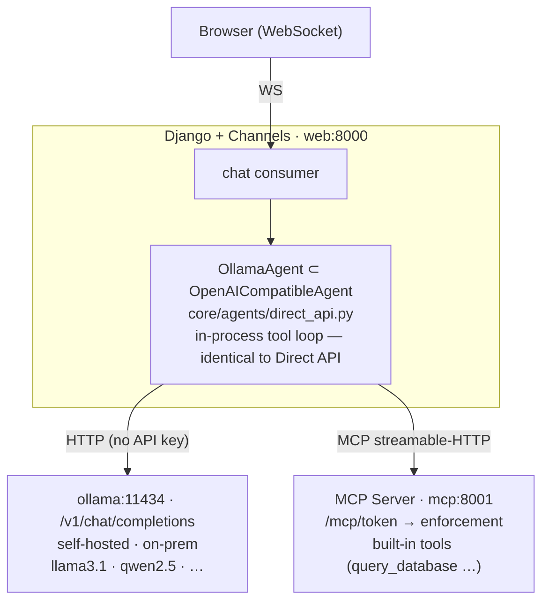

# Local LLM with Ollama

This integration runs inference on **self-hosted hardware** via an
[Ollama](https://ollama.com) container, so **no data leaves your infrastructure**
and there are **no per-token costs**. Ollama exposes an **OpenAI-compatible**
chat-completions API, so TetherDust reuses the [[TetherDust Documentation/3. Agent Integrations/4. Direct API Agent.md|Direct API Agent]]
implementation unchanged — Ollama is "the Direct API agent with a different
`base_url`."

This document covers only what is *specific* to Ollama: the container, the
`OllamaAgent` subclass, how to pull a model, and how to configure the agent. For
the in-process tool loop, MCP token filtering, and the stream protocol — all
identical here — see the [[TetherDust Documentation/3. Agent Integrations/4. Direct API Agent.md|Direct API Agent]] doc. See
[[TetherDust Documentation/3. Agent Integrations/1. Overview.md|Overview]] for how this option sits alongside the others.

---

## Table of Contents

1. [At a glance](#at-a-glance)
2. [What's different from the Direct API agent](#whats-different-from-the-direct-api-agent)
3. [The Ollama container](#the-ollama-container)
4. [Pulling a model](#pulling-a-model)
5. [Configuration](#configuration)
6. [Tradeoffs](#tradeoffs)

---

## At a glance



- **No external API.** Inference runs in the `ollama` container on your hardware.
- **No API key.** A local Ollama accepts unauthenticated requests, so the
  `OllamaAgent` sends no `Authorization` header and the key field is left blank.
- **Self-hosted, profile-gated.** The container is optional and started via a
  Docker Compose profile; it is **not** a `web` dependency, so leaving the
  profile off never blocks startup.
- **Everything else is the Direct API agent** — same tool loop, same MCP
  token filtering, same stream protocol.

---

## What's different from the Direct API agent

Only two things differ from `OpenAICompatibleAgent`; both live in the small
`OllamaAgent` subclass (`core/agents/direct_api.py`):

| Aspect | `OpenAICompatibleAgent` (`openai_api`) | `OllamaAgent` (`ollama`) |
|---|---|---|
| API key | Required; sent as `Authorization: Bearer …` | **Not required** (`REQUIRES_API_KEY = False`); the header is omitted when no key is set |
| Display name | "OpenAI-compatible API (Direct)" | "Local LLM with Ollama" |
| Default `base_url` | none (admin enters it) | pre-filled `http://ollama:11434/v1` for a new agent |

```python
class OllamaAgent(OpenAICompatibleAgent):
    REQUIRES_API_KEY = False

    def get_name(self) -> str:
        return "Local LLM with Ollama"
```

The parent class only adds the `Authorization` header when an API key is present,
so an optional key still works (e.g. if you put Ollama behind an auth proxy) but
none is needed for the default local setup. Registered under the `ollama` agent
type in `core/agents/__init__.py` and `AgentConfiguration.AGENT_TYPE_CHOICES`;
because it runs in-process it is in `DIRECT_API_AGENT_TYPES`, so there is no
`AGENTS.md` to sync — the system prompt is sent inline per request.

---

## The Ollama container

`docker-compose.yml` defines a profile-gated `ollama` service:

```yaml
ollama:
  image: ollama/ollama:latest
  profiles: ["ollama"]
  volumes:
    - ollama-models:/root/.ollama   # pulled models persist across restarts
  healthcheck:
    test: ["CMD", "ollama", "list"]
    interval: 15s
    timeout: 5s
    start_period: 30s
    retries: 3
```

Start it (alongside the rest of the stack):

```bash
docker compose --profile ollama up -d --build
```

Django reaches it at `http://ollama:11434/v1` on the default Compose network; no
host port mapping is required and no new `web` env var is needed — the URL lives
in `AgentConfiguration.settings.base_url`.

> **macOS note.** Docker Desktop on macOS cannot access the Mac GPU, so an
> in-container Ollama runs **CPU-only** and is noticeably slower. For GPU
> acceleration, run on a Linux host with NVIDIA drivers and uncomment the `deploy`
> GPU reservation in `docker-compose.yml`.

---

## Pulling a model

The container ships **no models**; pull one (with **tool-calling support** — TetherDust
drives everything through MCP function calls) into the persistent volume:

```bash
docker compose exec ollama ollama pull llama3.1
```

Confirmed tool-call-capable models include **Llama 3.1+**, **Qwen 2.5**, and
**Mistral 7B Instruct**. Check the [Ollama model library](https://ollama.com/library)
for the "Tools" capability before choosing — a model without it cannot call the
MCP tools and the agent will only produce plain text. Smaller local models are
also weaker at multi-step database analysis than frontier cloud models.

---

## Configuration

In the console: **Agents → Add Agent → "Local LLM with Ollama"**, then:

| Field | Value |
|---|---|
| `name` | Any display name, e.g. "Local Llama 3.1". |
| `base_url` | Pre-filled `http://ollama:11434/v1` (the in-cluster URL). |
| `model` | The model you pulled, e.g. `llama3.1`. |
| API key | **Leave blank** — a local Ollama needs none. |
| `system_prompt` | Sent inline as the `system` message each request (no `AGENTS.md` sync). |

Save, then **activate** it (only one agent is active at a time). `get_agent()`
reads the active row fresh per request, so activation takes effect on the next
message — no restart.

The same tunable environment variables as the Direct API agent apply
(`DIRECT_API_CONNECT_TIMEOUT`, `DIRECT_API_RESPONSE_TIMEOUT`,
`DIRECT_API_MAX_TOOL_ROUNDS`, `MCP_BASE_URL`).

---

## Tradeoffs

- ✅ **No external API costs; no data leaves your infrastructure** — works
  air-gapped.
- ✅ **Reuses the Direct API agent wholesale** — no new tool loop, MCP filtering,
  or stream handling to maintain.
- ✅ **No API key to manage** for the default local setup.
- ❌ **Needs capable hardware** — a GPU for acceptable performance at most model
  sizes; CPU-only (including Docker on macOS) is slow.
- ❌ **Smaller local models are less capable** than frontier cloud models for
  complex multi-step database analysis.
- ❌ **A new container** adds operational surface (mitigated by the optional
  Compose profile).
