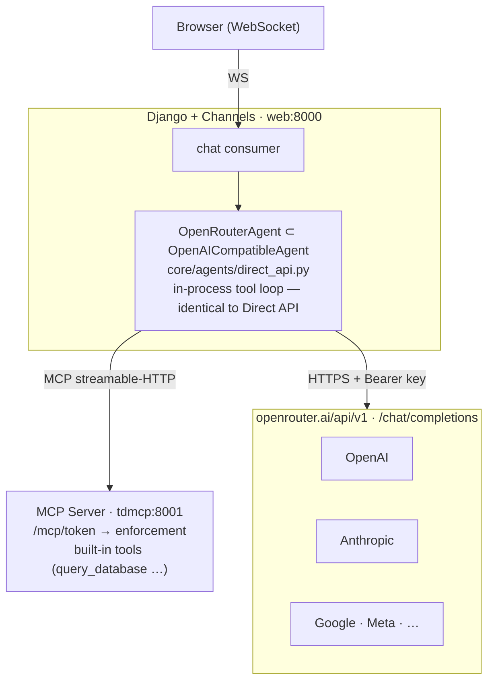

# Gateway (OpenRouter)

[OpenRouter](https://openrouter.ai) is a **gateway**: one OpenAI-compatible
endpoint that routes to 100+ models from every major provider behind a **single
API key**. Because the endpoint is OpenAI-compatible, TetherDust reuses the
[[TetherDust Documentation/3. Agent Integrations/4. Direct API Agent.md|Direct API Agent]] implementation unchanged — OpenRouter
is "the Direct API agent pointed at the gateway, with the model chosen as a
config string." Switching from GPT to Claude to Llama is a one-field change, not
a new agent class or container.

This document covers only what is *specific* to OpenRouter: the `OpenRouterAgent`
subclass, the attribution headers it sends, and how to configure it. For the
in-process tool loop, MCP token filtering, and the stream protocol — all
identical here — see the [[TetherDust Documentation/3. Agent Integrations/4. Direct API Agent.md|Direct API Agent]] doc. See
[[TetherDust Documentation/3. Agent Integrations/1. Overview.md|Overview]] for how this option sits alongside the others.

---

## Table of Contents

1. [At a glance](#at-a-glance)
2. [What's different from the Direct API agent](#whats-different-from-the-direct-api-agent)
3. [Choosing a model](#choosing-a-model)
4. [Configuration](#configuration)
5. [Tradeoffs](#tradeoffs)

---

## At a glance



- **No new container.** Like the Direct API agent, the loop runs in-process in
  Django; there is nothing to build or profile-gate.
- **One key, every provider.** A single `OPENROUTER_API_KEY` reaches all models;
  the provider is selected by the `model` string (e.g. `anthropic/claude-sonnet-4-5`).
- **Attribution headers.** The subclass adds OpenRouter's recommended
  `HTTP-Referer` and `X-Title` headers (used for its app rankings/dashboards).
- **Everything else is the Direct API agent** — same tool loop, same MCP token
  filtering, same stream protocol.

---

## What's different from the Direct API agent

Only the attribution headers, display name, and a pre-filled base URL differ from
`OpenAICompatibleAgent`; all live in the small `OpenRouterAgent` subclass
(`core/agents/direct_api.py`):

| Aspect | `OpenAICompatibleAgent` (`openai_api`) | `OpenRouterAgent` (`openrouter`) |
|---|---|---|
| API key | Required; sent as `Authorization: Bearer …` | Required (same) |
| Extra headers | none | `HTTP-Referer` + `X-Title` (attribution) |
| Display name | "OpenAI-compatible API (Direct)" | "OpenRouter (Gateway)" |
| Default `base_url` | none (admin enters it) | pre-filled `https://openrouter.ai/api/v1` for a new agent |

The base class exposes two overridable hooks — `_extra_headers()` and
`_extra_body()` — that are merged into every provider request. `OpenRouterAgent`
overrides only `_extra_headers()`:

```python
class OpenRouterAgent(OpenAICompatibleAgent):
    def get_name(self) -> str:
        return "OpenRouter (Gateway)"

    def _extra_headers(self) -> Dict[str, str]:
        headers: Dict[str, str] = {}
        if OPENROUTER_REFERER:
            headers["HTTP-Referer"] = OPENROUTER_REFERER
        if OPENROUTER_TITLE:
            headers["X-Title"] = OPENROUTER_TITLE
        return headers
```

Both header values default to TetherDust identifiers and are overridable via the
`OPENROUTER_REFERER` and `OPENROUTER_TITLE` environment variables; setting either
to an empty string omits that header. The attribution is optional — OpenRouter
works without it — but it is recommended for the provider's analytics.

Registered under the `openrouter` agent type in `core/agents/__init__.py` and
`AgentConfiguration.AGENT_TYPE_CHOICES`; because it runs in-process it is in
`DIRECT_API_AGENT_TYPES`, so there is no `AGENTS.md` to sync — the system prompt
is sent inline per request. The `_extra_body()` hook is available (and empty by
default) as the natural extension point for OpenRouter's gateway-specific request
fields such as model-fallback lists or provider routing preferences.

---

## Choosing a model

With OpenRouter the model is a **config string**, not an architectural choice:

```
anthropic/claude-sonnet-4-5
openai/gpt-4o-mini
meta-llama/llama-3.1-70b-instruct
google/gemini-2.0-flash
```

Switching providers is just editing this one field on the active agent (or
creating a second agent and activating it) — no container, no redeploy. Browse
the catalog and exact identifiers at [openrouter.ai/models](https://openrouter.ai/models).
As with every TetherDust agent, pick a model with **tool-calling support**:
the entire flow runs through MCP function calls, so a model that cannot call
tools will only produce plain text.

---

## Configuration

First create a key at [openrouter.ai/keys](https://openrouter.ai/keys). In the
console: **Agents → Add Agent → "OpenRouter (Gateway)"**, then:

| Field | Value |
|---|---|
| `name` | Any display name, e.g. "OpenRouter — Claude Sonnet". |
| `base_url` | Pre-filled `https://openrouter.ai/api/v1`. |
| `model` | A provider-qualified model string, e.g. `anthropic/claude-sonnet-4-5`. |
| API key | Your OpenRouter key (stored encrypted; blank on edit keeps the current key). |
| `system_prompt` | Sent inline as the `system` message each request (no `AGENTS.md` sync). |

Save, then **activate** it (only one agent is active at a time). `get_agent()`
reads the active row fresh per request, so activation takes effect on the next
message — no restart.

Optional environment variables (set on the `web` service):

| Variable | Default | Purpose |
|---|---|---|
| `OPENROUTER_REFERER` | `https://tetherdust.local` | `HTTP-Referer` attribution header. |
| `OPENROUTER_TITLE` | `TetherDust` | `X-Title` attribution header. |

The same tunables as the Direct API agent also apply
(`DIRECT_API_CONNECT_TIMEOUT`, `DIRECT_API_RESPONSE_TIMEOUT`,
`DIRECT_API_MAX_TOOL_ROUNDS`, `MCP_BASE_URL`).

---

## Tradeoffs

- ✅ **One key and one agent class covers every provider** — no per-provider
  classes or containers to maintain.
- ✅ **Easy model switching** — change a config string, not infrastructure.
- ✅ **Built-in fallback routing** — OpenRouter can re-route to another provider
  if one is down.
- ✅ **Reuses the Direct API agent wholesale** — no new tool loop, MCP filtering,
  or stream handling.
- ❌ **Small per-token markup** (~3%) on top of the underlying provider pricing.
- ❌ **Data passes through a third party** — may not meet strict data-residency or
  compliance requirements.
- ❌ **Per-token billing** — unlike the flat-cost subscription CLI option.
