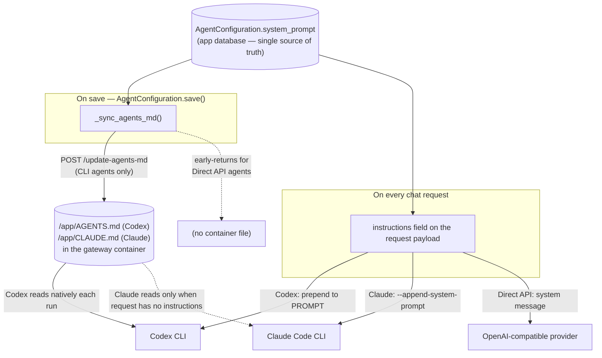

# System Prompt

The **system prompt** is the standing instruction set that shapes every agent
reply — its role, the MCP tool workflow, output formatting, and the refusal
policy. It is the single biggest lever on response quality, and it behaves
differently depending on the integration *mechanism*.

This page is cross-cutting: it explains where the prompt is **stored**, how it is
**delivered** to each agent type, what "fallback" actually means, and the gotchas
around editing it. For the per-integration request lifecycle see
[[TetherDust Documentation/3. Agent Integrations/2. CLI Tool with Auth Token.md|CLI Tool with Auth Token]],
[[TetherDust Documentation/3. Agent Integrations/3. CLI Tool with API Key.md|CLI Tool with API Key]], and
[[TetherDust Documentation/3. Agent Integrations/4. Direct API Agent.md|Direct API Agent]]. See
[[TetherDust Documentation/3. Agent Integrations/1. Overview.md|Overview]] for how the integration types fit together.

---

## Table of Contents

1. [At a glance](#at-a-glance)
2. [The one source of truth](#the-one-source-of-truth)
3. [Two delivery paths](#two-delivery-paths)
4. [Behaviour by integration type](#behaviour-by-integration-type)
5. [What "fallback" means](#what-fallback-means)
6. [Editing the prompt](#editing-the-prompt)
7. [The default prompt and where it lives](#the-default-prompt-and-where-it-lives)
8. [Gotchas](#gotchas)
9. [Code reference](#code-reference)

---

## At a glance

The prompt always **originates in the database**. From there it fans out along up
to two paths depending on the agent type.

---

## The one source of truth

Whatever agent type you use, the editable prompt lives in exactly one place: the
**`system_prompt` column on `AgentConfiguration`** (`engine/models/agent.py`), a
`TextField` in the app's PostgreSQL database. Everything else — the inline
`instructions` on a request, the `AGENTS.md`/`CLAUDE.md` file inside a gateway
container — is a **copy** derived from that column, never an independent source
you edit directly.

`AgentConfiguration.get_active()` reads the row fresh per request, so editing the
prompt (or switching the active agent) takes effect on the **next message** with
no redeploy.

---

## Two delivery paths

A saved prompt reaches the running agent by one or both of these:

1. **Inline, per request (`instructions`).** The agent attaches the prompt to
   every chat request — but **only when `system_prompt` is non-empty**
   (`engine/agents/codex.py:102-104`). A blank prompt means the request carries no
   `instructions` at all.

2. **Synced to a container file, on save (CLI agents only).**
   `AgentConfiguration.save()` calls `_sync_agents_md()`
   (`engine/models/agent.py:114-158`), which POSTs the prompt to the gateway's
   `/update-agents-md` endpoint. The gateway **overwrites** its system-prompt
   file:
   - Codex → `/app/AGENTS.md` (`containers/codex/codex_api.py:573`)
   - Claude → `/app/CLAUDE.md` (`containers/claude/claude_api.py:452`)

   The service URL is resolved **type-aware** (`agent.py:133-145`) so a Claude
   agent never pushes its prompt onto the Codex container, and a blank-URL
   `*_api` agent falls back to its own `*_API_SERVICE_URL`.

> **The two paths are belt-and-suspenders for CLI agents, not redundant.** The
> inline `instructions` path is what actually governs chat. The file sync exists
> because the **Codex CLI reads `/app/AGENTS.md` natively on every invocation**
> regardless of the request, and because it gives the **Claude** gateway a value
> to read when a request arrives without inline instructions. If the sync ever
> fails, chat still works — the prompt rides along each request inline.

---

## Behaviour by integration type

| Integration | DB `system_prompt` | Synced to container file? | Delivered per request as | If left blank |
|---|---|---|---|---|
| **Codex** (`codex`, `codex_api`) | ✅ source of truth | ✅ `/app/AGENTS.md` | Prepended to the single `PROMPT` arg (`codex_api.py:356-359`) | Codex CLI still reads whatever is in `/app/AGENTS.md` (its baked-in default until overwritten) |
| **Claude Code** (`claude_code`, `claude_code_api`) | ✅ source of truth | ✅ `/app/CLAUDE.md` | `--append-system-prompt` (`claude_api.py:245-247`) | Gateway falls back to reading `/app/CLAUDE.md` (`_resolve_instructions`) |
| **Direct API** (`openai_platform`, `claude_console`, `openrouter`, `ollama`, `openai_api`) | ✅ source of truth | ❌ never (no container) | A `{"role": "system"}` message at the head of the array (`direct_api.py:286-287`) | **No system prompt is sent at all** — there is no fallback |

The split is by *mechanism*, not by credential: the auth-token and API-key
variants of each CLI behave identically for the system prompt. The two CLI rows
sync and read a container file; the Direct API row never touches a file because
those agents run the in-process `OpenAICompatibleAgent` loop with no gateway
container.

---

## What "fallback" means

"Fallback" is a precise term for **Claude only**, and it describes a
**request-time source selection**, not a preserved backup default.

The Claude gateway's `_resolve_instructions` (`containers/claude/claude_api.py:174-180`)
does:

> *Per-request `instructions` win; otherwise fall back to the stored `CLAUDE.md`.*

So for a single request the gateway chooses between two inputs:

1. the `instructions` on the request payload (preferred), and
2. the `/app/CLAUDE.md` file on disk (the **fallback** when a request carries no
   instructions).

A request carries no instructions precisely when `system_prompt` is blank (the
agent only attaches `instructions` for a non-empty prompt). That is the only case
where the file is consulted.

Two clarifications that are easy to get wrong:

- **The fallback file is not a pristine, preserved default.** It holds *whatever
  was last written to it* — which starts as the baked-in default but is
  **overwritten the moment any agent saves a prompt** to that container.
- **For Codex, "fallback" is the wrong word entirely.** The Codex CLI reads
  `/app/AGENTS.md` **unconditionally** on every run, and the gateway *also*
  prepends inline instructions — there is no "if no instructions, fall back"
  branch. The file is simply the always-on base prompt, not a fallback.

---

## Editing the prompt

The admin edits the prompt in the agent **edit form** (System Prompt card,
`management/templates/management/agents/form.html`). Saving runs the normal
`AgentConfiguration.save()` → `_sync_agents_md()` chain described above.

**Form pre-fill.** When you open the form for an agent whose `system_prompt` is
blank, the view seeds the textarea from a default file so you see (and can edit)
the prompt the agent effectively uses
(`management/views/agent.py` · `_default_system_prompt_path`):

- `claude_code` / `claude_code_api` → seeds from `containers/claude/CLAUDE.md`
- every other CLI / Direct API type → seeds from `containers/codex/AGENTS.md`

This pre-fill is **display only** — it is not persisted unless you save the form.

> **The web container needs those default files to exist for the pre-fill to
> work.** They are copied into the web image via the Dockerfile
> (`COPY containers/codex/AGENTS.md` and `COPY containers/claude/CLAUDE.md`). Without
> them the textarea would render empty on a blank-prompt agent. The view resolves
> them at `/app/containers/codex/AGENTS.md` and `/app/containers/claude/CLAUDE.md` inside
> the container.

---

## The default prompt and where it lives

The shipped default prompt is the repo file:

- `containers/codex/AGENTS.md` (Codex)
- `containers/claude/CLAUDE.md` (Claude Code)

Each is **baked into its gateway image** at build time and lives in the running
container at `/app/AGENTS.md` / `/app/CLAUDE.md`. That baked-in copy **is** the
fallback — there is **no separate "default" file kept aside**. The same repo
files are *also* copied into the **web** image so the edit form can pre-fill from
them (a distinct copy in a distinct container — same original content).

Once an agent saves a non-empty prompt, the baked-in default in that gateway
container is replaced. The pristine default then survives only in (1) the repo
source and (2) the image layer — recoverable by recreating the container.

---

## Gotchas

- **Clearing the prompt does not restore the default.** `_sync_agents_md()`
  early-returns when `system_prompt` is empty (`agent.py:118-119`), so saving a
  blank prompt pushes *nothing* — the container keeps whatever was last written.
  To truly restore the shipped default, recreate the container:
  `docker compose up -d --force-recreate codex claude`.

- **Direct API agents have no fallback.** A blank `system_prompt` means the model
  receives only the user's message — no role, no tool workflow, no refusal
  policy. Always set a prompt for these.

- **Shared Service URL → agents clobber each other.** Two CLI agents that resolve
  to the same Service URL (the same container) write the same
  `/app/AGENTS.md` / `/app/CLAUDE.md`; the last save wins. Give each agent its own
  Service URL to keep prompts isolated.

- **The sync is best-effort.** `_sync_agents_md()` swallows errors and logs a
  warning (`agent.py:155-158`). Chat still works because the prompt is sent inline
  per request — but a stale file can affect Codex's native read or Claude's
  fallback until the next successful save.

---

## Code reference

| Concern | Location |
|---|---|
| Prompt column (source of truth) | `engine/models/agent.py` · `AgentConfiguration.system_prompt` |
| Sync to container on save | `engine/models/agent.py:114-158` · `_sync_agents_md()` |
| Direct API early-return (no file) | `engine/models/agent.py:120-123` |
| Inline `instructions` (Codex/Claude) | `engine/agents/codex.py:102-104` |
| Direct API system message | `engine/agents/direct_api.py:286-287` |
| Codex: write file | `containers/codex/codex_api.py:573` · `/update-agents-md` |
| Codex: prepend to PROMPT | `containers/codex/codex_api.py:356-359` |
| Claude: write file | `containers/claude/claude_api.py:454-457` · `/update-agents-md` |
| Claude: per-request fallback | `containers/claude/claude_api.py:174-180` · `_resolve_instructions` |
| Claude: `--append-system-prompt` | `containers/claude/claude_api.py:247-249` |
| Edit form pre-fill | `management/views/agent.py` · `_default_system_prompt_path` |
| System Prompt card (UI) | `management/templates/management/agents/form.html` |
| Default prompts copied into web image | `Dockerfile` · `COPY containers/.../AGENTS.md` `CLAUDE.md` |
