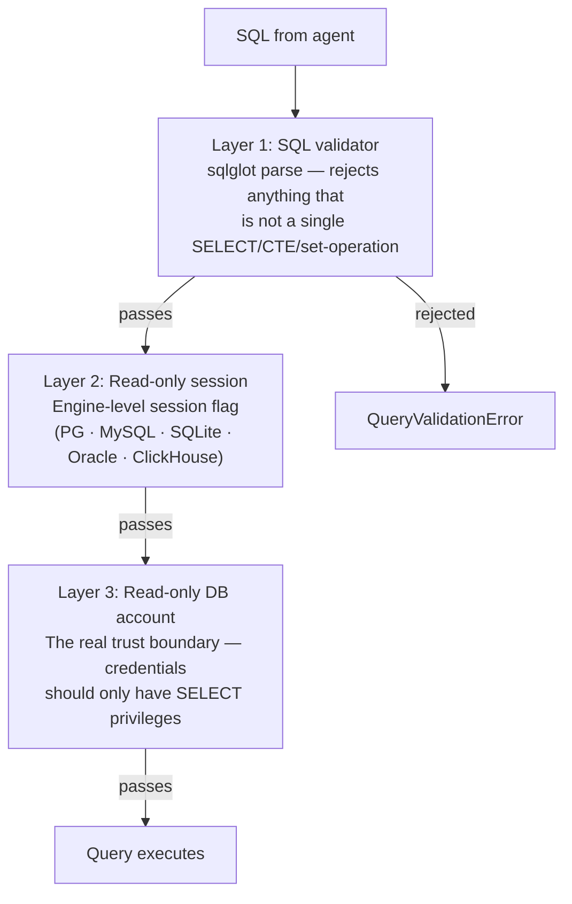

# Security

TetherDust is designed to let users query databases through an AI agent without
giving that agent write access. This page summarises the security model, where
each defence layer lives, and what you must configure correctly for a safe
deployment.

---

## Table of Contents

1. [Threat model](#threat-model)
2. [Read-only query enforcement](#read-only-query-enforcement)
3. [Credential encryption](#credential-encryption)
4. [Role-based access control](#role-based-access-control)
5. [MCP token filtering](#mcp-token-filtering)
6. [Django transport security](#django-transport-security)
7. [Authentication and sessions](#authentication-and-sessions)
8. [Production deployment checklist](#production-deployment-checklist)

---

## Threat model

TetherDust's primary concern is an AI agent that, through a crafted prompt or a
model mistake, attempts to:

- **Modify or delete data** — writing to a database it was only supposed to read.
- **Exfiltrate data beyond what the user is authorised to see** — querying tables
  or databases outside the user's role.
- **Escalate privileges** — reading credentials or configuration it should not have.

Secondary concerns are standard web-application risks: session hijacking, CSRF,
credential storage, and transport interception.

---

## Read-only query enforcement

Every query routed through `query_database` passes three independent layers of
read-only protection in `mcp_server/utils/db_service.py`:



### Layer 1 — SQL validation

`validate_read_only_sql(sql, engine)` parses the query using
[sqlglot](https://github.com/tobymao/sqlglot) against the target engine's
dialect. It raises `QueryValidationError` unless the query is exactly one of:

- A `SELECT` statement
- A CTE (`WITH … SELECT`)
- A set operation (`UNION`, `INTERSECT`, `EXCEPT`)

Rejected: `INSERT`, `UPDATE`, `DELETE`, `DROP`, `CREATE`, `TRUNCATE`,
multi-statement input, `SELECT … INTO`, stored-procedure calls, and
data-modifying CTEs.

### Layer 2 — Read-only session

For engines that support it, the connection is placed in a read-only session
before the query executes:

| Engine | Mechanism |
|---|---|
| PostgreSQL | `SET SESSION CHARACTERISTICS AS TRANSACTION READ ONLY` |
| MySQL / MariaDB | `SET SESSION TRANSACTION READ ONLY` |
| SQLite | `PRAGMA query_only = ON` |
| Oracle | `ALTER SESSION SET DEFAULT_TABLESPACE …` (read-only DDL session) |
| ClickHouse | `SETTINGS readonly=1` per query |
| SQL Server, BigQuery, Snowflake | No session-level read-only — rely on layers 1 and 3 |

This layer is only active when the `DatabaseConnection.read_only` flag is
checked (default: on).

### Layer 3 — Read-only database account

The most important layer. Even if layers 1 and 2 have a bug, a database account
with only `SELECT` privileges cannot write.

**Always connect with a read-only account.** Setup scripts per engine:

```sql
-- PostgreSQL
CREATE ROLE tetherdust_ro LOGIN PASSWORD '...';
GRANT CONNECT ON DATABASE mydb TO tetherdust_ro;
GRANT USAGE ON SCHEMA public TO tetherdust_ro;
GRANT SELECT ON ALL TABLES IN SCHEMA public TO tetherdust_ro;
ALTER DEFAULT PRIVILEGES IN SCHEMA public GRANT SELECT ON TABLES TO tetherdust_ro;

-- MySQL / MariaDB
CREATE USER 'tetherdust_ro'@'%' IDENTIFIED BY '...';
GRANT SELECT ON mydb.* TO 'tetherdust_ro'@'%';
```

For **BigQuery**: grant `roles/bigquery.dataViewer` + `roles/bigquery.jobUser`
(not `dataEditor`).

For **Snowflake**: grant a role with `USAGE`/`SELECT` privileges only.

For **SQL Server**: add the login to the `db_datareader` role.

---

## Credential encryption

All sensitive fields — database passwords, agent API keys, and agent auth tokens
— are encrypted at rest using [Fernet](https://cryptography.io/en/latest/fernet/)
symmetric encryption from the `cryptography` package.

### How it works

`core/models/_encryption.py` provides two helpers:

- `encrypt_value(value)` — encrypts a string with the configured key.
- `decrypt_value(value)` — decrypts a string; tolerates legacy plaintext values
  (returns them unchanged) to support migrations.

Model fields that store sensitive data are backed by a `_field` attribute and
expose a Python `@property`. The setter encrypts on assignment; the getter
decrypts on access. The encrypted ciphertext is what lives in the database.

### Key management

The key is a URL-safe base64-encoded 32-byte value, set via
`TETHERDUST_ENCRYPTION_KEY`. It is shared to all services that need to
decrypt credentials (`mcp`, `local-mcp`, `web`, `celery-worker`, `celery-beat`)
via Docker Compose environment variable substitution.

**Key generation:**
```bash
python -c "from cryptography.fernet import Fernet; print(Fernet.generate_key().decode())"
```

**Important:**
- Never commit the key to version control. It lives in `.env`, which is
  gitignored.
- Losing the key means all stored credentials must be re-entered — there is no
  recovery path.
- Rotating the key requires decrypting all stored credentials with the old key
  and re-encrypting with the new one before deploying the new key.

### Production enforcement

In production (`DJANGO_DEBUG=false`), attempting to save a credential without a
key raises `ImproperlyConfigured` and is refused. In debug mode a one-time
warning is logged and the value is stored in plaintext — this is deliberate
convenience for local development and must never reach a real deployment.

---

## Role-based access control

Every user's access is gated by the `Role` / `UserProfile` model. The
agent can only see databases, tools, and documentation sources that the user's
role explicitly permits. Even if the agent is told to query a database the user
cannot access, the MCP server rejects the call.

See [[TetherDust Documentation/2. Features/11. Roles & Access Control.md|Roles & Access Control]]
for the full model.

---

## MCP token filtering

Role restrictions are enforced at the MCP server by a per-request token
mechanism (`core/agents/mcp_filter.py`):

1. Before the agent starts, Django calls `register_filter(token, restrictions)`
   on the MCP server, storing the per-request allow-lists keyed by a UUID token.
2. Django hands the agent a tokenized MCP URL: `http://mcp:8001/mcp/<token>`.
3. On every tool call the MCP server extracts the token, looks up the allow-lists,
   and silently hides or blocks disallowed tools and databases.
4. After the agent turn ends, Django calls `clear_filter(token)` to clean up.

Because the token is a UUID generated server-side and never exposed to the
browser, the filter cannot be bypassed by manipulating the agent's context.
Restrictions are enforced by the MCP server independently of what the agent
believes it is allowed to do.

---

## Django transport security

When `DJANGO_DEBUG=false`, `settings.py` automatically enables:

| Setting | Value | Purpose |
|---|---|---|
| `SECURE_SSL_REDIRECT` | `True` | Redirects all HTTP to HTTPS. |
| `SESSION_COOKIE_SECURE` | `True` | Session cookie sent only over HTTPS. |
| `CSRF_COOKIE_SECURE` | `True` | CSRF cookie sent only over HTTPS. |
| `SECURE_CONTENT_TYPE_NOSNIFF` | `True` | Prevents MIME-type sniffing. |
| `SECURE_HSTS_SECONDS` | `31536000` | HSTS for 1 year. |
| `SECURE_PROXY_SSL_HEADER` | `("HTTP_X_FORWARDED_PROTO", "https")` | Trusts the proxy's forwarded proto header. |

These assume TLS is terminated by a reverse proxy in front of the app. Configure
`DJANGO_CSRF_TRUSTED_ORIGINS` to your HTTPS origin(s) when behind a proxy.

Overridable via env vars — see
[[TetherDust Documentation/1. Getting Started/2. Configuration Reference.md|Configuration Reference]].

---

## Authentication and sessions

TetherDust uses Django's built-in session authentication:

- Sessions are stored in the PostgreSQL app database.
- Session cookies are `HttpOnly` and (in production) `Secure`.
- There is no built-in API key or token authentication for end users — all access
  is through the browser session.
- The Django admin (`/admin/`) is available to superusers for emergency access
  but is not used for routine administration (use the console instead).

**Single sign-on / LDAP**: Not built in. Django's pluggable authentication
backends can be configured in `settings.py` if SSO is required.

---

## Production deployment checklist

- [ ] `TETHERDUST_ENCRYPTION_KEY` — freshly generated, stored securely, never in
  version control.
- [ ] `DJANGO_SECRET_KEY` — freshly generated.
- [ ] `DJANGO_SUPERUSER_PASSWORD` — changed from the default `admin`.
- [ ] `DB_PASSWORD` — changed from the default `tetherdust`.
- [ ] `DJANGO_DEBUG=false` — enables production hardening.
- [ ] `DJANGO_ALLOWED_HOSTS` — set to your real hostname(s).
- [ ] `DJANGO_CSRF_TRUSTED_ORIGINS` — set to your HTTPS origin(s).
- [ ] TLS terminated in front of the app; reverse proxy forwards `X-Forwarded-Proto`.
- [ ] All database connections use **read-only accounts**.
- [ ] All database connections have **Read-only** checked in the console.
- [ ] Run `docker compose exec web python manage.py check --deploy` — should report no issues.
- [ ] `.env` is not committed to version control (it is in `.gitignore`).
